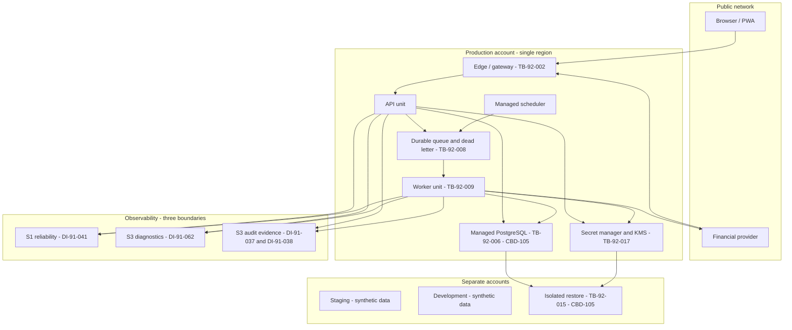

# CBD-103 — Hosting and Runtime Topology Specification

| Field | Value |
| --- | --- |
| Status | **Approved** — Product Owner approved v1.0 on August 20, 2026. Defines the managed execution and operational boundary CBD-103 evaluates providers against. It selects no provider; the candidate evaluation does that separately, and CBD-108 makes the selection. |
| Document version | 1.0 |
| Owner | Alexander Wohlford |
| Reviewer | Alexander Wohlford — Product Owner |
| Jira | [CBD-103](https://cobudget.atlassian.net/browse/CBD-103) |
| Parent | [CBD-15](https://cobudget.atlassian.net/browse/CBD-15) — Select initial managed providers |
| Companions | Candidate Shortlist and Gate Evaluation v1.0; Operational and Cost Assessment v1.0; Acceptance Criteria Traceability v1.0 |
| Confluence page | [CBD-103 — Hosting and Runtime Topology Specification](https://cobudget.atlassian.net/wiki/spaces/CBD/pages/12320769) |
| Repository baseline | `5745587` |
| Last updated | August 20, 2026 |

## 1. Purpose and authority

CBD-103 must select "the managed execution and operational boundary for web,
API, workers, scheduled reconciliation, and telemetry." A provider cannot be
measured against a boundary that has not been described, so this document
describes it first and the candidate evaluation measures providers against it.

Every decision here is **derived** from an approved source, in the same sense
the CBD-102 hard-gate catalog uses that word. Each `TD-103-*` decision cites the
approved material that forces it. Where no approved source settles a question,
this document says so and records an open item rather than inventing a
constraint.

The authoritative inputs are:

| Source | What it fixes here |
| --- | --- |
| `docs/architecture.md` | Modular monolith, separate API and worker deployment, synchronization flow, security baseline |
| CBD-11 / CBD-71 approved decisions | Budget-space time zone, local-midnight semantics, period-state derivation, versioned holiday reference data |
| CBD-72 / CBD-12 | Authority recheck at commit, invalidation on permission loss, package expiry |
| CBD-91 (`DI-91-*`) | Which data class may live in which store, at which sensitivity tier |
| CBD-92 (`SA-92-*`, `RL-92-*`, `OP-92-*`, `AN-92-*`, `EP-92-*`, `TB-92-*`) | Service authority, ceilings, staff access, telemetry content, entry points, trust boundaries |
| CBD-94 (`SR-94-*`) | Security and privacy requirements this topology must be capable of satisfying |
| CBD-102 | The gates a provider is measured against, and the demand quantities it is sized for |
| `FU-95-008` | The bounded follow-up this topology answers |

## 2. What this document does not do

* It does not select, recommend, or rank a provider.
* It does not provision anything. CBD-15 excludes production accounts,
  credentials, contracts, purchasing, provisioning, deployment, and integration,
  and this document stays inside that boundary.
* It does not set the rate, quota, or resource **values** that `RL-92-007` and
  `ME-94-010` assign to architecture and CBD-94. It describes where a ceiling is
  enforced, not what the ceiling is.
* It does not close any `EG-91-*` evidence gap or `RF-92-*` review finding.
* It does not implement a mitigation. Nothing here is built.

## 3. Method

Decisions carry stable `TD-103-*` keys. Numbers are never reused or renumbered,
following the CBD-92 `TH-92-*` convention.

Each decision records the approved source that forces it and, where the decision
resolves a genuine conflict between two approved constraints, the conflict and
the reasoning. A decision with no cited source is a preference and is marked as
one, so the distinction between "the approved material requires this" and "this
seemed sensible" is never lost.

Three decisions below (`TD-103-003`, `TD-103-007`, `TD-103-014`) resolve real
tensions rather than restating a requirement. They carry the longest rationale
for that reason.

## 4. Deployment units

### 4.1 The units

`TD-103-001` — **Two deployment units, one build artifact, one codebase.**

| Unit | Contains | Scaling trigger | Entry points served |
| --- | --- | --- | --- |
| **API** | HTTP request handling, authorization, synchronous domain operations, webhook receipt | Request concurrency | `EP-92-001`–`006`, `008`, `009`, `011`, `012` |
| **Worker** | Queue consumption, background domain calculators, scheduled work, delivery | Queue depth | `EP-92-007`, `009`, `010`, `013`, `014` |

Both units are built from one repository and one container image. They differ
only in entrypoint and configuration. This is `docs/architecture.md` § Direction
stated as a topology: *"Deploy the API and background workers separately, but
keep the business modules in one codebase. Split services only when measured
scale or team ownership justifies the operational cost."*

**Source:** `docs/architecture.md` § Direction; CBD-103 acceptance criterion 1.

`TD-103-002` — **The scheduler is a managed trigger, not a deployment unit.**

Scheduled work is initiated by a managed scheduler that enqueues a job. It does
not execute domain logic and holds no application code. The worker remains the
only executor of domain effects, so `SA-92-*` authority is proven in exactly one
place rather than two.

**Source:** `SA-92-*` preamble (CBD-92 §2.4); `TB-92-009`; `EP-92-007`.

### 4.2 Why this is not premature service decomposition

CBD-103 acceptance criterion 1 requires separately deployable API and workers
*"without premature service decomposition."* The two are in tension unless the
split is drawn on an operational rather than a domain boundary, so the split
here is drawn on exactly one property: **whether work is triggered by a request
or by a queue.**

Consequences that keep this from becoming a microservice split:

* One codebase, one image, one dependency graph, one migration history.
* No network call between API and worker. They communicate only through the
  datastore and the queue, which are boundaries the approved model already
  requires (`TB-92-006`, `TB-92-008`).
* No separately versioned interface between them, so no compatibility matrix.
* A domain module is not owned by a unit. The same calculator is reachable from
  both, and correctness does not depend on which one called it.

The demand model supports the split as an operational necessity rather than an
aesthetic one: `DM-102-024` puts Base API load at 15,600 requests/month while
`DM-102-021` puts background work at 29,280 jobs/month. Background work is
roughly twice request work by volume and is bursty against provider webhooks
(`DM-102-017`). Sharing one scaling unit would let a synchronization burst
degrade interactive authorization.

**Source:** CBD-103 acceptance criterion 1; `DM-102-021`; `DM-102-024`;
`docs/architecture.md` § Direction.

## 5. Period state is derived, not job-produced

`TD-103-003` — **Scheduled jobs materialize period state; they never determine
it.**

This is the load-bearing constraint CBD-11 places on hosting, and it is easy to
get backwards.

CBD-67 `INV-22` is explicit: *"The active budget cycle is resolved dynamically
from the authoritative budget-space date and schedule; it never depends on a
user action or the successful completion of a midnight activation job."* CBD-67
`INV-31` says the same for a pending schedule change: it becomes authoritative
when the budget-space calendar reaches its effective date at local midnight,
*"regardless of whether a background process has completed."*

Therefore:

* The authoritative active period is a **pure function** of the budget-space
  date and the applicable schedule version. It is computed on read.
* `SA-92-002` period generation writes a materialized projection for query
  efficiency and for downstream job fan-out. That projection is a cache.
* A scheduler outage, a missed tick, a delayed queue, or a failed worker
  **cannot** change which period a budget space is in, cannot split a calendar
  date between schedule versions, and cannot make a completed period reopen.

**The consequence for provider selection is significant and reduces what CBD-103
must require.** Period-boundary correctness is not on the scheduler's
availability path. A scheduler that fires late, fires twice, or misses a tick
produces a stale projection, not a wrong answer. This removes scheduler
availability from the correctness argument entirely and leaves it as a freshness
and cost question. No candidate needs to be excluded for scheduler availability,
and no compensating control is needed for a missed tick beyond catch-up.

What the scheduler is still needed for, and where lateness is a real cost:
synchronization recovery under `TD-103-010`, alert timeliness, and lifecycle
disposition deadlines under `SR-94-121`.

**Source:** CBD-67 `INV-20`, `INV-22`, `INV-23`, `INV-31`, `INV-55`; CBD-71
`SD-071-018`, governance `GC-01`; `SA-92-002`.

`TD-103-004` — **Local-midnight work is selected by local-date comparison, not
by per-time-zone schedules.**

Each budget space has exactly one named IANA time zone (CBD-67 `INV-11`), and
schedule execution occurs at local midnight in that zone (`INV-08`, `GC-01`).
Time zones exist at 15-minute offset granularity, so a scheduler firing on the
hour cannot align to every local midnight.

The design is one frequent tick — at most every 15 minutes — that selects budget
spaces whose local calendar date has advanced past the last date processed for
that space, and enqueues one job per selected space keyed by
`(space_id, local_date)`.

This is correct across the cases CBD-69 requires:

| Case | Why local-date comparison holds |
| --- | --- |
| Daylight-saving transition (`EC-69-17`) | A local day of 23 or 25 hours still advances the local date exactly once. Comparing dates never skips or duplicates one; comparing elapsed hours would do both. |
| A 15-, 30-, or 45-minute offset zone | The tick interval divides every real-world offset. |
| Missed or delayed tick | The next tick observes the same advanced date and enqueues the same idempotent job. Catch-up is automatic. |
| Duplicate tick | The `(space_id, local_date)` idempotency key makes the second enqueue a no-op. |

**Source:** CBD-67 `INV-08`, `INV-11`; CBD-69 `EC-69-17`, `INV-69-02`; CBD-71
`GC-01`.

`TD-103-005` — **Holiday reference data is a versioned application artifact, not
a runtime service dependency.**

CBD-71 `GC-04` requires holiday calculations to use *"explicit, versioned
reference data rather than a live mutable service,"* and `SD-071-030` names
Federal Reserve Financial Services as the authority stored as versioned local
data, with unsupported years blocking confirmation rather than falling back
silently.

The runtime therefore ships holiday data inside the build artifact. There is no
outbound call to a holiday service, no cache to invalidate, and no provider
capability required. A hosting candidate is not evaluated on anything here.

**Source:** CBD-71 `GC-04`, `SD-071-030`; CBD-68-AC08.

## 6. Jobs, queues, and scheduling

### 6.1 The job envelope

`TD-103-006` — **Every job carries its own authority context.**

The queue payload carries these fields, and a job missing any required field is
rejected rather than executed:

| Field | Purpose | Source |
| --- | --- | --- |
| `schema_version` | Reject an unrecognized envelope shape | CBD-91 §4 rule 9 |
| `authority_mode` | Exactly one of user-delegated or service purpose | `TB-92-009` |
| `sa_purpose` | The named `SA-92-001`–`008` purpose, when service authority | `SA-92-*` preamble |
| `delegated_subject` | Subject or recipient binding, when user-delegated | `TB-92-008` |
| `tenant_id`, `resource_ref` | Tenant and resource identity | `TB-92-008`; `TB-92-005` |
| `authorization_version` | The authorization state the job was enqueued against | `PM-72-003`; `SR-94-110` |
| `service_policy_version` | The service-policy version in force at enqueue | `SA-92-*` preamble |
| `idempotency_key` | Deduplicate redelivery and replay | `EP-92-007`; `RL-92-006` |
| `enqueued_at`, `expires_at` | Bound the useful life of delayed work | `TB-92-008` |

The payload is **minimal and typed**: it carries references and versions, not
customer content. `DI-91-039` places active job payloads at S3 and requires the
durable queue to be a controlled boundary; carrying financial values in the
envelope would widen that boundary for no benefit, since the worker re-reads
authoritative state anyway under `TD-103-007`.

This is `HG-102-016` stated as a schema. A runtime that cannot carry arbitrary
structured metadata through enqueue, retry, and dead-letter cannot host this
envelope and fails that gate.

**Source:** `HG-102-016`; `SA-92-001`–`008`; `DI-91-039`; `EP-92-007`;
`TB-92-008`; `TB-92-009`; `SR-94-031`–`038`.

`TD-103-007` — **Authority is re-evaluated at execution, and effects are derived
rather than accumulated.**

A job proves authority twice: once at enqueue, and again at execution against
**current** state. The enqueued `authorization_version` is not a grant; it is a
staleness detector. If current authorization differs, the job does not execute
its effect.

This resolves a real conflict, which is why it is stated as a decision rather
than a restatement.

**The conflict.** `RL-92-006` requires that shedding under pressure *"preserves
ordered progress and lifecycle obligations rather than silently dropping them."*
Read as a transport requirement, that asks the broker for ordered delivery. But
broker ordering degrades in the presence of dead-lettering, which `HG-102-018`
independently requires. Google Cloud Pub/Sub documents the interaction directly:
*"If both message ordering and a dead-letter topic are enabled on a
subscription, this behavior might not be true, as Pub/Sub forwards messages to
dead-letter topics on a best-effort basis,"* and *"order might not be preserved
when messages are written to a dead-letter topic."*

The two features are not mutually exclusive — that stronger claim appeared in a
secondary summary and does not survive retrieval of the vendor page, which is
why it is not made here. What the vendor documents is weaker and sufficient:
with dead-lettering enabled, the ordering guarantee becomes best-effort. A
topology that depended on broker ordering would therefore be depending on a
guarantee the vendor withdraws in exactly the failure conditions the ordering
was meant to survive.

**The resolution.** Ordering is a property of the **database**, not the broker.

* The transactional outbox (`docs/architecture.md` § Synchronization flow step
  5) establishes order inside the database transaction that produced the change.
* `SA-92-003` deterministic recalculation *"may calculate, reconcile, atomically
  replace derived system state"* — it replaces, it does not increment. A
  recalculation is a pure function of current authoritative records and rule
  versions.
* Therefore a job that arrives late, twice, or out of order re-derives the same
  answer from the same current state. Duplicate delivery is a no-op. Reordered
  delivery converges.

"Ordered progress" is preserved at the level of **effect**, which is what
`RL-92-006` is protecting, and it becomes a CoBudget-side obligation under
`HG-102-017` rather than a vendor capability under `HG-102-018`.

**This is a load-bearing assumption and it has a cost.** It requires that no
background effect is order-dependent or accumulative. Any future job that
increments rather than replaces would break it silently — the failure mode is a
wrong total, not an error. `OI-103-004` records this, and CBD-94 verification
must include a reordered-and-duplicated delivery fixture that asserts
convergence, not merely absence of error.

**Source:** `RL-92-006`; `SA-92-003`; `SA-92-004`; `HG-102-017`;
`docs/architecture.md` § Synchronization flow; `SR-94-121`; Pub/Sub ordering
documentation registered as `EV-102-014`, dead-letter documentation as
`EV-102-015`.

### 6.2 Bounding every background path

`TD-103-008` — **Every background path is bounded and ends in an observable
terminal state.**

| Control | Requirement |
| --- | --- |
| Maximum attempts | Finite on every path. No path retries indefinitely. |
| Backoff | Exponential with a bounded ceiling. |
| Per-tenant concurrency cap | A single budget space cannot consume the worker pool. |
| Per-connection concurrency cap | A single financial connection cannot consume it either. |
| Dead-letter destination | Required. A path whose exhausted work is **deleted** rather than dead-lettered does not satisfy this. |
| Terminal state | Logged, queryable, and distinguishable from success. |

The dead-letter row is not a formality, and it disqualifies a plausible
component. Google Cloud Tasks provides maximum attempts, backoff, and both
concurrency and dispatch-rate caps, but documents no native dead-letter
destination: when a task exhausts its retry configuration, *the task is
deleted*. A deleted task is precisely the "unlogged stall" `HG-102-019`
prohibits and the "silent drop" `RL-92-006` prohibits. Cloud Tasks is therefore
not usable as the durable job queue for this topology, regardless of which
provider is selected. It remains usable for paths where loss is acceptable,
of which this topology currently has none.

**Source:** `HG-102-018`; `HG-102-019`; `RL-92-006`; `EP-92-007`; Cloud Tasks
queue-configuration documentation registered as `EV-102-013`.

`TD-103-009` — **Dead-letter state is a restricted boundary, and replay
reauthorizes.**

Failed-job state is `DI-91-061` at S3 and is *"reachable only through a
restricted path, not by ordinary operator browsing."* Two properties follow:

* The dead-letter destination carries an access role distinct from the role that
  operates the live queue. Operating the queue does not confer reading failed
  payloads.
* Replaying a dead-lettered job re-enters the ordinary execution path and
  re-proves authority under `TD-103-007`. Replay is not a re-enqueue that skips
  the check; a job dead-lettered before a revocation must not execute after it.

**Source:** `HG-102-027`; `DI-91-061`; `OP-92-001`; `SR-94-120`.

### 6.3 Synchronization and recovery

`TD-103-010` — **Recovery reconciliation is the defined failure-recovery path,
and it is itself bounded.**

CBD-103 acceptance criterion 2 requires that durable and idempotent jobs and
recovery reconciliation have a defined failure-recovery path. The path is:

1. **Webhook receipt** — the API unit verifies the provider signature and
   rejects replay at the edge, then durably records a minimal event and returns
   quickly (`TD-103-019`).
2. **Synchronization job** — enqueued with the `TD-103-006` envelope, keyed
   idempotently on the connection and provider cursor.
3. **Cursor advance** — incremental fetch uses the saved per-connection cursor.
   The cursor advances only after the database transaction commits, so a crash
   mid-job re-fetches rather than skips.
4. **Fan-out** — domain events are written to the transactional outbox in the
   same transaction, then dispatched.
5. **Scheduled reconciliation** — a periodic per-connection job re-fetches from
   the last committed cursor regardless of whether a webhook arrived. This is
   the recovery mechanism for a missed, dropped, or never-sent webhook, and it
   is why webhook delivery is not on the correctness path.
6. **Watermark** — each connection carries a last-successful-sync watermark.
   It drives the customer-visible connection health that `docs/architecture.md`
   requires, and it bounds the recovery scope of the next reconciliation run.

Each of steps 2, 4, and 5 is bounded under `TD-103-008`. A reconciliation run
that exhausts its attempts dead-letters and leaves the watermark unadvanced, so
the failure is visible as staleness rather than as silent success.

`SR-94-118` constrains what the customer-visible health state may say: only the
`PR-94-004` allowlisted reason necessary to explain stopped data, never private
provider or authorizer detail. The watermark is a timestamp and a safe class,
not a provider error string.

**Source:** CBD-103 acceptance criterion 2; `docs/architecture.md`
§ Synchronization flow; `SA-92-001`; `CA-92-002`; `HG-102-018`; `SR-94-118`;
`DM-102-018`.

### 6.4 Fan-out, and a correction to the demand model

`DM-102-020` assumes three downstream jobs per synchronization job, and
`OI-102-010` asks CBD-103 to confirm that against the runtime design before
`DM-102-021` is treated as a sizing commitment.

The topology produces **four** distinct downstream `SA-92-*` purposes, not
three:

| Downstream work | Purpose |
| --- | --- |
| Deterministic recalculation | `SA-92-003` |
| Derived-data invalidation and rebuild | `SA-92-004` |
| Shared alert-fact evaluation | `SA-92-005` |
| Delivery | Recipient authority, not service authority |

`DM-102-020`'s basis names recalculation, alert evaluation, and delivery, and
omits `SA-92-004` invalidation. Whether that makes the real figure three or four
depends on a design choice this document now settles: **invalidation is
performed inside the recalculation job's transaction, not as a separate job.**
`SA-92-003` explicitly permits emitting invalidation events, and `SA-92-004`'s
rebuild is lazy — a derived view is rebuilt when next requested, not eagerly on
a queue.

With that choice, the fan-out is three and `DM-102-021` stands unchanged. The
choice is recorded as `TD-103-011` because it is load-bearing for the sizing
figure, and `OI-103-005` records that an eager-rebuild design would raise
`DM-102-021` by roughly a third.

`TD-103-011` — **Derived-data invalidation is transactional with recalculation;
rebuild is lazy.**

**Source:** `SA-92-003`; `SA-92-004`; `DM-102-020`; `OI-102-010`; `TB-92-007`.

## 7. Networking and the edge

`TD-103-012` — **The edge is a distinct enforcement point in front of both
units.**

The edge enforces, before application code runs: TLS termination, origin and
input validation, per-surface ceilings, uniform denial shape, and webhook
signature verification.

`TD-103-013` — **Ceilings are per surface, and denial is uniform.**

`RL-92-002` rejects a single global limit as compliance. Each `RL-92-001`
bounded surface carries its own policy, attached to the distinct entry points
`HG-102-021` enumerates.

`RL-92-003` and `TB-92-002` then require that throttled and unthrottled
responses stay uniform in status, body, error class, header set, `Retry-After`
value, and observable timing. This has a specific and easily missed consequence:
**conventional rate-limit headers must be suppressed.** A gateway that emits
remaining-quota or remaining-attempt headers, and cannot turn them off, converts
its limiter into the enumeration oracle `RL-92-003` exists to prevent. This is
the `HG-102-020` pass test and it is a genuine differentiator between gateway
products.

`TD-103-014` — **Pre-authentication surfaces count against caller-controlled and
infrastructure-derived keys.**

Counting an unauthenticated attempt against a claimed account identifier reveals
that identifier's existence through throttling behaviour. Pre-authentication
surfaces therefore key on values that assert nothing about an unverified
subject. Subject-bound counters apply only after authentication, and where a
subject-bound limit is unavoidable, `RL-92-005` requires an independent recovery
path the attacker cannot exhaust.

**Source:** `RL-92-001`–`005`; `HG-102-020`; `HG-102-021`; `HG-102-022`;
`HG-102-023`; `TB-92-002`; CBD-72 `XSP-02`.

`TD-103-015` — **Private networking between units and datastore; no public
datastore endpoint.**

The datastore selected under CBD-105 is reachable only from the application
units over private networking. This is not itself an `HG-102-*` gate — the
catalog §11 moved network isolation to the rubric as `WR-102-005`, because no
approved source sets a binding isolation threshold — so it is recorded here as a
**preference with a stated reason** rather than as a derived requirement: it
narrows `TB-92-006` to a smaller reachable surface at no functional cost.

`TD-103-016` — **Webhook signature verification and replay rejection happen at
the edge, before the durable queue.**

`DI-91-012` requires the edge to verify signature and replay and to bind a
minimum event record *"without retaining its raw transaction payload or reusable
signature material."* Raw signature material is therefore discarded at the
boundary and never reaches the durable record, so a durable-queue compromise
cannot yield replayable provider material.

**Source:** `HG-102-025`; `DI-91-012`; `EP-92-006`; `docs/architecture.md`
§ Security baseline.

## 8. Secrets, keys, and workload identity

`TD-103-017` — **A dedicated secret manager or KMS holds every S4 value, and the
runtime authenticates to it by workload identity.**

No static credential exists in the deployment configuration, environment, or
image. The unit proves its own identity to the secret boundary and receives the
minimum secret for its purpose (`TB-92-017`, `EP-92-015`).

The prohibition is specific. `HG-102-024`'s fail test is *"a platform whose only
secret mechanism is a plaintext environment variable visible in a console or
build log."* This is the gate most likely to eliminate an otherwise attractive
low-burden platform, and it does so on a real property rather than a preference:
`DI-91-051` requires *"dedicated secret manager or KMS/HSM; non-exportable keys
where supported,"* and `SR-94-040` prohibits high-impact secrets from appearing
in *"ordinary domain rows, queues, logs, audit, diagnostics, support, analytics,
exports, or clients."* A console-readable environment variable is an ordinary
surface.

`TD-103-018` — **Provider tokens are field-encrypted in addition to store
encryption.**

`docs/architecture.md` § Key data rules requires encrypting financial-provider
tokens *separately from ordinary application data*, and § Security baseline
requires *"provider tokens at the field level."* `DI-91-010` places them at S4
in a *"field-encrypted secret store separated from ordinary data."*

So datastore-level encryption at rest does not satisfy this. The token
ciphertext is produced with a key held in the KMS boundary and is unreadable to
anyone holding only the database, including anyone holding only a backup. This
is what makes the `HG-102-006` custody separation meaningful rather than
nominal.

`TD-103-019` — **Secret rotation and revocation enumerate their dependents.**

`SR-94-042` requires rotation and revocation to *"identify and invalidate every
dependent session, callback, connection, package, queue, replica, and backup
recovery path without reactivating prior authority."* The secret inventory
required by `SR-94-039` therefore records, per secret, its dependents — not
merely its owner and store — because rotation without a dependent list silently
leaves live authority behind.

`TD-103-020` — **Break-glass custody follows the catalog §2.5.1 second
principal.**

Key-recovery custody and restore return-to-service approval are held by the
named second principal, who holds **no** path to customer content, no restore
execution, and no budget-space membership. Restore execution is held by the
operator, who holds no restore approval.

This is an operating arrangement, not a provider capability, but it constrains
provider choice in one specific way recorded in `HG-102-006`: a provider fails
where key custody or restore approval *implies* the ability to read customer
data, because that collapses the boundary regardless of how roles are named.

**`OI-102-022` remains open and is not closed by this document.** The second
principal is defined as a role and nobody holds it. `HG-102-006` cannot be
satisfied in practice until the role is filled, however capable the provider.
This topology is buildable without it; CoBudget's recovery claims are not.

**Source:** `HG-102-024`; `HG-102-006`; `DI-91-010`; `DI-91-051`; `DI-91-072`;
`EP-92-015`; `TB-92-017`; `OP-92-006`; `SR-94-039`–`043`; `SR-94-069`;
`SR-94-081`; `docs/architecture.md` § Key data rules, § Security baseline;
catalog §2.5.1.

## 9. Observability: three boundaries, not one

`TD-103-021` — **Reliability telemetry, restricted diagnostics, and audit
evidence occupy three separate destinations with three separate access roles and
three separate retention policies.**

| Destination | Class | Tier | Contents | Who may read |
| --- | --- | --- | --- | --- |
| **Reliability** | `DI-91-041` | S1 | The `AN-92-003` allowlist only: service/component and version, coarse operation class, safe outcome/error class, duration/capacity bucket, aggregate health count | Ordinary operator |
| **Restricted diagnostics** | `DI-91-062` | S3 | Deliberate, case-linked, redacted capture when S1 is insufficient | Restricted role, per incident |
| **Audit and security evidence** | `DI-91-037`, `DI-91-038` | S3 | Append-only semantic events with actor, policy, decision, integrity, ordering | Restricted role, separate from diagnostics |

`AN-92-006` forbids joining, enriching, exporting, or reusing an identifier
collected for one purpose in another. `HG-102-026`'s fail test is direct: *"A
platform offering one log stream with one access role for both fails, since
`DI-91-062` evidence and `DI-91-041` S1 telemetry cannot share a boundary."*
`HG-102-003` extends the same test across the provider's own telemetry, support,
and analytics surfaces.

This is the second gate most likely to eliminate a candidate, and it eliminates
exactly the class of platform that markets a single unified observability
product as a feature.

`TD-103-022` — **Redaction is structural, not a filter.**

The S1 reliability sink accepts a **closed, typed field set**. The application
cannot emit an unlisted field to it, because the logger's S1 interface has no
parameter that would carry one. A field that does not exist in the type cannot
be forgotten in a redaction rule.

The rejected alternative is a redaction filter that strips known-sensitive
patterns on the way out. It is rejected because it **fails open**: it removes
what it recognizes and forwards what it does not, so the first unanticipated
field shape is a leak that nothing reports. `AN-92-003`'s allowlist is an
allowlist precisely because a denylist cannot enumerate what has not been
invented yet, and `CBD-91` §4 places derived and copied data at the highest
sensitivity of any input.

`SR-94-043` then requires build-time and runtime scanning plus negative tests
proving prohibited fields do not enter logs, errors, traces, queues, audit,
support, analytics, exports, or client bundles. The structural approach makes
those tests assertions about a type, which is what makes them cheap enough to
run on every build.

**Source:** `AN-92-003`; `AN-92-006`; `HG-102-003`; `HG-102-026`; `DI-91-041`;
`DI-91-062`; `DI-91-037`; `DI-91-038`; `SR-94-043`; `SR-94-063`–`066`;
CBD-91 §4.

`TD-103-030` — **Audit evidence is written transactionally in the primary
datastore, not shipped to the observability provider.**

The three destinations in `TD-103-021` are separated by purpose, but separation
alone leaves a failure mode that matters: if audit evidence were shipped to an
observability vendor, then an observability outage during which the application
kept serving would produce **undetectable evidence omission**. `SR-94-064`
requires that omission, reordering, overwrite, selective deletion, forgery, and
correlation loss all be *detectable*, and evidence that was never written is the
one case a downstream integrity check cannot see.

`DI-91-037` already places customer-visible audit history in an *"append-only
customer-audit store"* rather than a log stream. This decision states the
operational consequence: a consequential action and its audit record commit in
the **same database transaction**. The record cannot be missing while the effect
exists, because the effect would have rolled back with it.

Two consequences follow:

* Audit availability shares fate with the datastore, which is a CBD-105 concern
  with a defined recovery objective, rather than with a telemetry vendor that
  has none.
* An observability-provider outage degrades operability and diagnostics. It
  cannot degrade evidence integrity, and it cannot silently reduce what CoBudget
  can later prove.

The observability provider still receives the S1 reliability stream, and losing
that stream during an outage loses only allowlisted content-free operational
metadata.

**Source:** `SR-94-064`; `DI-91-037`; `DI-91-038`; `OP-92-007`; `SA-92-007`;
`HG-102-015`; CBD-72 §9.

`TD-103-023` — **Product analytics and behavioural capture are absent, not
disabled.**

`AN-92-001` and `AN-92-002` prohibit them for Private MVP. No analytics SDK,
session replay, heatmap, keystroke or form capture, DOM or screenshot recording,
cross-site tracker, advertising identifier, or third-party behavioural pixel is
integrated. A platform that injects any of these by default and offers no
verifiable off-switch fails `HG-102-004`.

Note the asymmetry the evidence register records: `HG-102-004` is deliberately
**not** on the §5.2 non-exceptable list, because `AN-92-007` supplies an
amendment path. That path requires a new Product Owner and privacy approval, so
a candidate failing `HG-102-004` fails a gate that cannot be excepted — only
amended at source.

## 10. Environment and account separation

`TD-103-024` — **Three environments in three separate provider accounts or
projects, sharing no secret, no key, and no data.**

| Environment | Contains | Data |
| --- | --- | --- |
| **Production** | The live service | Real customer data (S1–S4) |
| **Staging** | Pre-production verification | Synthetic fixtures only |
| **Development** | Integration and rehearsal | Synthetic fixtures only |

Separation is at the provider's own strongest isolation boundary — a separate
account, project, or subscription — not a namespace or tag within one. This
gives each environment its own IAM boundary, its own key material, its own
billing surface, and its own blast radius.

`TD-103-025` — **No production data leaves production, in any direction, for any
purpose.**

There is no production-to-staging data copy, no anonymized production extract,
and no production database restored into a lower environment. `OP-92-001` makes
routine access to customer content default-deny; a staging copy would create
exactly the routine path it prohibits, with weaker controls.

The restore rehearsal `HG-102-041` and `SR-94-081` require is a restore into an
**isolated** environment under separated custody — which is not the same thing
as a lower environment, and is not reachable by ordinary development access.
CBD-105 owns that restore path; this document records only that it terminates
outside the three environments above.

`TD-103-026` — **The local-development boundary holds no production secret and
no production data.**

Local development runs against synthetic fixtures and local or ephemeral
service instances. No developer machine holds a production credential, and no
production secret is retrievable by a human identity in the ordinary case —
`TD-103-017` makes workload identity the retrieval path, and `HG-102-005`
requires that standing human production access be unavailable.

CBD-70 supplies the calendar fixture set that makes this practical for the
schedule domain: 21 calendar fixtures and 75 approved scenarios, deterministic
under fixed dates, so the highest-risk domain logic is testable without any real
data.

**Source:** `FU-95-008`; `OP-92-001`; `HG-102-005`; `SR-94-081`; CBD-70 calendar
example set; CBD-71 `SD-071-018`.

## 11. Deployment and rollback from versioned configuration

`TD-103-027` — **Every deployable input is versioned, and a deployment is
identified by an immutable digest.**

| Input | Versioned as | Rollback |
| --- | --- | --- |
| Application code | Container image, addressed by content digest, never by a mutable tag | Redeploy the prior digest |
| Infrastructure | Terraform configuration in the repository, with remote state | Apply the prior commit |
| Runtime configuration | Declarative service revision, versioned with the deployment | Activate the prior revision |
| Secret **values** | Versioned in the secret manager, referenced never inlined | Activate the prior secret version |
| Database schema | Ordered migrations, forward-only | See `TD-103-028` |

A mutable tag is excluded deliberately: redeploying `latest` is not a
reproducible rollback, because the artifact it names has changed.

`TD-103-028` — **Rollback is a code and configuration operation, never a schema
reversal.**

Schema changes follow expand-and-contract, so that the previous application
version runs against the current schema:

1. **Expand** — add the new structure; deploy nothing that requires it.
2. **Migrate** — deploy code that writes both and reads the new.
3. **Contract** — remove the old structure only after the version that used it
   is no longer deployable as a rollback target.

This makes rollback safe by construction. The alternative — a reversible "down"
migration executed under incident pressure — is rejected because it can destroy
committed customer data to recover an application fault, and because it is the
least-rehearsed path in the system at the moment it is most needed.

`docs/architecture.md` § Key data rules requires that historical periods be
preserved when a user changes a schedule, and CBD-67 `INV-22` requires completed
cycles to stay stable. A down migration that dropped a column carrying schedule
version history would violate both, silently, during an outage.

`TD-103-029` — **Deployment and rollback are reproducible by one operator
without vendor involvement.**

CBD-103 acceptance criterion 5 requires deployment and rollback to be
reproducible from versioned configuration. The operational test is that the
current production state can be reconstructed from the repository and the secret
manager alone: image digest, Terraform state, service revision, and secret
versions. Nothing required to redeploy exists only as a console setting that was
clicked once.

This is also `WR-102-030` one-person recoverability, scored rather than gated,
and `HG-102-005`: if the only way to deploy is a console session held by a named
human, the platform fails both.

**Source:** CBD-103 acceptance criterion 5; `HG-102-005`; `WR-102-028`;
`WR-102-030`; `docs/architecture.md` § Key data rules; CBD-67 `INV-22`;
`FU-95-008` restore/redeploy path.

## 12. Trust-boundary diagram

Boundaries are `TB-92-*`. The diagram shows where this topology places each one;
it does not assert that any control is implemented.

## 13. Gate disposition carried by this topology

The CBD-102 catalog marks four applicable gates **Config** — CoBudget satisfies
them by design on any provider that does not foreclose them. This topology is
where that design is recorded, so the candidate evaluation can treat them as
CoBudget obligations rather than as vendor questions.

| Gate | Satisfied by | Remaining vendor condition |
| --- | --- | --- |
| `HG-102-014` — S4 material out of ordinary provider surfaces | `TD-103-017`, `TD-103-018`, `TD-103-022` | The provider must not force S4 material into an ordinary surface. Non-exceptable under evidence register §5.2. |
| `HG-102-017` — job authority fails closed | `TD-103-006`, `TD-103-007` | The consumer contract must permit rejecting a job without the platform retrying it into success or dropping it unlogged. |
| `HG-102-023` — ceiling denial cannot lock a subject out | `TD-103-014` | The limiter must support an independent recovery path where a subject-bound limit is unavoidable. |
| `HG-102-025` — webhook verification before durable queue | `TD-103-016` | The edge must be able to run verification before enqueue. |

A **Config** gate is a CoBudget implementation obligation that CBD-94
verification must later prove. None of the four is proven by this document;
recording the design is not evidence that it was built. `EX-102-007` states the
same principle for compensating controls, and it applies here: a control that is
CoBudget-side work is not effective until built and verified.

## 14. Open items

| ID | Item | Effect |
| --- | --- | --- |
| OI-103-001 | The topology assumes a **single deployment region in the United States**, confirmed by the Product Owner on August 18, 2026, consistent with the demand model's US-only destination scope and the Private MVP's US market. | Closes `OI-102-012` as an assumption. Multi-region would multiply hosting and database figures and is a re-evaluation trigger, not a Private MVP option. The specific region within the United States is not fixed here and is a per-candidate `HG-102-011` question. |
| OI-103-002 | `OI-102-022` — the §2.5.1 second principal is defined but unfilled. | Unchanged by this document. `TD-103-020` describes the arrangement; nobody holds the role. `HG-102-006` cannot be satisfied in practice until it is filled. Blocks any CoBudget recovery claim. |
| OI-103-003 | `RL-92-007` and `ME-94-010` still own the ceiling **values**. `TD-103-013` fixes where a ceiling is enforced, not what it is. | No `RL-92-001` surface may be released until `PR-94-002` records concrete values, per `SR-94-037`. |
| OI-103-004 | `TD-103-007` requires that no background effect is order-dependent or accumulative. Nothing mechanically enforces that today. | A future accumulative job would break convergence silently — the symptom is a wrong total, not an error. CBD-94 verification must include a reordered-and-duplicated fixture asserting convergence. |
| OI-103-005 | `TD-103-011` folds invalidation into recalculation, which is what keeps `DM-102-020` fan-out at three. | An eager-rebuild design would raise `DM-102-021` by roughly one third. Recorded so the sizing figure's dependency on a design choice is visible. |
| OI-103-006 | `TD-103-015` private networking is a preference, not a derived requirement. Catalog §11 moved network isolation to rubric `WR-102-005` because no approved source sets a binding threshold. | It cannot be used to disqualify a candidate. It scores. |
| OI-103-007 | This topology has not been reviewed by anyone other than its author, and no part of it is built. | It is a design record, not evidence of a working system. The independent security review that CBD-92 §1 and the architecture baseline require before public launch remains outstanding. |
