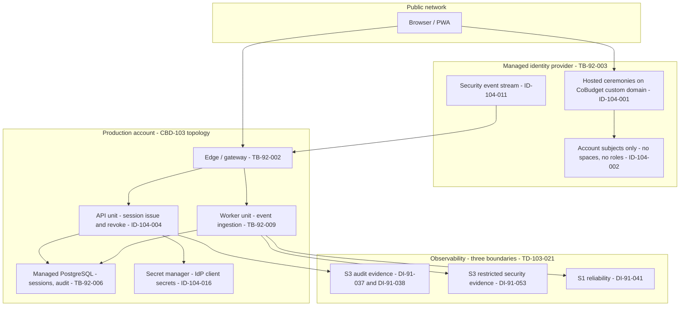

# CBD-104 — Identity Integration Boundary Specification

| Field | Value |
| --- | --- |
| Status | **Approved** — Product Owner approved v1.0 on August 21, 2026. Defines the managed-identity boundary CBD-104 evaluates providers against. It selects no provider; the candidate evaluation measures against this boundary, and CBD-108 makes the selection. |
| Document version | 1.0 |
| Owner | Alexander Wohlford |
| Reviewer | Alexander Wohlford — Product Owner |
| Jira | [CBD-104](https://cobudget.atlassian.net/browse/CBD-104) |
| Parent | [CBD-15](https://cobudget.atlassian.net/browse/CBD-15) — Select initial managed providers |
| Companions | Candidate Shortlist and Gate Evaluation v1.0; Integration, Outage, Support, Cost, and Exit Assessment v1.0; Acceptance Criteria Traceability v1.0 |
| Confluence page | [CBD-104 — Identity Integration Boundary Specification](https://cobudget.atlassian.net/wiki/spaces/CBD/pages/13107201) |
| Repository baseline | `6b1ac8e` |
| Last updated | August 21, 2026 |

## 1. Purpose and authority

CBD-104 must select identity services that support secure consumer access and
approved collaboration boundaries. A provider cannot be measured against a
boundary that has not been described, so this document describes the boundary
first and the candidate evaluation measures providers against it — the same
relationship the CBD-103 topology specification has to its candidate
evaluation.

Every decision here is **derived** from an approved source, in the sense the
CBD-102 hard-gate catalog uses that word. Each `ID-104-*` decision cites the
approved material that forces it. Where no approved source settles a question,
this document says so and records the decision as a preference with a stated
reason, or leaves an open item, rather than inventing a constraint.

The authoritative inputs are:

| Source | What it fixes here |
| --- | --- |
| `docs/architecture.md` | Managed identity provider with MFA/passkeys; the security baseline |
| CBD-72 / CBD-12 | Roles, permissions, protected-action reauthentication, session invalidation on permission loss |
| CBD-73 | The invitation, consent, and revocation ceremony the identity boundary must not absorb |
| CBD-91 (`DI-91-*`) | Which identity data class may live where, at which sensitivity tier |
| CBD-92 (`TB-92-003`, `EP-92-001`–`004`, `OP-92-*`, `AN-92-*`, `RL-92-*`) | The identity trust boundary, entry points, staff access, telemetry, ceilings |
| CBD-94 (`SR-94-001`–`011`) | Identity, session, invitation, and recovery requirements |
| CBD-102 | The gates a provider is measured against, and the demand quantities |
| CBD-103 topology (`TD-103-*`) | The runtime this identity boundary plugs into |
| `FU-95-007` | The bounded follow-up this boundary partially answers |

## 2. What this document does not do

* It does not select, recommend, or rank a provider.
* It does not provision anything and creates no account or tenant.
* It does not define the session, token, or invitation **schemas**, choose
  parameter values such as `PR-94-001` timing, or implement anything.
  [CBD-21](https://cobudget.atlassian.net/browse/CBD-21) implements
  authentication against the selected provider, and
  [CBD-41](https://cobudget.atlassian.net/browse/CBD-41) implements the
  invitation lifecycle; both consume this boundary, neither is replaced by it.
* It does not close any `EG-91-*` evidence gap or `RF-92-*` review finding,
  and it does not close `FU-95-007`, whose closure evidence requires a provider
  decision, schemas, rate values, and deterministic test results that do not
  exist yet.
* It does not amend CBD-72, CBD-73, or any CBD-92 contract. Where it cites
  one, it cites it as a binding input.

## 3. Method

Decisions carry stable `ID-104-*` keys, never reused or renumbered, following
the CBD-92 `TH-92-*` convention. Each decision records the approved source
that forces it. Two decisions (`ID-104-004`, `ID-104-019`) are preferences
with a stated reason rather than derivations, and each says so where it is
defined — the distinction between "the approved material requires this" and
"this seemed sensible" is never lost.

## 4. The credential boundary

`ID-104-001` — **The IdP holds the entire credential boundary, and every
credential ceremony runs on IdP-served surfaces.**

`DI-91-002` places authentication factors and recovery secrets in an
"IdP-only credential boundary; CoBudget stores no password, passkey private
key, MFA seed/code or recovery secret," reachable by the subject "through the
IdP ceremony and IdP security service only." `TB-92-003` states the same
boundary condition: factors and recovery remain IdP-only.

This specification adopts the strictest integration shape that satisfies it:
registration, sign-in, factor enrollment, step-up, and recovery ceremonies are
**served by the IdP**, on a CoBudget-controlled custom domain (`ID-104-019`).
No CoBudget-authored page, script bundle, or API ever receives, relays, or
holds a password, one-time code, or passkey assertion in a form the IdP has
not already bound. An embedded integration in which CoBudget's own page hosts
the credential field would place factor material inside CoBudget-served code —
exactly what the `HG-102-028` pass test traces for — so it is excluded even
where a provider offers it.

**Source:** `DI-91-002`; `TB-92-003`; `HG-102-028`; `EP-92-001`.

`ID-104-002` — **One IdP identity per account subject, and the IdP knows
nothing about budget spaces.**

Each account subject has exactly one IdP identity. Budget-space membership,
roles, Viewer profiles, and the cross-space structure of CBD-72 §7 are never
synchronized to the IdP as groups, roles, attributes, or metadata. `DI-91-001`
prohibits a "cross-space identity graph" from the identity profile's
disclosure set, and `PM-72-010` makes cross-space identifiers insufficient
authority — an IdP directory that mirrored spaces would be a second,
unauthorized copy of the most sensitive relationship structure CoBudget holds,
residing at a vendor whose deletion behaviour CoBudget does not control.

The demand model prices this shape: `DM-102-005` counts account subjects
(Base 50), not memberships (`DM-102-003`, Base 60), and identity MAU is
`DM-102-005 × DM-102-008`.

**Source:** `DI-91-001`; `PM-72-010`; CBD-72 §7; `DM-102-005`.

`ID-104-003` — **CoBudget remains the sole authority for application roles and
permissions; provider authorization features are deliberately unused.**

The CBD-104 acceptance criteria require that CoBudget remains authoritative
for application roles and permissions. This is already forced by approved
material: `PM-72-001` makes authorization default-deny on CoBudget's own
inputs, `PM-72-002` requires server-side evaluation at open and mutation time
against the CBD-72 §8 input set, and `SR-94-001` requires that an
authentication result "MUST NOT grant a budget-space role by itself."

Consequently the IdP's role, group, RBAC, fine-grained-authorization, and
organization features are not used for budget-space authority, and IdP-issued
tokens carry no budget-space role claim. The IdP authenticates a subject;
every authorization decision is CoBudget's, evaluated against current
membership, role, profile, lifecycle, and authorization-version state. A
provider losing or corrupting its directory can therefore deny access but can
never widen it.

**Source:** CBD-104 acceptance criteria; `PM-72-001`; `PM-72-002`; CBD-72 §8;
`SR-94-001`.

## 5. Sessions

`ID-104-004` — **The application session is CoBudget's: issued at the edge
after IdP authentication, opaque, server-revocable, and the only authority an
API call carries.**

`DI-91-003` places active session credentials at "IdP, client and application
edge" inside a "protected cookie/token/session-store boundary" where "caches
may hold minimum opaque revocation/version state," and requires revocation "on
logout, recovery, account lock or applicable security event." `SR-94-002`
requires rotation after authentication, recovery, assurance elevation, and
account switch, and invalidation within `PR-94-001`.

The decision: after the IdP ceremony completes, CoBudget's edge exchanges the
IdP result for a **CoBudget application session** — an opaque identifier
resolved server-side against a revocable record. Protected API calls are
authorized against that record and current CBD-72 §8 state, never against a
provider-issued token validated only by signature.

This is recorded as a decision rather than a restatement because it resolves a
real property of every shortlisted provider, established in the candidate
evaluation's evidence: providers issue self-contained JWTs that remain
signature-valid after revocation unless the verifier consults the provider,
per-session revocation APIs are tier-gated on one candidate, and another
candidate's revocation is per-user with a propagation delay of minutes.
Locating session authority in CoBudget's own store makes prompt, individual,
`PM-72-003`-consistent revocation a CoBudget property on any provider, and
narrows what `HG-102-031` must obtain from the vendor to the provider-held
artifacts in `ID-104-005`. The shape — a deliberate design choice with a
stated reason, satisfiable on any candidate — is a **preference** in the
`TD-103-015` sense, and it is the strictest shape that satisfies the cited
sources.

**Source:** `DI-91-003`; `SR-94-002`; `SR-94-005`; `PM-72-003`; `TB-92-003`;
candidate evaluation §7.2.

`ID-104-005` — **Provider-held authority artifacts are minimized, and every
one that exists is revocable.**

Whatever the provider issues beyond the immediate ceremony result — an IdP
SSO cookie that silently re-authenticates, a refresh token, a device
credential — is either not requested, configured to the minimum lifetime the
ceremony needs, or revoked on the same `SR-94-002` events that invalidate the
application session. `TB-92-003` requires session and assurance results to be
"minimal, bound, fresh, revocable, and non-replayable"; a long-lived provider
artifact that can mint new authority after CoBudget revoked its session would
fail all five words at once.

`HG-102-031` is evaluated against exactly this residue: what the provider
holds, whether it can be revoked promptly and individually, and whether
revocation state is checkable.

**Source:** `TB-92-003`; `SR-94-002`; `DI-91-003`; `HG-102-031`.

`ID-104-006` — **Invalidation propagates in both directions.**

CoBudget-side events — logout, recovery, credential or factor change, account
deletion, security revocation, and the CBD-72 permission-loss events of
`PM-72-003` and permission 22 — revoke the application session **and** the
provider-held artifacts of `ID-104-005`. Provider-side security events —
factor removal, recovery completion, account disable, risk detection — reach
CoBudget through the provider's event stream (`ID-104-013`) and invalidate
affected application sessions within `PR-94-001`. A revocation that reached
only one side would leave live authority on the other, which is the stale
grant `SR-94-110` and `PM-72-003` prohibit.

**Source:** `SR-94-002`; `PM-72-003`; CBD-72 permission 22; `SR-94-110`.

## 6. Assurance and protected actions

`ID-104-007` — **A protected action consumes an action-bound assurance result,
and CoBudget stores evidence, never factor material.**

CBD-72 §6.1 fixes the contract: Co-owner removal, Primary ownership transfer,
and budget-space deletion require "a fresh reauthentication result bound to
the actor, action, budget space, and short validity window," and permissions
20a, 20b, 27, 29, 34, and 35 — plus archived-space deletion requests,
restoration, and Primary-package generation under CBD-72 §5.7/§6.4/§6.5 —
name fresh reauthentication individually. `DI-91-052` fixes what may be
retained: a "minimum result bound to subject, action, budget space where
applicable, assurance level and short validity window," explicitly excluding
passwords, factor values, and "unnecessary IdP payload," and prohibiting reuse
"as a general activity profile."

The boundary therefore requires the provider to perform an action-bound
step-up ceremony (`HG-102-030`) whose result carries a short validity window
and cannot be replayed after expiry (`HG-102-037`), and requires CoBudget to
validate that result server-side at commit time together with the current
CBD-72 §8 inputs (`SR-94-003`). The assurance result is one input to the
protected-action decision, never the decision: possession of a fresh
assertion authorizes nothing by itself (`SR-94-001`).

The wider ambiguity — `docs/architecture.md` requiring "stronger
authentication for access" generally, classified unresolved by `CR-91-010` —
stays open and is deliberately not settled here. The boundary requires the
gated floor; headroom above it is scored under `WR-102-033`.

**Source:** CBD-72 §6.1, permissions 20a/20b/27/29/34/35, §5.7, §6.4, §6.5;
`DI-91-052`; `SR-94-001`; `SR-94-003`; `HG-102-030`; `HG-102-037`.

`ID-104-008` — **MFA is enforceable for every account, passkeys are a
first-class factor, and no phone number is an identity or a mandatory
factor.**

`docs/architecture.md` names "Managed identity provider with MFA/passkeys" as
the direction, and the CBD-15 authoritative inputs require "managed identity
with MFA." `HG-102-029` gates both factors on the evaluated plan, enforceable
by policy. `HG-102-034` adds the two prohibitions this boundary restates as
integration rules: SMS one-time codes are never the only available second
factor, and a phone number collected as a notification destination
(`DI-91-029`) is never reused as an authentication factor or identity key —
`NT-92-001` and `NT-92-002` already exclude push and SMS from every
authentication and authorization role, and Private MVP enables no SMS
authentication factor at all, which also keeps the per-message authentication
SMS cost lines of every candidate at zero (`ID-104-018` records the cost
consequence pattern).

**Source:** `docs/architecture.md` § Proposed stack; CBD-15 authoritative
inputs; `HG-102-029`; `HG-102-034`; `NT-92-001`; `NT-92-002`; `DI-91-029`;
`EG-91-004` safe interim position.

## 7. Recovery

`ID-104-009` — **Recovery is an IdP ceremony, separated from notification
destinations, and it never resurrects prior authority.**

Account recovery runs entirely inside the IdP credential boundary
(`DI-91-002`: revoke/replace after recovery). Three separations follow from
approved material:

* **Recovery ≠ notification.** A notification destination under `DI-91-029`
  is not a recovery channel, and the invited channel of CBD-73 confers no
  recovery authority (`IC-73-005`: channel control is not sole control, and
  verification confers no "identity, login, recovery, primary-contact, or
  account authority").
* **Recovery ≠ continuation.** Completed recovery rotates session identifiers
  and invalidates affected sessions under `SR-94-002`, and every provider-held
  artifact of `ID-104-005` is revoked with them. Recovery proves present
  control of the account's recovery factor; it does not restore the authority
  of whoever held the session before.
* **Recovery ≠ support.** `SR-94-006` prohibits identity or recovery support
  from impersonating a customer or converting channel possession into product
  authority, on either side of the vendor boundary — `OP-92-005` and
  `HG-102-008` apply the same prohibition to the vendor's own operational
  model.

Uniform responses apply throughout: recovery surfaces are enumeration-
resistant under `HG-102-032` and `EP-92-001`, and rate-limited under
`RL-92-003`/`RL-92-004` so that neither response shape nor throttling behaviour
reveals whether an account exists.

**Source:** `DI-91-002`; `DI-91-029`; `IC-73-005`; `SR-94-002`; `SR-94-006`;
`OP-92-005`; `HG-102-008`; `HG-102-032`; `EP-92-001`; `RL-92-003`;
`RL-92-004`.

## 8. The invitation boundary

`ID-104-010` — **The invitation ceremony is CoBudget's, and the IdP
contributes exactly one step: authenticating the candidate account.**

CBD-73 defines the acceptance ceremony: an opaque, single-use reconciliation
code resolved server-side (`IC-73-002`), verification of control of the exact
invited channel (`IC-73-003`), authenticated account attachment, versioned
disclosure, and an explicit final choice, bound together by a server-generated
one-time ceremony binding. `SR-94-007`–`010` fix its uniform-response,
one-way-verifier, commit-time-recheck, and atomicity requirements.

None of that is delegated to the IdP. Specifically:

* The IdP's email-verification machinery is **not** invited-channel
  verification. The invited channel may differ from the account's primary
  contact, and equality between them proves nothing (`IC-73-005`).
* Accepting an invitation never creates, promotes, or verifies an IdP contact
  attribute. The invited channel does not become a login identifier, recovery
  channel, or notification destination by acceptance (`IC-73-005`;
  `FU-95-019`'s approved non-promotion rule).
* Invitation reconciliation codes and ceremony bindings are CoBudget
  application records (`DI-91-006`), never provider tokens, so no provider
  capability is required for them and no provider surface ever sees them.

What CBD-104 must evaluate is therefore narrow: the IdP's authentication step
inside the ceremony, and the uniformity of the surfaces it hosts
(`SR-94-007`; `HG-102-032`).

**Source:** CBD-73 `IC-73-002`/`003`/`005`; `SR-94-007`–`010`; `DI-91-006`;
`FU-95-019`; `EP-92-002`.

## 9. Events, evidence, and telemetry

`ID-104-011` — **Provider authentication events are restricted security
evidence, consumed into the three-boundary observability model, and never
product analytics.**

Device, network, and risk context, detection signals, and authentication
evidence are `DI-91-053` at S3: "restricted security/telemetry boundary,"
with prohibited disclosure including "ordinary product analytics or customer
export." `AN-92-004` restricts them to single-purpose security evidence, and
`HG-102-033` fails a provider that routes sign-in telemetry into an analytics
surface without a verifiable off-switch.

The provider's event/log stream is ingested into the `TD-103-021` boundaries:
security-relevant events into the restricted audit/security-evidence
destination, operational health into the S1 reliability destination under the
`AN-92-003` allowlist, and nothing into any analytics surface. Webhook or
streaming delivery of these events follows the same authenticity, replay, and
bounded-retry posture the topology fixes for provider callbacks (`TD-103-016`,
`TD-103-008`) — the reliability of this stream is an evaluation subject, not
an assumption, because `ID-104-006` depends on it.

**Source:** `DI-91-053`; `AN-92-004`; `AN-92-006`; `HG-102-033`;
`TD-103-021`; `TD-103-016`; `TD-103-008`.

`ID-104-012` — **CoBudget's own audit obligations are met at the application
boundary; provider logs are corroboration, never the store of record.**

The audit history CoBudget must be able to produce — protected-action
attempts and outcomes (`DI-91-009`), consent evidence (`DI-91-007`), the
append-only customer audit store (`DI-91-037`), security evidence
(`DI-91-038`) — is written transactionally with the effect it records, per
`TD-103-030`, at the moment CoBudget's edge or API commits the action.
`DI-91-052` assurance evidence is captured the same way, as the minimum bound
result.

This is forced by retention arithmetic as much as by `SR-94-064`: the
candidate evaluation's evidence register records provider log retention as
short as one to thirty days depending on tier. An evidence obligation that
outlives provider retention cannot rest on provider logs. Provider-side logs
and the `OP-92-007` vendor-access evidence remain corroborating sources and
are still gated (`HG-102-009`, `HG-102-015`) — but the record CoBudget cites
is its own.

**Source:** `TD-103-030`; `SR-94-063`; `SR-94-064`; `DI-91-037`; `DI-91-038`;
`DI-91-052`; `OP-92-007`; candidate evaluation §9.

## 10. Lifecycle and environments

`ID-104-013` — **Identity deletion propagates to the provider with evidence,
and provider retention is disclosed before selection.**

Account termination under the approved `RI-93-018` terminal disposition
(carried by `FU-95-022`) deletes the IdP identity: `PA-92-006` and the CBD-91
§5.1 provider row require a documented deletion path with a verifiable
response, and `HG-102-035` gates exactly that for the identity category —
deletion exercised, response and effective date captured, residual retention
disclosed. The provider's retention of identity and authentication records is
obtained in writing as part of evaluation evidence, because CoBudget cannot
state a custody limit it does not know (`DI-91-045` pattern; CBD-91 §5.1).

**Source:** `PA-92-006`; CBD-91 §5.1 provider row; `HG-102-035`;
`HG-102-012`; `FU-95-022`.

`ID-104-014` — **Three provider tenants mirror the three environments, and
share nothing.**

`TD-103-024` separates production, staging, and development at the provider's
strongest isolation boundary. The identity provider follows it: one tenant,
user pool, or directory per environment, with separate signing keys, separate
client credentials, separate custom domains, and synthetic identities only
outside production (`TD-103-025`; `TD-103-026`). A provider must support at
least three isolated tenants without a per-tenant price that dominates the
category cost — the assessment records this as a sandbox/test-environment
question under CBD-104's acceptance criteria.

**Source:** `TD-103-024`–`026`; CBD-104 acceptance criteria (sandbox).

## 11. Operations

`ID-104-015` — **The identity console follows the no-standing-credential
rule, and its configuration is versioned.**

`HG-102-036` applies `HG-102-005` to the identity console as a distinct
privilege boundary: no durable human-held administrative credential for
production identity configuration, just-in-time expiring grants where the
provider supports them. Alongside it, identity configuration — connection
settings, factor policies, ceremony branding, client definitions — is managed
as versioned configuration in the repository wherever the provider exposes a
declarative interface, extending `TD-103-027`'s reproducibility rule to the
identity tenant: the production tenant is reconstructible from the repository
and the secret manager, not from console memory.

**Source:** `HG-102-036`; `HG-102-005`; `OP-92-004`; `EP-92-015`;
`TD-103-027`; `TD-103-029`.

`ID-104-016` — **IdP client secrets and API credentials are S4 material inside
the topology's secret boundary.**

The relying-party client secret, management-API credentials, and any webhook
signing secret the provider issues are `DI-91-051`-class values: they live in
the `TD-103-017` secret manager, are retrieved by workload identity, never
appear in configuration files or logs, and their rotation enumerates
dependents per `TD-103-019`. This is the identity category's share of
`HG-102-014`, and it is what makes that Config gate satisfiable here.

**Source:** `DI-91-051`; `TD-103-017`–`019`; `HG-102-014`; `SR-94-039`–`043`.

`ID-104-017` — **The IdP authenticates customers, not services.**

Service-to-service and workload authentication inside the topology uses the
platform's workload identity per `TD-103-017`, never the consumer IdP's
machine-to-machine tokens. This keeps the customer identity boundary
single-purpose (`AN-92-006` separation by purpose), avoids granting the IdP a
view of internal service topology, and has a recorded cost consequence: every
shortlisted candidate meters machine-to-machine authentication separately, so
a boundary that kept M2M out of the IdP also keeps those lines at zero.

**Source:** `TD-103-017`; `TB-92-017`; `AN-92-006`; assessment §6 cost
records.

`ID-104-018` — **Identity ceremonies stay off the notification channels.**

The IdP's ceremony messages — verification codes, recovery links, factor
enrollment prompts — are lifecycle/security communications under the
`EM-92-003` tier when delivered by email, and are never delivered by push or
SMS notification channels (`NT-92-001`: neither channel is an authentication
channel). Whether a candidate's ceremony email can be brought under
CoBudget's `EM-92-*` content control — custom sender domain, template
control, or routing through the CBD-106 provider — is an assessment question
per candidate, because `EM-92-001`/`EM-92-005` bind the envelope and payload
CoBudget's messages may carry, and a hosted ceremony that emails customers
outside that control is a boundary CoBudget must at least document.

**Source:** `EM-92-001`–`005`; `NT-92-001`; `HG-102-047` pattern (gated in
category E, applied here as an assessment question); assessment §2.

## 12. Exit posture

`ID-104-019` — **The integration is standard OIDC on a CoBudget-controlled
custom domain, with no provider SDK in the domain layer.**

This is a **preference with stated reasons**, in the `TD-103-015` sense — no
approved source names a protocol, and catalog §11 deliberately left interface
standardization to rubric `WR-102-024`:

* The relying-party integration uses the OIDC authorization-code flow with
  PKCE against the provider's standard endpoints. A provider-proprietary
  session SDK may exist at the edge adapter, never inside domain modules —
  the same seam `TD-103-001` keeps between business modules and
  infrastructure, and the property `WR-102-024` scores.
* Every ceremony URL the customer sees — and, decisively, the **WebAuthn
  Relying Party ID** under which passkeys are created — is a CoBudget-owned
  domain. Passkey credentials bind to the RP ID at enrollment; a passkey
  created against a vendor-owned domain is unusable with any successor
  provider, while one created against `auth.` on CoBudget's domain survives a
  provider exit if the successor can import the public keys and serve the
  same RP ID. The candidate evaluation's evidence shows the custom-domain
  prerequisite is live on the shortlist — one candidate requires a custom
  domain before passkeys can be registered at all, and another binds enrolled
  passkeys to the first domain they were enrolled against.

The exit consequence is assessed in the companion assessment §8: identity is
the category where exit means re-enrolment (rubric §4.1 already prices this
at portability weight 14), and this decision is the single largest reducer of
that cost available at integration time.

**Source:** preference; `WR-102-024`; rubric §4.1; catalog §11; assessment
§8; candidate evaluation §9 (`EV-102-021`, `EV-102-023`).

## 13. Boundary diagram

Boundaries are `TB-92-*`. The diagram shows where this specification places
identity flows against the CBD-103 topology; it does not assert that any
control is implemented.

The customer authenticates on IdP-served surfaces; CoBudget's edge exchanges
the result for an application session; provider security events flow back
through the verified event path; and evidence lands in CoBudget's own
boundaries.

## 14. Gate disposition carried by this boundary

One applicable gate is marked **Config** in the CBD-102 catalog. This
boundary is where CoBudget's side of it is recorded, so the candidate
evaluation can treat it as a CoBudget obligation rather than a vendor
question:

| Gate | Satisfied by | Remaining vendor condition |
| --- | --- | --- |
| `HG-102-014` — S4 material out of ordinary provider surfaces | `ID-104-001` (factor material never enters CoBudget surfaces), `ID-104-016` (IdP secrets in the KMS boundary), `TD-103-022` (structural log redaction) | The provider must not force S4 material into an ordinary surface. Non-exceptable under evidence register §5.2. |

A Config gate is a CoBudget implementation obligation that CBD-94
verification must later prove. Recording the design is not evidence that it
was built; `EX-102-007` states the same principle for compensating controls,
and it applies here.

## 15. Open items

| ID | Item | Effect |
| --- | --- | --- |
| OI-104-001 | `ID-104-004` narrows what `HG-102-031` must obtain from a vendor to the provider-held artifacts of `ID-104-005`, but the catalog gate text is unchanged and is evaluated as written. | The candidate evaluation records provider revocation capability against the gate's own pass test. The narrowing affects how a result is weighed in CBD-108, not what is measured. |
| OI-104-002 | `PR-94-001` (session invalidation timing) and every rate value under `RL-92-007`/`ME-94-010` remain unset. This boundary states where they apply, not what they are. | No authentication surface may be released until `PR-94-002` records concrete values. Unchanged from `OI-103-003`'s statement of the same rule. |
| OI-104-003 | The `CR-91-010` ambiguity — "stronger authentication for access" generally — is deliberately left open pending `EG-91-004`/`EG-91-007`. `ID-104-007` requires only the gated action-bound floor. | A future resolution widening the assurance requirement re-opens candidate fitness under `WR-102-033` headroom scoring, not under the gates. |
| OI-104-004 | The invitation ceremony boundary (`ID-104-010`) depends on CBD-73's `OI-73-001` intended-recipient rule, which remains open and blocks every acceptance commit. | Unchanged by this document. The IdP's authentication step is evaluable now; the ceremony it slots into is not yet implementable. |
| OI-104-005 | `ID-104-018` leaves per-candidate ceremony-email control as an assessment question rather than a gate, because `EM-92-*` binds CoBudget's messages and no approved source yet binds a ceremony email the IdP sends as itself. | The assessment records each candidate's position. If the Product Owner decides ceremony email must sit inside the `EM-92-*` boundary, that is a new constraint for CBD-108, not a rewrite of this specification. |
| OI-104-006 | This boundary has not been reviewed by anyone other than its author, and nothing in it is built. | It is a design record, not evidence of a working system. The independent security review that CBD-92 §1 and the architecture baseline require before public launch remains outstanding. |
