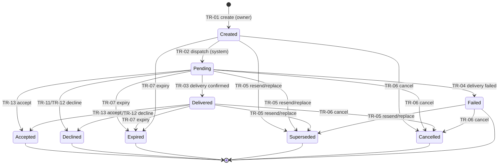

# CBD-73 — Invitation, Consent, and Revocation Lifecycle Specification

| Field | Value |
| --- | --- |
| Status | **Draft v0.1 — Product Owner review required** |
| Document version | 0.1 |
| Owner | Alexander Wohlford |
| Jira | [CBD-73](https://cobudget.atlassian.net/browse/CBD-73) |
| Parent | [CBD-12](https://cobudget.atlassian.net/browse/CBD-12) |
| Epic | [CBD-1](https://cobudget.atlassian.net/browse/CBD-1) |
| Governing permission model | CBD-72 Collaboration Permission Model **v0.1.53**, approved August 18, 2026 (`docs/cbd-72-collaboration-permission-model.md`) |
| Governing schedule decisions | CBD-71 **MVP Schedule Decisions v1.1**, approved August 15, 2026 |
| Governing product decisions | `RI-93-001`–`RI-93-019` dispositions recorded August 16, 2026 in `docs/cbd-95-architecture-roadmap-follow-up-register.md` §6 |
| Message inventory | `docs/cbd-73-customer-message-inventory.md` |
| Test inventory | `docs/cbd-73-negative-recovery-test-inventory.md` |
| Traceability and review | `docs/cbd-73-acceptance-criteria-traceability.md` |
| Last updated | August 18, 2026 |

> **Authority:** The approved CBD-72 permission model, the CBD-11/CBD-71 inherited rules, and the August 16, 2026 `RI-93-*` Product Owner decisions are controlling inputs. This specification defines the invitation, informed-consent, membership-change, revocation, and removal lifecycle that consumes them. It cannot weaken or broaden an approved outcome without explicit change control. Execution-level mechanisms named in §15 may refine mechanics but not outcomes.

## 1. Purpose

This specification defines the complete lifecycle contract for budget-space collaboration membership: how an invitation is created and delivered, how the recipient proves control of the invited channel, what the recipient sees before consenting, what acceptance records, how roles and resource scopes change after acceptance, and how participation ends through revocation or removal. It is written to be complete enough for interface design, server-side policy design, data modeling, message drafting, threat review, and deterministic negative testing.

It defines requirements and outcomes. Exact code format, expiry durations, limiter values, template strings, and cache/job/session mechanisms remain execution-level decisions (§15).

## 2. Scope and vocabulary

| Term | Meaning |
| --- | --- |
| Invitation | A server-side record offering one person one proposed role in one budget space, delivered to one intended email address or mobile phone number. |
| Reconciliation code | The opaque, single-use secret embedded in the invitation link. It resolves the authoritative server-side invitation record and confers nothing by itself. |
| Invited channel | The exact email address or mobile phone number the invitation targets. |
| Channel verification | Proof, performed during the acceptance ceremony, that the acting person controls the invited channel. Verification is not consent and is not account authentication. |
| Acceptance ceremony | The bounded server-mediated flow from opening the link through explicit affirmative acceptance or decline. |
| Consent evidence | The durable record proving versioned, informed agreement: person, budget space, role, resource scope, timestamp, consent-copy version, and source. |
| Notification-only destination | An optional, separately verified destination nominated during acceptance under `RI-93-011`. It receives supported notifications and nothing else. |
| Inviter block | The recipient-controlled, account-level suppression of future invitations from one inviter under `RI-93-010A`. |
| Revocation | A member ending their own participation in one budget space. |
| Removal | An authorized owner ending another member's participation in one budget space. |
| Roles | Primary Owner, Co-owner, Collaborator, Viewer, and Accountability Partner, exactly as defined by CBD-72 §2.2. |

## 3. Governing invariants

| ID | Invariant | Source |
| --- | --- | --- |
| IC-73-001 | Only the Accepted state confers anything. An invitation in every other state confers no role, access, action, visibility, derived data, export, search result, alert eligibility, or notification-destination activation. | CBD-72 §2.1; CBD-73 scope |
| IC-73-002 | Link possession is never authority. The link exposes only an opaque, single-use reconciliation code; role, scope, recipient, consent, and invitation state are loaded from and validated against the authoritative server-side invitation record at every use. | CBD-73-AC16; CBD-12-AC35 |
| IC-73-003 | The recipient must verify control of the exact invited channel before acceptance. A forwarded link alone is insufficient, and verification is not consent. | CBD-73-AC15; CBD-12-AC34; approved consent policy |
| IC-73-004 | Acceptance requires an explicit affirmative action, separate from opening the link and from channel verification, taken by an authenticated account after complete current-version disclosure, and produces durable consent evidence. | CBD-73-AC04; CBD-12-AC14 |
| IC-73-005 | Channel control is not sole control. Verification and possession confer no identity, login, recovery, primary-contact, or account authority, and recorded consent is not proof of voluntariness. | RI-93-016; FU-95-007 boundary |
| IC-73-006 | Superseded, consumed, cancelled, expired, and declined codes permanently confer nothing. Prior codes can never restore access; restoration after any terminal outcome requires a new invitation. | CBD-73-AC05/AC10; CBD-12-AC15/AC35 |
| IC-73-007 | A role or resource-scope expansion requires explicit disclosure and new consent before expanded access begins. A reduction takes effect immediately with notification and never requires the affected member's consent. | CBD-73-AC06/AC07; CBD-12-AC16 |
| IC-73-008 | Revocation and removal stop budget-space authorization and alert delivery immediately, suppress queued notifications, and invalidate the affected access in existing sessions without signing the person out globally. The effect is scoped to one membership: sign-in, other budget-space memberships, and other roles are untouched. | CBD-73-AC09/AC10; CBD-12-AC17 |
| IC-73-009 | Previously contributed shared work remains in the budget space and stays attributed to the former member. Attribution changes only through the separately approved terminal account-deletion disposition (`RI-93-018`), which is out of CBD-73 scope. | CBD-12-AC17; CBD-92 PA-92-006 |
| IC-73-010 | Invitation surfaces use uniform, non-enumerating outcomes. No response, timing difference, status label, count, or error distinguishes a blocked inviter, a rate-limited pair, a nonexistent account, or another person's private state. | RI-93-010; CBD-92 RL-92-003–005; FU-95-019 |
| IC-73-011 | Authorization is default-deny, evaluated server-side at protected-detail open time and mutation time; permission loss invalidates open work; a denied mutation changes no state and is audited; concurrent changes never silently overwrite confirmed state. | CBD-72 PM-72-001–005 |
| IC-73-012 | Consent is membership- and budget-space-specific. No consent, block, or preference recorded here creates account-global authority, and nothing in this lifecycle alters another budget space. | CBD-73 planning notes; CBD-72 PM-72-010 |
| IC-73-013 | Every customer-facing message in this lifecycle follows the approved `RI-93-016` semantic standard, and each external delivery stays within the approved CBD-92 channel ceilings. Exact strings, locales, and accessibility evidence remain gated under `FU-95-017`. | RI-93-016; FU-95-001 decision; FU-95-017 |
| IC-73-014 | The one bounded exception to unilateral self-revocation is a sole active Primary Owner, whose supported exits are Primary ownership transfer and budget-space archival; the interface always offers both. No other member's exit requires anyone's approval. | CBD-12-AC17; CBD-72 §6.3 |

## 4. Invitation lifecycle state model

### 4.1 States

An invitation record moves through the following states. The reconciliation code is a separate object whose validity is derived from the invitation state (§4.3): the code is usable only while its invitation is active and becomes permanently unusable the moment the invitation leaves the active set.

| State | Class | Meaning |
| --- | --- | --- |
| Created | Active | The record and its code exist server-side; delivery has not been requested. No recipient-facing artifact exists yet. |
| Pending | Active | Delivery was requested; no delivery confirmation has been observed. On channels without delivery confirmation, Pending is the ordinary pre-acceptance state. |
| Delivered | Active | The delivery provider confirmed delivery to the invited channel. Confirmation changes only inviter-facing status; it grants the recipient nothing. |
| Accepted | Terminal | The verified, authenticated recipient completed the explicit affirmative acceptance; membership activated atomically; the code is Consumed. The only state that confers anything (IC-73-001). |
| Declined | Terminal | The verified recipient explicitly declined during the acceptance ceremony (`RI-93-010B`), with or without invoking the inviter block. |
| Expired | Terminal | The expiry time passed without a terminal outcome. |
| Superseded | Terminal | A resend or replacement created a successor invitation; this record and its code are permanently invalidated (CBD-73-AC05). |
| Cancelled | Terminal | An authorized owner withdrew the invitation before acceptance, or the system cancelled it because its creating authority was revoked (§4.4 item 6). |
| Failed | Terminal-recoverable | Delivery conclusively failed (bounce, rejection, undeliverable destination). The record is inactive; the safe recovery is resend/replacement or cancellation by the inviter. |

**Consumed** is the terminal disposition of the reconciliation code, reached exactly once, through acceptance. A consumed code is permanently unusable and any later presentation is denied and audited (IC-73-006). AC01's consumed outcome is therefore modeled on the code object, where single-use is enforced.

**Declined** extends the AC01 minimum state list. It is required by the approved `RI-93-010B` decision (an explicit decline-once / decline-and-block choice) and by the rejected-invitation language in the CBD-73 scope; the traceability record notes this addition.

### 4.2 State diagram

The ceremony steps between opening the link and the terminal outcome (code resolution, channel verification, account attachment, disclosure) are recorded events, not invitation states; the invitation remains in its active state until a terminal transition commits (§4.4 items 8–10).

### 4.3 Code validity

1. Each invitation has exactly one active reconciliation code at a time. The stored form is non-readable (hashed or equivalent, per `DI-91-006`); the raw bearer value exists only in the recipient delivery and in the acceptance request.
2. The code encodes no role, scope, recipient identity, budget-space identity, or expiry; all of those live only in the server-side record (IC-73-002).
3. The code is valid only while its invitation is in an active state. Acceptance consumes it; every other terminal transition invalidates it. The invalidation set — superseded, consumed, cancelled, expired, declined — is permanent (IC-73-006).
4. Presenting any invalid code produces the uniform safe outcome (`MSG-73-020`), changes no state, and is audited (`AE-73-14`). Repeated presentation of consumed or invalidated codes is a security-relevant signal routed to the `FU-95-015` abuse controls.

### 4.4 Transition table

Each row states the authorized actor, preconditions, resulting state, customer message, notification fan-out, audit event, and failure/recovery behavior (CBD-73-AC12). Message IDs resolve in `docs/cbd-73-customer-message-inventory.md`; audit IDs in §14.

| ID | Transition | Authorized actor | Preconditions | Resulting state | Customer message | Notifications | Audit | Failure and recovery |
| --- | --- | --- | --- | --- | --- | --- | --- | --- |
| TR-73-01 | Create invitation | Primary Owner or Co-owner for Collaborator, Viewer, or Accountability Partner invitations (CBD-72 permission 24); Primary Owner only for a Co-owner invitation (permission 26) | Active membership with the required role; live budget space (`DI-91-004` archival stops invitations); exactly one intended email address or mobile phone number; valid proposed role and permitted visibility scope (§7.2); inviter block check passes silently (§8.2); pair-scoped limit not exhausted (§8.3) | Created | `MSG-73-001` (inviter confirmation) | None beyond the inviter surface | AE-73-01 | Authorization failure denies with no record and a denial audit event. A blocked or rate-limited creation returns the uniform non-disclosing outcome (IC-73-010): the inviter surface behaves as if the invitation were created and proceeds to a non-delivering path, or presents the uniform limit message where the Product Owner's approved copy requires one; no outcome reveals a block. |
| TR-73-02 | Dispatch | System | Invitation Created; delivery provider available | Pending | None | External delivery to the invited channel (`MSG-73-002`, within channel ceilings) | AE-73-02 | Provider unavailability retries within execution-level bounds; conclusive failure follows TR-73-04. |
| TR-73-03 | Delivery confirmation | System, on provider evidence | Invitation Pending; provider confirms delivery | Delivered | Inviter-visible safe status update | None | AE-73-03 | Absent confirmation the invitation simply remains Pending; both are valid pre-acceptance states. |
| TR-73-04 | Delivery failure | System, on provider evidence | Invitation Pending; conclusive bounce/rejection | Failed | Inviter-visible safe status (`MSG-73-003`) | Inviter notified per their personal preferences | AE-73-04 | Recovery is inviter resend/replacement (TR-73-05) after correcting the destination, or cancellation (TR-73-06). Failure detail never exposes recipient account existence (IC-73-010). |
| TR-73-05 | Resend / replace | Same authority as TR-73-01 | Invitation in any active state or Failed; limits pass (§8.3 counts this attempt) | Old invitation Superseded; successor invitation Created with a new code and current disclosure version | `MSG-73-004` (inviter), successor delivery via TR-73-02 | None beyond delivery | AE-73-05 | Every superseded code is permanently invalidated at commit (CBD-73-AC05). A stale resend against an invitation that reached a terminal state concurrently is denied without partial state (PM-72-005). |
| TR-73-06 | Cancel | Same authority as TR-73-01; system under item 6 below | Invitation in any active state or Failed | Cancelled | `MSG-73-005` (inviter confirmation) | None. A recipient who later presents the code receives the uniform outcome `MSG-73-020` | AE-73-06 | Cancellation is idempotent against already-terminal states: the attempt is rejected safely with current status shown to the inviter. |
| TR-73-07 | Expire | System clock | Expiry time reached while the invitation is active | Expired | None at expiry; later code presentation receives `MSG-73-020` | Inviter-visible safe status; no external notification is sent for expiry | AE-73-07 | Expiry duration is an execution-level parameter (§15). Expiry during an in-progress ceremony causes the commit-time recheck to deny acceptance safely (TR-73-13 failure path). |
| TR-73-08 | Open link / resolve code | Whoever possesses the link | None — resolution validates the presented code against the server-side record | No state change | Valid: `MSG-73-010` ceremony entry. Invalid or inactive: uniform `MSG-73-020` | None | AE-73-08 | Resolution grants nothing (IC-73-002). Pre-verification surfaces disclose no budget-space, inviter, or recipient detail beyond the approved ceremony-entry minimum (§7.1). |
| TR-73-09 | Verify invited channel | The person acting in the ceremony | Active invitation; valid code; verification of the exact invited channel completed within the ceremony's bounded attempts | No state change; verification evidence recorded | `MSG-73-011` | None | AE-73-09 | Failed or abandoned verification leaves the invitation active and unusable for acceptance; bounded attempts and cooldowns follow `FU-95-015` controls; outcomes are uniform (IC-73-010). |
| TR-73-10 | Attach account | The verified recipient | Channel verified in this ceremony; the person authenticates an existing CoBudget account or completes new-account sign-up through the identity workstream (out of CBD-73 scope) | No state change; candidate account binding recorded | `MSG-73-012` | None | AE-73-10 | The invitation may attach to an existing account whose primary email address or phone number differs from the invited channel (CBD-73-AC17). Attachment confers no membership, and the invited channel is not promoted to any account or notification destination (IC-73-005, §9). |
| TR-73-11 | Decline once | The verified recipient | Channel verified; explicit decline choice made on the unselected choice surface (`RI-93-010B`) | Declined | `MSG-73-013` (recipient) | Inviter-facing status follows the gated presentation decision in §15 item 7 | AE-73-11 | Interruption, timeout, or ambiguity is not a decline and creates no block; the invitation stays active until expiry or another terminal transition. |
| TR-73-12 | Decline and block inviter | The verified recipient | As TR-73-11, with the explicit block choice selected | Declined, plus an active inviter block record (§8.2) | `MSG-73-014` (recipient, including how to remove the block) | None to the inviter; the block is invisible to them (`RI-93-010A`) | AE-73-12 | The block is account-level, applies across all budget spaces, and persists until the recipient removes it. Failure to write the block fails the decline atomically rather than declining without the protection the person chose. |
| TR-73-13 | Accept | The verified, authenticated recipient | Active invitation; valid code; channel verified in this ceremony; account attached; complete current-version disclosure presented (§7); explicit affirmative acceptance action; at commit: budget space live, invitation and code still active, proposed role and scope still valid, creating authority not revoked, one-Primary invariant preserved for Co-owner outcomes | Accepted; code Consumed; membership Active with the consented role and any consented initial visibility scope; consent evidence recorded (§13 DR-73-04); a nominated destination activates only if its own verification succeeded (§9) | `MSG-73-015` (recipient welcome/confirmation) | Recipient; inviting owner; other members per the approved two-way disclosure semantics (§7.3) and their personal delivery preferences | AE-73-13 (correlated event group) | Any failed commit-time recheck denies atomically with no partial membership, no consumed code, and no destination activation; the recipient sees the safe current status (`MSG-73-021`) and the safe recovery is a fresh invitation from the space. Concurrent supersede/cancel/expiry wins deterministically; acceptance never resurrects a terminal invitation. |
| TR-73-14 | Present invalid, superseded, consumed, cancelled, expired, or declined code | Whoever possesses the link | None | No state change | Uniform `MSG-73-020` with the safe recovery path | None | AE-73-14 | Recovery from every invalid-code condition is identical and understandable: the holder is told the link is no longer valid and, where appropriate, to ask the budget space for a new invitation (CBD-73-AC05). Repeated attempts feed abuse controls (§4.3 item 4). |

Additional transition rules:

1. Creation, resend, cancellation, and acceptance each recheck current authorization and current invitation state at commit time (PM-72-002/003); a stale actor or stale record denies without partial state (PM-72-005).
2. Delivery uses the minimum destination and message content the channel contract allows (`DI-91-054`; §7.1). The external invitation message is a purpose-specific delivery surface under the approved August 16, 2026 channel decision; its exact template is gated (§15 item 4).
3. Pre-acceptance, the inviter and owners see only safe status (created/pending/delivered/failed/terminal), never the recipient's account existence, verification progress, block state, or any acceptance-ceremony detail (`DI-91-054` prohibited disclosure; IC-73-010).
4. A recipient may hold multiple invitations from different spaces or inviters; each is independent (IC-73-012). Within one space, issuing a new invitation to the same intended recipient while one is active uses TR-73-05 semantics: the older invitation is superseded, never left as a duplicate (CBD-73-AC05).
5. Acceptance while the recipient already holds an active membership in that budget space is denied at commit: one active role per person per space (CBD-72 §2.1). The safe recovery is the §10 role-change path, not a second membership.
6. **Creating-authority revocation.** If the membership that created an invitation loses owner authority before acceptance, the invitation is an open work product of lost permission and is cancelled by the system at that revocation (PM-72-003 applied to invitations; cause recorded). Another owner may issue a fresh invitation. This rule is a CBD-73 proposal for Product Owner review, marked in the traceability record.
7. Nothing in any pre-acceptance state creates alert eligibility, notification-destination activation, search visibility, export inclusion, or derived-data presence (IC-73-001; CBD-72 §2.1).

## 5. Invited-channel verification and account attachment

1. Acceptance is impossible without verification of control of the exact invited channel in the current ceremony (IC-73-003). A forwarded, shared, or leaked link fails at this step even with a valid code.
2. Verification uses a channel-appropriate proof (execution-level mechanism, §15) bound to the invitation and ceremony. Verification evidence records channel, method class, time, and outcome (§13 DR-73-03) — never the raw secret.
3. Verification is not consent, is not account authentication, and confers no identity, login, recovery, or primary-contact authority (IC-73-005). It unlocks exactly one thing: continuing the ceremony.
4. After verification, the invitation may attach to the recipient's existing CoBudget account even when that account's primary email address or phone number differs from the invited channel (CBD-73-AC17; CBD-12-AC36). The invited channel is not added to the account, is not promoted to a notification destination, and gains no account authority by attachment (IC-73-005; §9).
5. A person without an account completes account creation through the identity workstream (`FU-95-007`; CBD-21/CBD-41/CBD-104) and returns to the ceremony; identity-provider mechanics are out of CBD-73 scope.
6. Verification attempts are bounded, rate-limited, cooled down, and uniformly answered under the `FU-95-015` abuse controls; no verification outcome discloses whether an account exists for the channel (IC-73-010).

## 6. Consent policy

1. Opening the link is not consent. Verifying the invited channel is not consent. Only the explicit affirmative acceptance action, taken after the complete current-version disclosure, is consent (approved consent policy; IC-73-004).
2. Consent evidence records person, budget space, role, resource scope, timestamp, consent-copy version, and source (CBD-73-AC04; §13 DR-73-04). The source names the acceptance surface and the invitation record and version it resolved.
3. Consent is versioned. A material change to the disclosure content, proposed role, or permitted scope after dispatch requires replacement (TR-73-05) so the recipient always consents to the current version; an acceptance against a stale disclosure version is denied at commit (TR-73-13).
4. Consent is membership- and budget-space-specific (IC-73-012). Acceptance in one space consents to nothing in any other space and to no account-global behavior.
5. Recorded consent is evidence of the ceremony, not proof of voluntariness (`RI-93-016`). Consent, decline, and revocation copy must remain voluntary, accessible, and nonjudgmental and must always include a safe path to decline or leave (CBD-73-AC13; message inventory §3).

## 7. Pre-acceptance disclosure

### 7.1 Surface boundary

1. The external delivery message (email or SMS) carries the minimum needed to act: the link with its opaque code and generic CoBudget framing within the approved channel ceilings. Protected detail belongs to the authenticated, verified ceremony surfaces, not to the external message (FU-95-001 decision; IC-73-013). The exact external template is gated (§15 item 4).
2. Before channel verification, the ceremony surface discloses only the approved ceremony-entry minimum — that this is a CoBudget invitation requiring verification — and no budget-space identity, inviter identity, member list, or financial data (IC-73-010).
3. The full disclosure below is presented only after channel verification, and acceptance additionally requires authentication (§5).

### 7.2 Required disclosure content

Before the acceptance action, the recipient sees, in the current consent-copy version (CBD-73-AC03; CBD-12-AC13; `RI-93-009`):

1. The budget-space identity and the inviting member's display identity.
2. The proposed role, in approved role terminology, and what that role can and cannot do — the permitted actions and restrictions inherited from CBD-72.
3. The shared resources the role would see: for a Viewer, the intended initial visibility profile and scope groups the invitation carries (or that the membership starts with no visibility if none is carried); for an Accountability Partner, the fixed comprehensive financially read-only boundary of CBD-72 §5.3; for a Collaborator or Co-owner, the full shared financial scope; never actual pre-consent financial data, hidden resources, private member details, or a member list beyond what the approved disclosure names (`RI-93-009`).
4. The two-way view: what existing members will see about the acceptor after acceptance — display identity, role, and attributed activity per CBD-72 permission 1 and `DI-91-065` — and what remains private to the acceptor (personal notification settings, personal alert state, other-space memberships).
5. The authorized alert behavior of the role: whether and how the member can receive alerts about budget-space activity, and for an Accountability Partner the informational-alert eligibility, stated within the CBD-71/CBD-72 alert invariants.
6. The revocation method: that the member may leave unilaterally at any time (with the IC-73-014 sole-Primary exception stated where it could ever apply), that owners may remove non-owner members, and what removal does and does not affect.
7. The consequence boundary of acceptance: acceptance activates the role immediately; no payment, financial, legal, or bank-account authority is created (CBD-72 §1).
8. The `RI-93-010B` unselected choice — accept, decline once, or decline and block this inviter — presented without a default.
9. The optional `RI-93-011` notification-only destination nomination (§9), including that the invited channel does not automatically become a notification destination.

A Viewer invitation carrying an intended initial visibility profile does not weaken CBD-72 §5.1 item 1: the Viewer role itself continues to confer nothing, and visibility exists only through an explicitly assigned profile. Here the disclosed initial profile is consented at acceptance and applied in the same atomic commit; an invitation carrying no profile produces a membership with no visibility until the §10 change path runs.

### 7.3 Two-way member notice at acceptance

At acceptance, affected members are notified per CBD-73-AC11 within their personal delivery preferences and the channel ceilings: the new member's display identity and role, and nothing about the acceptance ceremony, invited channel, or destination choices. This completes the two-way disclosure whose acceptor-facing half is §7.2 item 4.

## 8. Decline, inviter block, and invitation limiting

### 8.1 Decline

1. The decline choice appears only on the post-verification ceremony surface, as an explicit unselected choice alongside acceptance (`RI-93-010B`).
2. Decline once (TR-73-11) ends this invitation and creates no persistent state; a future invitation from the same inviter is permitted, subject to §8.3.
3. Decline and block (TR-73-12) ends this invitation and creates the §8.2 block in the same atomic commit.
4. Interruption, ambiguity, timeout, or abandonment neither declines nor blocks (`RI-93-010B`).

### 8.2 Inviter block (`RI-93-010A`)

1. The block is recipient-controlled, account-level state binding one blocked inviter (an authenticated account) for the blocking recipient, across all budget spaces, until the recipient removes it.
2. While active, invitation creation and resend targeting the blocking recipient by the blocked inviter are suppressed with uniform non-disclosing outcomes: the inviter observes nothing that distinguishes a block from an ordinary unaccepted invitation (IC-73-010).
3. The block changes no existing membership in any space and has no effect on any other inviter (`RI-93-010A`).
4. The recipient manages their blocks in their personal account settings; the list, its existence, and its changes are invisible to every other person, and block records never appear in budget-space-scoped audit surfaces (§14 item 4).
5. Block matching against an intended invitation destination that is not yet linked to an account uses the same privacy-preserving key derivation as §8.3, so an unlinked destination neither defeats the block nor becomes a recipient-existence oracle. Key derivation is recorded in `PR-94-002` (§15 item 3).

### 8.3 Pair-scoped invitation limit (`RI-93-010C`)

1. A cross-space limit is keyed to the authenticated inviter plus a privacy-preserving recipient key. It counts inviter-originated create and resend attempts, never recipient actions.
2. There is no recipient-wide quota: limiting one inviter–recipient pair never affects the recipient's ability to receive invitations from anyone else, and legitimate unrelated inviters are never throttled by another inviter's behavior (`FU-95-019`).
3. Exhaustion produces uniform, non-disclosing outcomes with equivalent responses and timing (CBD-92 `RL-92-003`–`RL-92-005`; IC-73-010).
4. No raw recipient identifier is stored or logged in limiter state; exact values, key derivation, storage, and recovery evidence are recorded in `PR-94-002` (§15 item 3).
5. The limit composes with the volume ceiling on the invitation surface (`RL-92-001`) and the `FU-95-015` abuse controls; the strictest applicable control governs.

## 9. Notification-only destination (`RI-93-011`)

1. During acceptance, the recipient may optionally nominate one notification-only destination different from the invited channel, because the invited channel is verified for control but not for sole control.
2. The nominated destination requires its own separate verification. Failed, stale, or abandoned destination verification activates nothing and does not block ordinary acceptance.
3. The destination activates only in the atomic acceptance commit (TR-73-13) and only when its verification succeeded. Nothing activates on decline, expiry, supersede, cancellation, or failed acceptance.
4. The destination is invisible to the inviter and to every other budget-space member (CBD-72 §5.4 personal-settings boundary).
5. The destination is notification-only: it grants no identity, login, recovery, primary-contact, account, invitation-proof, or acceptance authority (IC-73-005), and it follows the current channel ceilings and the recipient's personal delivery preferences.
6. The invited channel is never automatically promoted to a personal notification destination; any later destination change uses the recipient's ordinary personal notification settings, outside CBD-73 scope.

## 10. Role and resource-scope changes after acceptance

1. Owner authority to propose changes is exactly CBD-72's: permission 25 for non-owner role transitions, permission 22 for Viewer profile and scope groups, permission 26 for Co-owner appointment, §6.2 for Primary transfer.
2. **Classification.** A change is an expansion if it would add any authority or visibility the member does not hold immediately before the change: a role transition to broader authority, a first Viewer profile assignment, a profile widening, or added scope groups. A change that only removes authority or visibility is a reduction. A mixed change (for example Collaborator to Viewer with a new profile) is classified as an expansion for its added part and is consent-gated as a whole, because CBD-72 role transitions commit atomically.
3. **Expansion.** The proposed change is disclosed to the affected member in the current consent-copy version — before/after role and scope, what becomes visible or possible, and the revocation method — and takes effect only when that member gives a new explicit affirmative consent (IC-73-007). Consent evidence is recorded with the same DR-73-04 fields, with the change proposal as source. Until consent, nothing changes and no expanded access begins. A proposal expires or is withdrawn without effect (execution-level duration, §15).
4. **Reduction.** The change commits immediately and atomically: lost access, derived artifacts, caches, open work, reports, alerts, pending downloads, and packages are invalidated per CBD-72 permissions 22/25, and the affected member is notified with safe before/after semantics (`RI-93-015`; `MSG-73-032`). The member's consent is not required to lose access, and there is no actor-only reversal window: restoration is a fresh consented grant (`RI-93-003`).
5. Consent to an expansion is invalidated by any material change to the proposal; commit rechecks proposal version, membership state, and authorization versions and denies stale commits without partial state (PM-72-003/005).
6. Co-owner appointment acceptance (CBD-72 permission 26) and Primary ownership transfer acceptance (§12) are expansions and use this section's consent machinery with their additional CBD-72 safeguards.
7. Every proposal, consent, denial, commit, and invalidation is audited (§14) and notified per CBD-73-AC11.

## 11. Revocation and removal

### 11.1 Authority

| Action | Authority | Source |
| --- | --- | --- |
| Revoke own participation | Any member, unilaterally, without another party's approval — except a sole active Primary Owner, whose supported exits are transfer and archival, both always offered (IC-73-014) | CBD-12-AC17; CBD-72 §6.3 |
| Remove a Collaborator, Viewer, or Accountability Partner | Primary Owner or any Co-owner, through a prominent confirmation flow naming the member and the consequences | CBD-72 permission 24 |
| Remove a Co-owner | Primary Owner only, as a protected action under the CBD-72 §6.1 contract (fresh reauthentication, explicit named confirmation, commit-time recheck) | CBD-72 permission 27 |
| Remove or demote the Primary Owner | Nobody; atomic transfer (§12) is the only replacement path | CBD-72 permission 28 |
| Cancel a pending invitation | §4.4 TR-73-06 | CBD-72 permission 24 |

Self-revocation requires an explicit confirmation naming the budget space and the consequences; it is deliberately low-friction and never requires approval, a reason, a waiting period, or another party's action (CBD-73-AC13 safe-leave requirement).

### 11.2 Revocation and removal execution checklist

Every revocation and removal executes all of the following, atomically where marked, and the checklist is the deliverable contract for CBD-73-AC09/AC10. Items marked *(execution-level)* state the required outcome; the mechanism is an architecture decision (§15).

| ID | Requirement | Timing |
| --- | --- | --- |
| RC-73-01 | End the membership's authorization: every subsequent read, mutation, search, report, export, and derived-data evaluation for that membership denies (PM-72-001/002). | Atomic with commit |
| RC-73-02 | End alert eligibility: the former member's eligibility closes, their open recipient-personal instances close per CBD-72 §5.4.1 item 2, and no new instance is created for them. | Atomic with commit |
| RC-73-03 | Suppress queued, unsent notification delivery attempts addressed to the former member for this budget space (CBD-72 §5.4.1 item 2). Already-delivered external copies are outside anyone's recall and are never claimed to be revocable (`RI-93-016`). | Immediate |
| RC-73-04 | Invalidate the affected budget-space access in existing sessions without signing the person out of CoBudget globally: the session survives; its authority in this space ends *(execution-level: session/cache versioning per `FU-95-007`)*. | Immediate |
| RC-73-05 | Invalidate caches, derived artifacts, open work, report caches, pending downloads, and undownloaded packages that depend on the ended membership's authorization *(execution-level: authorization-version keying per `FU-95-010`)*. | Immediate |
| RC-73-06 | Stop queued and scheduled jobs from acting under the ended authority: jobs reauthorize against current state before effect, so queued work for this membership denies at execution *(execution-level: `FU-95-009` envelope)*. | Before any later effect |
| RC-73-07 | Deny in-flight requests at their commit-time recheck (PM-72-002/003); a mutation that began under valid authority and commits after revocation fails without partial state. | At commit |
| RC-73-08 | Invalidate every invitation code ever associated with the person's membership in this space; prior codes cannot restore access, and restoration requires a new invitation (IC-73-006; CBD-12-AC17). | Atomic with commit |
| RC-73-09 | Preserve previously contributed shared work in the budget space, attributed to the former member via the safe display identity (`DI-91-065`); the former member loses the ability to read, edit, or remove it through the ended membership (CBD-72 §5.6 item 7). | Permanent |
| RC-73-10 | Leave every other budget-space membership, role, block record, personal notification setting, and the person's CoBudget sign-in untouched (IC-73-008). | Always |
| RC-73-11 | For a connection authorizer: stop that connection's synchronization, preserve imported records and provenance, make private configuration inaccessible, and transfer authority to nobody (CBD-72 §6.3; PM-72-011). | Immediate |
| RC-73-12 | Notify the affected person and the relevant owners with safe, nonjudgmental, non-attributing copy within channel ceilings (`RI-93-015` semantics; `MSG-73-033`–`MSG-73-035`); notification failure never delays or reverses the authorization cutoff. | Immediate, after commit |
| RC-73-13 | Record the complete audit group: request, confirmation/reauthentication evidence where required, commit, every checklist effect completion, and any denial (§14). | With each step |
| RC-73-14 | For removal flows, present the prominent confirmation naming the specific member, their role, and the concrete consequences before commit; for Co-owner removal additionally enforce the §6.1 protected-action contract. | Before commit |

### 11.3 What revocation and removal never do

1. Never sign the person out of CoBudget or touch another budget space (IC-73-008).
2. Never delete, reattribute, or orphan contributed shared work (IC-73-009).
3. Never expose why the person left or was removed, to anyone, in any notice, status, or export; copy never characterizes another person's circumstances (`RI-93-016`).
4. Never leave a budget space without an active Primary Owner (CBD-72 PM-72-008, §6.3): flows that would violate the invariant are denied and the transfer/archival exits are offered instead (IC-73-014).
5. Never grant the remover any new authority — no connection adoption (CBD-72 §6.3), no content moderation (CBD-72 §5.6 item 4), no personal-settings access (CBD-72 §5.4).

## 12. Primary ownership transfer consent ceremony

CBD-72 §6.2 and permission 29 control the transfer itself. CBD-73 owns its consent, disclosure, message, and audit contract:

1. Eligibility, the atomic commit, the resulting roles, and the connection-authority boundary are exactly CBD-72 §6.2 items 1–8; nothing here modifies them.
2. The recipient's acceptance is an expansion consent under §10: authenticated, against a versioned disclosure of the full financial and administrative access, protected Primary powers, prior-role termination consequences, and unchanged connection-authorizer boundaries (CBD-72 §6.2 items 2–3). Consent evidence is recorded with DR-73-04 fields plus the disclosure version and session-assurance reference (`DI-91-052`).
3. The current Primary's fresh reauthentication and explicit confirmation (CBD-72 §6.2 item 4) is recorded as its own consent-evidence record; both records join one correlated audit group with the commit (CBD-72 §6.2 item 8).
4. Inactive, stale, unaccepted, and self-transfer attempts are rejected at commit with no partial change (CBD-72 §6.2 item 5; scenario OWN-06); a stale disclosure version is an unaccepted attempt.
5. The prior Viewer profile/groups or Accountability Partner role state closes atomically in the commit; required consent and audit history is retained; personal preferences remain personal-account state (CBD-72 §6.2 item 7).
6. Support-mediated transfer remains refused as a product rule; the honest bounded response for a shut-out subject is `RI-93-017` copy scope under CBD-75, referenced by the message inventory but not defined here.

## 13. Invitation and consent data requirements

Each requirement names its governing CBD-91 data class; CBD-91 rules (audience, prohibited disclosure, retention) govern wherever this table is silent. Field lists are semantic requirements; physical schemas are implementation design that may narrow but not broaden them.

| ID | Record | Required content | Data class |
| --- | --- | --- | --- |
| DR-73-01 | Invitation record | Budget space; creating membership and its role at creation; delivery channel type; intended email address or mobile phone number (protected, masked in every non-delivery surface); proposed role; permitted visibility scope (Viewer intended initial profile/groups, Partner fixed-boundary marker, or role marker); issue time; expiry time; invitation version binding the disclosure/consent-copy version; current state and state history; supersede linkage in both directions; correlation IDs. | `DI-91-054` |
| DR-73-02 | Reconciliation code | Non-readable stored form; issue and expiry times; single active code per invitation; consumed/invalidated marker with cause and time; no role, scope, recipient, or space derivable from the code value; raw bearer value never stored, logged, or shown after dispatch. | `DI-91-006` |
| DR-73-03 | Channel-verification evidence | Invitation reference; channel; method class; bounded-attempt state; outcome and time. Distinct from consent and from account contact verification; never contains the verification secret. | `DI-91-054` / `DI-91-052` |
| DR-73-04 | Consent evidence | Person (account); budget space; membership; role; resource scope; timestamp; consent-copy version; source (surface plus invitation or change-proposal reference and version); ceremony correlation. For protected actions, the session-assurance reference. Retained to explain active and historical authority. | `DI-91-007` |
| DR-73-05 | Inviter block record | Blocking recipient account; blocked inviter account; created time; active until recipient removal. Personal-account state: invisible to the inviter and to budget-space surfaces; enforced at TR-73-01/TR-73-05 through privacy-preserving matching (§8.2 item 5). | `DI-91-001` scope (personal account) |
| DR-73-06 | Pair-scoped limiter state | Key of authenticated inviter plus privacy-preserving recipient token; inviter-originated create/resend counts; no raw recipient identifier stored or logged; retention only as long as enforcement needs; exact parameters recorded in `PR-94-002`. | `DI-91-054` boundary; `PR-94-002` |
| DR-73-07 | Notification-only destination record | Recipient account; destination; separate verification evidence and state; activation marker bound to the acceptance commit; invisible to every other member; conveys no identity, login, recovery, primary-contact, account, invitation-proof, or acceptance authority. | CBD-72 §5.4 personal-settings boundary |
| DR-73-08 | Membership-change proposal | Proposing membership; affected membership; before/after role and scope; classification (expansion or reduction); disclosure version; pending/consented/withdrawn/expired/committed state; commit evidence and correlation. | `DI-91-005` / `DI-91-007` |
| DR-73-09 | Revocation/removal record | Acting party (self or owner); affected membership; confirmation evidence; protected-action reauthentication reference where required (`DI-91-052`); commit time; per-item checklist completion evidence for RC-73-01–RC-73-12; correlation. | `DI-91-009` |

## 14. Audit-event inventory

Every event uses the CBD-72 §9 field schema: event ID, time, actor/principal, acting membership and role, budget space, action, target type and safe identifier, decision/result, policy/rule version, reason code, correlation ID, and safe semantic delta. Payloads never contain the raw reconciliation code, verification secret, unmasked destination, or data the audit viewer is unauthorized to inspect.

| ID | Event | Notes |
| --- | --- | --- |
| AE-73-01 | Invitation created / creation denied | Denials include blocked and rate-limited creations, recorded without disclosing the block or limit to the inviter-facing surface (item 4 below). |
| AE-73-02 | Invitation dispatched | Privacy-safe destination reference only. |
| AE-73-03 | Delivery confirmed | Provider evidence class, no payload. |
| AE-73-04 | Delivery failed | Safe failure class; no recipient-existence signal. |
| AE-73-05 | Invitation superseded (resend/replace) | Links predecessor and successor; records code invalidation. |
| AE-73-06 | Invitation cancelled | Actor or system cause (§4.4 item 6). |
| AE-73-07 | Invitation expired | System event. |
| AE-73-08 | Code resolution attempt | Valid and invalid outcomes; invalid attempts carry the presented-code state class (consumed, superseded, expired, cancelled, declined, unknown). |
| AE-73-09 | Channel verification attempt/outcome | Bounded-attempt state; no secret. |
| AE-73-10 | Account attached to ceremony | Account reference; no primary-contact comparison detail. |
| AE-73-11 | Invitation declined | Decline-once. |
| AE-73-12 | Invitation declined with inviter block created | The block-creation half is personal-account audit, not budget-space audit (item 4). |
| AE-73-13 | Acceptance committed | Correlated group: membership activation, code consumption, consent-evidence reference, optional destination activation, member notices. |
| AE-73-14 | Invalid/reused code presented | Feeds abuse controls (§4.3 item 4). |
| AE-73-15 | Acceptance denied at commit | Stale/ineligible/concurrent cause class; no partial state. |
| AE-73-16 | Destination verification attempt/outcome/activation/non-activation | Personal-account scoped. |
| AE-73-17 | Change proposed | Before/after role and scope, classification. |
| AE-73-18 | Change consent given / proposal declined / proposal withdrawn / proposal expired | Consent-evidence reference on consent. |
| AE-73-19 | Change committed | Expansion after consent; reduction immediately; invalidation set reference. |
| AE-73-20 | Change denied | Stale proposal, stale authorization, invariant violation. |
| AE-73-21 | Self-revocation committed | Includes the sole-Primary denial case as its paired denial event with exit offer (AE-73-24). |
| AE-73-22 | Member removed | Includes permission-24 removals and permission-27 protected Co-owner removal with reauthentication reference. |
| AE-73-23 | Revocation/removal effect completion | One correlated record per RC-73 checklist item that completes asynchronously (session invalidation, queue suppression, job revocation), so the cutoff is provable. |
| AE-73-24 | Sole-Primary self-revocation denied; transfer and archival exits offered | IC-73-014. |
| AE-73-25 | Ownership-transfer consent events | Recipient acceptance evidence, Primary confirmation evidence, commit, denial; correlated with the CBD-72 §6.2 item 8 event group. |
| AE-73-26 | Inviter block removed by recipient | Personal-account audit (item 4). |

Audit-placement rules:

1. Budget-space-scoped events (invitation lifecycle, acceptance, changes, revocation, removal, transfer) are auditable within the budget space and appear in the CBD-72 §5.7 customer administrative-history export allowlist where that allowlist already includes them: invitation/membership status transitions, role changes, ownership transitions, and protected-action outcomes with masked invitation channel.
2. Ceremony detail (verification attempts, account attachment, decline choice mechanics) is auditable for security purposes but is not member-visible detail and never appears in another member's surface or export.
3. Denied and failed protected actions appear in customer surfaces only as the CBD-72 §5.7 item 4 safe categories.
4. Block and limiter records are personal-account or security state, never budget-space audit: no owner-visible surface, export, or budget-space audit view can reveal a block's existence, a limit's state, or their changes (IC-73-010, `RI-93-010A`).

## 15. Execution-level decisions and gated work

These items are deliberately not decided here. Each names its owner or gate; none may weaken a §3 invariant.

| # | Item | Route |
| --- | --- | --- |
| 1 | Exact reconciliation-code format, entropy, and expiry duration; verification mechanism per channel; bounded-attempt values | Architecture/identity workstream `FU-95-007`; abuse values `FU-95-015` / `PR-94-002` |
| 2 | Session, cache, job, queue, and active-request invalidation mechanisms behind RC-73-04–RC-73-07 | `FU-95-007`, `FU-95-009`, `FU-95-010` |
| 3 | Pair-scoped limiter values, privacy-preserving recipient-key derivation, storage, and recovery evidence | `PR-94-002` (`RI-93-010C`) |
| 4 | Exact copy for every message, external delivery templates, email/SMS providers, locale and accessibility evidence | `FU-95-017`; `EG-91-006` / CBD-106; Product Owner approval of exact strings |
| 5 | Audit storage, integrity, and retention design | `FU-95-011` |
| 6 | Identity-provider, account-creation, and sign-in mechanics inside the ceremony | `FU-95-007` (CBD-21/CBD-41/CBD-104) |
| 7 | Whether the inviter-visible status of a declined invitation is distinguishable from expiry without action. The state model records Declined distinctly; the safe default pending decision is a non-attributing presentation, because attributing the decline creates a retaliation surface the block was approved to prevent | Product Owner, with the `FU-95-017` copy review |
| 8 | Whether §4.4 item 6 (system cancellation of invitations whose creating authority was revoked) is the approved rule | Product Owner review of this specification |

## 16. Revision history

| Version | Date | Author | Change | Approval |
| --- | --- | --- | --- | --- |
| 0.1 | August 18, 2026 | Claude with Alexander Wohlford as Product Owner | Initial complete draft: state model and transition table, code-validity rules, channel verification and account attachment, consent policy and two-way disclosure, decline/block/limit protections (`RI-93-010A`–`C`), notification-only destination (`RI-93-011`), post-acceptance change classification with expansion re-consent, revocation/removal authority and execution checklist, ownership-transfer consent ceremony, data requirements, audit-event inventory, and the execution-level register. | Draft; Product Owner review required |
