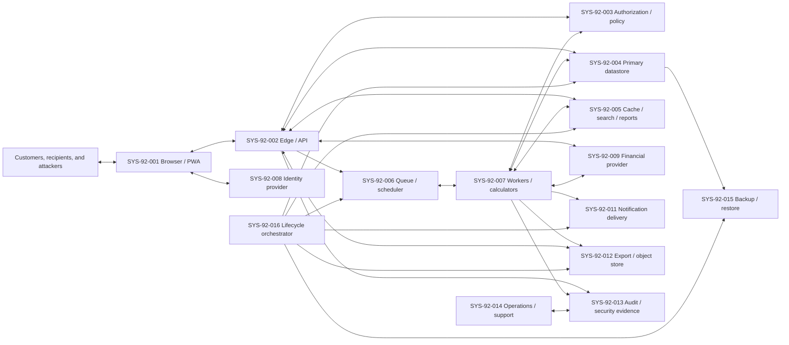
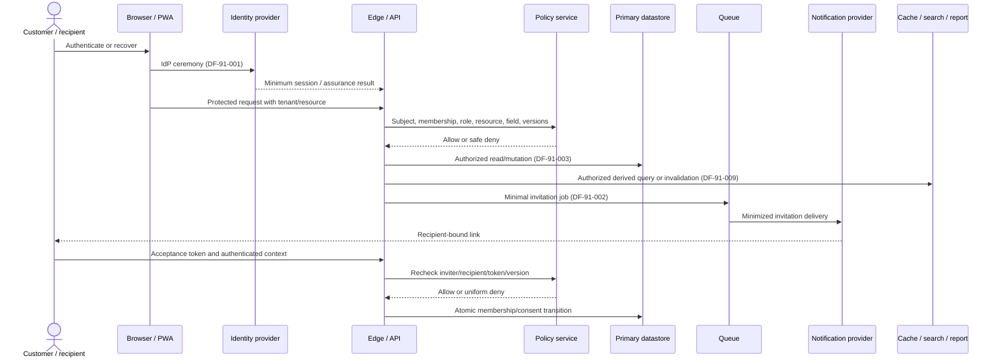
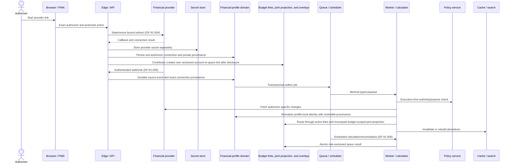
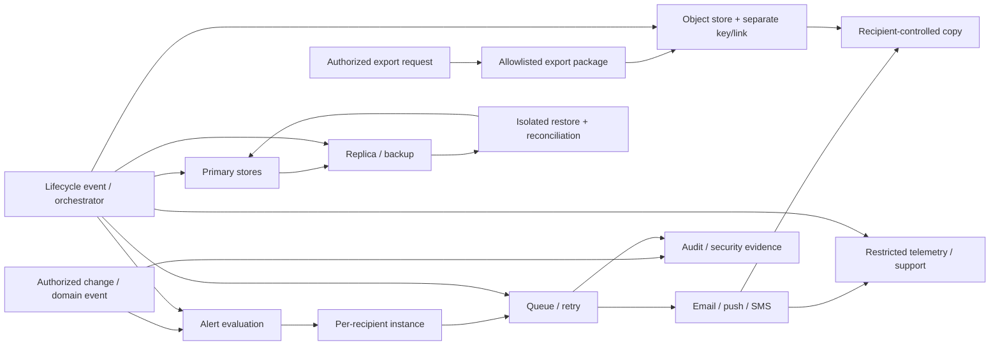

# CBD-92 — System Flow, Trust Boundary, and Technical Threat Model

| Field | Value |
| --- | --- |
| Status | **Approved** — Product Owner approved v1.0 on August 16, 2026 |
| Document version | 1.0 |
| Owner | Alexander Wohlford |
| Jira | [CBD-92](https://cobudget.atlassian.net/browse/CBD-92) |
| Parent | [CBD-14](https://cobudget.atlassian.net/browse/CBD-14) |
| Approved input | [CBD-91 — Private MVP Data Inventory](https://cobudget.atlassian.net/wiki/spaces/CBD/pages/8781826) v1.0 |
| Repository input | `docs/cbd-91-private-mvp-data-inventory.md` on `main` at the CBD-92 branch point |
| Last updated | August 16, 2026 |

## 1. Purpose, authority, and limits

This document models how Private MVP data crosses CoBudget system and trust
boundaries and identifies technical threats at those crossings. It supplies the
context diagrams, data-flow diagrams, trust-boundary register, stable-ID threat
register, initial technical-risk triage, and evidence-gap handoff required by
CBD-92.

It also records nine Product Owner-approved normative contracts: `SA-92-*`
background service authority (§2.4), `CA-92-*` financial-profile and budget-link
stewardship (§2.5), `CL-92-*` online-only client behavior (§2.6), `PA-92-*`
personal-account deletion and restoration (§2.7), `NT-92-*` push/SMS content
(§2.8), `EM-92-*` email content (§2.9), `OP-92-*` staff and exceptional
operations (§2.10), `AN-92-*` analytics and telemetry (§2.11), and `RL-92-*`
rate, quota, and resource ceilings (§2.12). Those
contracts are binding product decisions rather than analysis: a downstream
ticket or implementation may not relax one without a new Product Owner decision
and a new stable ID.

CBD-91 v1.0 is the approved data and flow baseline. Approved CBD-11/CBD-71
financial and schedule behavior and Product Owner-approved CBD-12/CBD-72 role,
consent, revocation, visibility, notification, lifecycle, and audit decisions
are fixed product inputs. A threat may require enforcement, verification, a
scoped restriction, or an explicit risk decision; it does not silently change
an approved product outcome.

This is a provider-independent conceptual model. Named providers and deployment
products in `docs/architecture.md` are hypotheses until CBD-15 and its provider
evaluations approve them. A box in a diagram establishes a security-relevant
responsibility and boundary, not a vendor, process count, network segment, or
final deployment topology.

This document does not:

* select hosting, identity, financial, notification, queue, cache, object-store,
  audit, backup, or key-management providers;
* approve a production architecture, retention schedule, mitigation plan, or
  residual risk;
* perform privacy/coercion analysis assigned to CBD-93;
* prioritize controls and verification assigned to CBD-94;
* claim legal compliance, penetration-test coverage, or production security.

The Product Owner approved this document on August 16, 2026 as the CBD-92
internal, provider-independent threat-model baseline, without an independent
security review. Approval authorizes CBD-93 and CBD-94 to consume the model. It
does not authorize implementation of any feature whose named evidence gap
remains blocking, and it makes no claim that an implementation enforces these
boundaries. Independent security review remains mandatory before public product
launch and may add or amend CBD-92 threats and CBD-94 risk, mitigation, and
verification decisions.

## 2. Modeling and technical-triage method

### 2.1 Stable identifiers

| Prefix | Meaning |
| --- | --- |
| `ACT-92-*` | Human, external, or service actor |
| `EP-92-*` | Entry point or privileged execution path |
| `SYS-92-*` | Logical system, store, or external dependency |
| `TB-92-*` | Trust boundary |
| `TH-92-*` | Technical threat |
| `RF-92-*` | CBD-92 review finding or unresolved design question |
| `SA-92-*` | Approved closed-list service-authority purpose |
| `CA-92-*` | Approved canonical-account stewardship rule |
| `CL-92-*` | Approved Private MVP client/offline rule |
| `PA-92-*` | Approved personal-account deletion/restoration rule |
| `NT-92-*` | Approved external-notification transport rule |
| `EM-92-*` | Approved Private MVP email-content rule |
| `OP-92-*` | Approved staff and exceptional-operations rule |
| `AN-92-*` | Approved Private MVP analytics and telemetry rule |
| `RL-92-*` | Approved rate, quota, and resource-ceiling rule |

CBD-91 IDs are reused without renumbering: `DI-91-*` identifies data/assets,
`DF-91-*` identifies flows, `EG-91-*` identifies evidence gaps, and `CR-91-*`
identifies source conflicts. Sensitivity levels `S1`–`S4` are the CBD-91 §2.1
scale and are not redefined here.

### 2.2 STRIDE application

STRIDE is applied to each entry point, privileged actor, trust-boundary crossing,
process, store, and external dependency:

| Category | Required question |
| --- | --- |
| Spoofing | Can a caller, recipient, provider, job, service, or operator be mistaken for another? |
| Tampering | Can payload, policy, state, ordering, provenance, or history be changed without detection? |
| Repudiation | Can a consequential action or denial occur without safe, attributable evidence? |
| Information disclosure | Can content, metadata, existence, counts, timing, destinations, or secrets cross an unauthorized boundary? |
| Denial of service | Can bounded resources or lifecycle progress be exhausted, blocked, or indefinitely retried? |
| Elevation of privilege | Can role, tenant, service authority, stale authorization, or administrative access exceed its intended scope? |

Enumeration, replay, IDOR, confused-deputy behavior, stale authorization,
cross-budget leakage, and audit compromise are treated as concrete STRIDE
mechanisms rather than separate rating categories.

### 2.3 Initial technical-risk triage

CBD-92 records a provider-independent **technical triage**, not a likelihood
estimate or residual-risk disposition. Deployment topology, provider controls,
implementation safeguards, operational exposure, and adversary evidence are not
yet sufficient to assign defensible probabilities. CBD-94 owns formal
likelihood, impact, priority, mitigation, verification, and residual-risk
decisions after those inputs exist.

| Technical exposure | Meaning at this stage |
| --- | --- |
| Broad | Public, customer, provider, or ordinary workflow path, or a repeatedly invoked asynchronous path |
| Conditional | Requires valid account or membership state, timing, partial access, a compromised dependency, or another material precondition |
| Restricted | Requires privileged operator/workload/key/backup access or multiple independent control failures |

Exposure describes **how the condition can be reached in the conceptual
model**, not how often exploitation will occur.

| Impact ceiling | Meaning at this stage |
| --- | --- |
| Critical | Cross-budget or broad S3/S4 compromise, durable loss of authority/integrity, or unrecoverable lifecycle failure |
| High | Material unauthorized financial/personal disclosure, privilege use, audit loss, or prolonged tenant outage |
| Medium | Bounded metadata disclosure, recoverable integrity loss, or limited availability loss |
| Low | Minimal content-free effect with straightforward recovery |

| Evidence confidence | Meaning at this stage |
| --- | --- |
| High | Approved requirements and explicit flows establish the condition and impact ceiling without depending on an unselected design |
| Medium | The conceptual interface is established, but architecture or control details could materially refine the condition |
| Low | The condition or impact depends materially on an unselected provider, topology, retention, support, analytics, key, backup, or recovery design |

The initial severity is `Critical` for Critical impact with Broad or Conditional
exposure; `High` for High impact with Broad or Conditional exposure or Critical
impact with Restricted exposure; `Medium` for Medium impact at any exposure or
High impact with Restricted exposure; and `Low` for Low impact at any exposure.
Exposure has no `Low` level, so exposure lowers a rating by at most one band and
never below the `Medium` floor that a High or Critical impact ceiling sets.
Evidence confidence does not reduce severity. It identifies where CBD-94 must
obtain design or provider evidence before making a formal risk judgment.

### 2.4 Closed-list background service-authority contract

Background execution has two authority modes. **User-delegated** work binds to
the initiating subject or recipient, tenant/resource scope, authorization
version, and applicable action assurance. **Service-authority** work is permitted
only for one of the `SA-92-*` purposes below and binds to the named purpose,
service-policy version, tenant/resource, and source consent or configuration
version required by that purpose. Missing, ambiguous, unlisted, or stale
authority fails closed.

| ID | Allowlisted service purpose | Authority basis and permitted effects | Stop/continuation rule |
| --- | --- | --- | --- |
| SA-92-001 | Connection-bound provider synchronization | Active authorizer consent and connection version, explicit budget-space/account link, current space lifecycle, and authenticated provider event or approved schedule. May fetch changes, preserve connection-specific observations, normalize through reversible provenance, persist results, and emit domain events. It grants no customer read or connection-management authority. | Stops immediately on consent revocation, disconnect, permanent orphaning, link removal, secret compromise, or space archival/deletion. A different active connection continues only under its own authorizer and provenance. |
| SA-92-002 | Schedule and period generation | Current live budget-space schedule/configuration and rule/reference-data versions. May generate or update deterministic system-owned period state required by approved schedule behavior. | Continues despite departure of the member who last edited the schedule because the approved configuration belongs to the live space; stops while archived, pending terminal deletion, or purged. |
| SA-92-003 | Deterministic recalculation and reconciliation | Current authorized shared records, provenance, financial/schedule rule versions, and live space/resource state. May calculate, reconcile, atomically replace derived system state, and emit invalidation/domain events. | Continues for current shared state despite an individual membership change; may not use data no longer linked/retained under its approved disposition and creates no authority to disclose a result. |
| SA-92-004 | Derived-data invalidation and controlled rebuild | Current resource, tenant, input-completeness, policy, and authorization-partition versions. May invalidate or rebuild partitioned cache/index/read-model material without answering a customer query or delivering a result. | Invalidates on every governing version change; rebuild fails closed when complete authorized partitioning cannot be established. Customer access remains separately authorized at query/open time. |
| SA-92-005 | Shared alert-fact evaluation | Current live shared financial state, fixed approved alert definition/rule version, and resource scope. May determine and persist a shared alert fact and trigger recipient-eligibility evaluation. It may not select a destination or disclose content by itself. | Stops alert generation while the space is archived or deleted. Per-recipient instance creation and every delivery require current recipient eligibility, authorization, consent/channel settings where applicable, and their own version checks. |
| SA-92-006 | Security and fraud/risk enforcement | Approved security/risk rule and minimum necessary security evidence. May detect, rate-limit, revoke, quarantine, or record only the security effect allowed by the purpose. | May continue after user authority removal only as needed to enforce or prove the security event; cannot perform unrelated product mutation or customer disclosure. |
| SA-92-007 | Audit and evidence preservation | Consequential event/decision, safe audit schema and policy version. May append, order, integrity-protect, and retain the minimum approved semantic evidence. | May continue after user authority removal under the approved evidence purpose; cannot copy secrets, refused content, or become a customer-data browsing path. |
| SA-92-008 | Lifecycle, retention, deletion, and restoration reconciliation | Valid approved lifecycle event, class-specific disposition, service-policy version, dependency order, and deletion/restore coverage state. May revoke, suppress, archive, delete, retain, reconcile, or expose only separately authorized safe status. | May continue after user authority removal until the approved lifecycle/security effect reaches terminal evidence or escalation; cannot perform unrelated product work or disclosure. |

The list is closed. Invitation creation/delivery, interactive mutation, report
calculation for a requester, export/snapshot generation, package download,
customer search/query, notification rendering/delivery, and ordinary
customer-data access are not service-authority purposes. They remain
user/recipient-delegated and require current execution-time authorization.
Adding a purpose requires Product Owner and security review, a new stable
`SA-92-*` ID, explicit data/effects and stop rules, and CBD-94 verification.

### 2.5 Financial-profile authority and explicit budget-link contract

The Product Owner approved CBD-91 §7.1 option 1 for the CBD-92 conceptual model.
The person-level financial-profile domain is the authoritative system steward
for each individual's provider connections and canonical provider/account
identity. A budget space receives only an explicitly linked safe representation
and remains a separate default-deny authority domain.

| ID | Approved stewardship rule | Required security effect |
| --- | --- | --- |
| CA-92-001 | Financial-profile stewardship | Provider consent, connection-private configuration, tokens, cursors, source observations, revocation state, and private provenance remain in the individual authorizer's financial-profile authority domain. Budget-space role or ownership never grants access to them. |
| CA-92-002 | Connection independence | Each provider connection has exactly one authorizer and retains its own consent, secret, cursor, revocation state, observations, provenance, repair, and disconnect lifecycle even when another connection appears to represent the same logical account. No connection inherits another connection's authority. |
| CA-92-003 | Profile-local canonicalization | Canonical provider/account identities remain inside the authoritative financial profile. Observations within that profile may share a normalized identity only after reliable provider identity or explicit confirmation, and retain reversible edges to every contributing connection. Weak identifiers, names, balances, timing, or membership alone never merge records. |
| CA-92-004 | Explicit budget-space link | Exposure to a budget space requires an independently authorized, versioned, revocable account-to-space link governed by `CA-92-009`. The link grants only the safe account representation and future routing allowed for that space; it grants no private connection control, source-provenance disclosure, membership, ownership, or authority in another space. Absence, ambiguity, staleness, or removal of the link fails closed. |
| CA-92-005 | Budget-space stewardship | Each budget-space domain is authoritative for its own planning classifications, visibility, comments, alerts, reconciliation decisions, aliases, and other space-specific overlays. An overlay cannot alter provider-source facts, private profile state, another space, or account-link authority. |
| CA-92-006 | Link-bound routing | Every provider event and synchronization result resolves the exact connection and provenance first, then routes only through currently active account-to-space links after independent lifecycle and version checks. A provider identifier, webhook, normalization match, or prior link cannot create or reactivate a link. |
| CA-92-007 | Separate unlink and disconnect effects | Unlinking stops future access, routing, and link-authorized work only for the affected space; it does not revoke an otherwise active provider connection. Disconnecting terminates only the authorizer's affected connection and does not terminate or transfer another connection. Retained history follows the approved CBD-91 §7.2 interim policy and remains subject to its legal/lifecycle gates. |
| CA-92-008 | Budget-scoped joint-account projection | Independently authorized profile-local accounts may be associated for one budget space's presentation and duplicate prevention only when each source is explicitly linked to that space and either approved reliable provider identity or the unanimous confirmation contract in `CA-92-010` establishes the association. The projection has no application-wide cross-person canonical identity, exposes no other profile or space association, retains reversible connection provenance, and is recomputed when a source, connection, or link changes. A projection in one space cannot create or imply a projection or link in another. |
| CA-92-009 | Contributor-controlled link creation and two-sided termination | An active Primary Owner, Co-owner, or Collaborator may link only an account in their own financial-profile authority domain to the current budget space, after current role/entitlement checks and an explicit disclosure of resulting space visibility, synchronization, unlink and retained-history effects. No separate owner approval is required. The contributing profile subject or a current Primary Owner/Co-owner of that space may unlink the exact account-to-space link after current authority, link-version and lifecycle checks plus explicit consequence confirmation. Nobody may link another person's account, and owner unlink authority grants no private connection access, repair, reauthorization, disconnect, provenance view, or authority in another space. Creation and removal are atomic, safely notified and audited; removal immediately suppresses link-authorized work and recomputes projections/derivatives under `CA-92-006–008`. |
| CA-92-010 | Unanimous explicit joint-association confirmation | When approved reliable provider identity does not establish a joint-account association, every distinct profile subject contributing an account/link to the proposed budget-scoped projection must explicitly confirm the exact budget space, safe account representations, association effect, duplicate-prevention behavior, and absence of private connection or cross-space authority. A non-contributing Primary Owner or Co-owner cannot substitute for a contributor. The proposal binds every contributor, profile/account/link version, association candidate, space, disclosure version, and expiry; all confirmations and versions are rechecked at one atomic commit. A decline, expiry, membership/link change, missing confirmation, or ambiguous participant set leaves all candidate accounts separate without revealing another person's response or private association. Attempts and outcomes are safely notified and audited. |
| CA-92-011 | Contributor-or-owner projection correction and dissociation | Any contributing profile subject may remove only their own source from a budget-scoped joint projection; a current Primary Owner or Co-owner may dissolve the projection for that space. Either action requires the exact space/projection/source set, current actor authority, current profile/account/link/projection versions, and explicit consequence confirmation. It atomically replaces the projection with separate budget-visible account representations and recomputes deduplication, balances, transactions, reconciliation, alerts, reports and derivatives without unlinking an account, altering a profile-local canonical identity, or touching any private connection. The split records a budget-scoped non-association decision bound to the evidence/version that was rejected so the same stale signal cannot immediately recreate the projection. Re-association requires materially new approved provider evidence or a new unanimous `CA-92-010` confirmation. Attempts/outcomes are safely notified and audited without exposing private provenance. |
| CA-92-012 | One financial profile per account subject for Private MVP | Each authenticated CoBudget account subject has exactly one active person-level financial-profile authority domain in Private MVP. The profile may contain many independently authorized provider connections and many profile-local canonical accounts. Each connection belongs to exactly one profile and has exactly one authorizer, but may contribute observations for many provider accounts. Each profile-local canonical account belongs to exactly one profile, may retain many reversible connection-observation edges, and may have many account-to-space links; each link binds exactly one profile-local account, one contributing subject, and one budget space. A budget-scoped joint projection belongs to exactly one space and references two or more current links without changing any source cardinality. Private MVP provides no profile selector and no profile transfer, merge, split, nesting, or sharing between account subjects. CoBudget does not infer that two account subjects represent the same legal person. |
| CA-92-013 | Membership loss, permanent subject loss, and orphan history | Loss of a subject's active membership in one budget space invalidates that subject's account-to-space links and link-authorized work only for that space; it does not disconnect a profile-level provider connection that remains authorized for the profile or another linked space. Rejoining creates no authority automatically and requires a new `CA-92-009` link authorization under current membership and disclosure versions. Under `PA-92-*`, an accepted personal-account deletion request immediately stops every connection, revokes/destroys provider authorization as supported, and invalidates every remaining link; the terminal transition deletes or applies the final approved disposition to the profile and no authority transfers. Each affected space retains only history permitted by CBD-91 §7.2 and the final lifecycle schedule, labels it orphaned/not synchronizing, and recomputes any joint projection from remaining independently authorized sources. A different entitled member may restore coverage only through their own new connection and the `CA-92-008–010` association rules. |

These decisions establish the system steward, default-deny sharing direction,
profile-local canonical identities, and budget-scoped joint-account projection.
§2.7 supplies the personal-account deletion grace and restoration flow that
`CA-92-013` depends on. These rules do not yet decide the concrete physical
schema, provider association signals, or final retention/deletion mechanics.
Those items remain in `RF-92-006` for CBD-82/CBD-12, provider evaluation, and
CBD-94 verification.

### 2.6 Online-only Private MVP client contract

Private MVP requires live server authorization for every customer-data read and
mutation. PWA installation does not create an offline financial-data mode.

| ID | Approved client/offline rule | Required security effect |
| --- | --- | --- |
| CL-92-001 | Static shell only while offline | The installed PWA may load an allowlisted static application shell and public assets without network access, but it displays no persisted customer, financial, membership, notification, report, export, audit, or lifecycle data. Offline shell state never implies an authenticated or authorized session. |
| CL-92-002 | No persistent customer-data cache | Service-worker, Cache API, IndexedDB, local-storage and equivalent durable browser stores may not persist authenticated API responses or S2–S4 customer data for offline reuse. S4 session, factor, reauthentication, export-link and provider material is never placed in script-readable persistent storage. |
| CL-92-003 | Transient connection-loss display | Customer data already rendered in an active tab may remain only in transient memory when connectivity is lost. The UI marks it offline/stale, performs no refresh or background reuse, and does not make it available after reload, tab teardown, logout, account switch, or application restart. |
| CL-92-004 | No offline mutation or queue | Financial, planning, membership, connection, link, alert, comment, export, lifecycle and settings mutations require a live authorized server commit. The client never reports local success, queues a deferred mutation, registers background sync, or persists a customer-data draft for later submission. A memory-only unsaved draft may remain in the active tab and is discarded on teardown. |
| CL-92-005 | Reconnect is a new authorization boundary | On reconnect, the client revalidates the current session, subject, tenant/resource, membership/role/profile, lifecycle and authorization versions before refreshing or submitting. Stale rendered state or an unsaved draft is never accepted as authority and must be discarded or safely reconciled against a fresh server response before submission. |
| CL-92-006 | Static-cache and purge discipline | Service-worker routes use an explicit static-asset allowlist and must not cache authenticated API/navigation responses by default or error fallback. Logout, account switch, access loss and detected subject/version mismatch clear reachable app-controlled customer state; server authorization still protects against an unreachable or malicious client. |
| CL-92-007 | Accurate custody boundary | CoBudget may claim logical invalidation and purge of reachable app-controlled state, not remote erasure of browser/platform backups, screenshots, downloaded exports, delivered messages, or other recipient-controlled copies. Customer language must preserve that distinction. |

### 2.7 Personal-account deletion and restoration contract

Personal-account deletion is distinct from leaving one budget space and from
Primary-only budget-space deletion. It uses a 30-calendar-day grace period but
does not preserve or restore authority during that period.

| ID | Approved personal-account lifecycle rule | Required security effect |
| --- | --- | --- |
| PA-92-001 | Eligibility and orphan prevention | A deletion request cannot start while the subject is the sole active Primary Owner of any budget space. The interface identifies each blocking space and offers the already approved Primary-transfer or space-archival exits without exposing another person's private state. Eligibility is rechecked at commit. |
| PA-92-002 | Protected deletion request | An eligible subject must freshly reauthenticate and explicitly confirm the exact account, immediate access/connection consequences, 30-day restoration deadline, non-restored authorities, retained shared-history boundary, and separately governed final retention/deletion. The request binds the subject, account/profile version, eligibility result, disclosure version, and correlation ID. |
| PA-92-003 | Immediate authority shutdown | The accepted request atomically disables interactive account access; revokes active sessions and pending assurance; removes active memberships and account-to-space links; stops user-delegated jobs, synchronization, alerts and external delivery; invalidates invitations, packages, download links, caches and derived artifacts; and revokes/destroys every profile provider authorization as supported. No owner, member, staff actor, job, or restoration token inherits that authority. Spaces retain only history allowed by the governing shared-history and final lifecycle rules. |
| PA-92-004 | Thirty-day recoverable state | For 30 calendar days the account is deletion-pending and unavailable for ordinary authentication or product use. Only the minimum isolated state needed to verify the subject, show a safe deletion status, prevent duplicate/conflicting lifecycle actions, and restore eligible private profile data may remain reachable through the protected restoration ceremony. The grace period does not permit synchronization, delivery, membership, link, connection, export, or background product authority. |
| PA-92-005 | Identity-verified restoration without authority resurrection | Before the deadline, the subject may cancel deletion only through an identity-verified recovery/restoration ceremony bound to the pending lifecycle record and current account version. Restoration returns the personal account and eligible private profile data to an inactive/unconnected state and establishes a new session only after normal authentication. It never restores prior memberships, roles, invitations, account-to-space links, provider connections or tokens, joint-projection participation, exports/packages/links, queued work, notification deliveries, or earlier sessions/assurance. Those require their ordinary fresh authorization or invitation workflows. |
| PA-92-006 | Irreversible terminal transition | When the window closes without valid restoration, the lifecycle service irreversibly terminates the account/profile and applies the approved per-class delete, anonymize, retain, rotate/revoke, vendor-request, client-purge and backup-expiry dispositions. Shared budget history may retain only what the approved service, legal basis and schedule permit, with attribution minimized or pseudonymized as required; retained history grants no login, recovery, profile, connection or cross-space correlation authority. |
| PA-92-007 | Race, replay and recreation controls | Deletion request, restoration and terminal transition are mutually exclusive versioned state changes. Stale sessions, simultaneous restoration/purge, delayed jobs, reused contact identifiers, account recreation and provider callbacks cannot cancel, bypass, duplicate, or resurrect the prior subject/profile authority. A later account using the same contact identifier is a new subject unless an approved identity process proves otherwise and never inherits former memberships, links, history access or connections. |
| PA-92-008 | Notice, evidence and claim boundary | Safe notices identify request acceptance, immediate shutdown, restoration completion, approaching deadline and terminal completion to the subject through still-authorized lifecycle channels, and never exceed the ceiling of the channel carrying them: email carries at most the `EM-92-003` action class, action-required flag and deadline; push and SMS carry only the `NT-92-001` fixed content-free body and never a lifecycle state, deadline or account reference; the authenticated in-app surface supplies every remaining detail. Consequential attempts/outcomes are recorded under `SA-92-007/008`. Customer-facing completion claims distinguish active-access termination from final processor/backup expiry and never promise erasure of recipient-controlled copies. |

### 2.8 Content-free push and SMS contract for Private MVP

In-app notification state remains the authoritative detailed customer view.
Push and SMS are optional transport hints, not copies of that view and never an
authentication, authorization, or protected-action channel.

| ID | Approved push/SMS rule | Required security effect |
| --- | --- | --- |
| NT-92-001 | Fixed content-free body | Every Private MVP push and SMS body uses the fixed semantic message “You have a new CoBudget update. Open CoBudget to review.” or an approved localized equivalent with identical information content. It includes no person, budget, membership/role, account, institution, event category, amount, merchant/payee, category/goal/bill label, alert condition, lifecycle state, deadline, denial reason, support/security fact, or other customer-specific content. |
| NT-92-002 | Generic authenticated destination | A push tap may open only a generic authenticated CoBudget entry point or notification inbox; SMS may contain only the ordinary public CoBudget application URL if a URL is included. Neither channel carries an invitation token, restoration secret, export/download link, protected-action prompt, resource identifier, recipient state, or query parameter that becomes authority or reveals the underlying event. Normal authentication and current in-app authorization select any detail after open. |
| NT-92-003 | Minimum provider payload | The delivery boundary sends the provider only the destination/token, fixed generic body or template identifier, channel controls, opaque attempt/correlation identifier, and minimum delivery metadata. Event payloads, customer/resource identifiers, financial values, protected tokens and internal authorization/denial facts never enter provider payloads, collapse keys, tags, analytics labels or callback echoes. |
| NT-92-004 | Recipient opt-in and send-time eligibility | Push and SMS remain recipient-controlled, per-channel and per-supported-category opt-in transports. Every attempt rechecks current account state, recipient eligibility, membership/role/profile where relevant, lifecycle, authorization version, destination/token version, consent/preference and event freshness. In-app eligibility is not proof that an external attempt remains allowed. |
| NT-92-005 | Stale suppression and harmless callbacks | Revocation, logout/device-token rotation, opt-out, membership/profile/lifecycle change, event correction or supersession suppresses pending external attempts. Provider delivery, bounce, opt-out and retry callbacks are authenticated, replay/idempotency protected and may update only delivery/preference state; they cannot acknowledge an in-app event, change product authority, or disclose which hidden event caused the attempt. |
| NT-92-006 | Mirroring, carrier and custody boundary | CoBudget treats lock screens, notification centers, paired devices, carrier systems, SMS forwarding, backups and screenshots as recipient/platform-controlled copies. The generic-body rule applies even when a platform claims previews are hidden, and customer language never promises remote erasure or confidentiality after delivery. |

### 2.9 Purpose-tiered minimal email contract for Private MVP

Email is a durable provider- and recipient-controlled copy. Its permitted
content depends on the minimum purpose needed for the recipient to recognize
and safely reach a protected workflow.

| ID | Approved email rule | Required security effect |
| --- | --- | --- |
| EM-92-001 | Routine product/financial email is content-free | Routine alert, report-ready, synchronization, planning, comment, reminder and other product email uses a generic subject/body stating only that a new CoBudget update is available and directing the recipient to authenticate in CoBudget. It includes no event category, person, budget, membership/role, account, institution, amount, merchant/payee, category/goal/bill label, alert condition, lifecycle/security fact, deadline, denial reason or resource identifier. |
| EM-92-002 | Invitation email identifies only the action class | An invitation email may identify itself as a CoBudget invitation and provide the recipient-bound invitation locator. It includes no inviter identity, budget name, proposed role/profile, membership relationship, financial content, other recipient, expiration reason or eligibility result. Authentication/registration, current token/recipient/inviter/space versions, explicit disclosure and acceptance are still required in-app; possession or delivery is never membership authority. |
| EM-92-003 | Lifecycle/security email may identify action class and deadline | A required personal-account, budget-space lifecycle, authentication/recovery, or material security notice may state only the safe action class, whether recipient action is required, and an applicable date/time deadline. It includes no budget/account/institution/person/member/device/location/network, financial content, connection state, factor detail, detection signal, internal reason or risk score. The authenticated protected workflow supplies all authorized detail. |
| EM-92-004 | Links locate but never authorize | Email links use an opaque, single-purpose, short-lived locator bound to the intended recipient and workflow version, with no customer data or resource name in the URL/referrer. The locator may find the invitation, lifecycle or security workflow but cannot accept, restore, transfer, delete, export, authenticate, recover, acknowledge, or otherwise complete a protected action without the required in-app identity, assurance, eligibility, current-state and confirmation checks. Routine email uses only a generic authenticated application destination. |
| EM-92-005 | Purpose-specific provider allowlist | The email provider receives only the destination, approved purpose-tier template, permitted action-class/deadline fields where applicable, opaque attempt/template/workflow locator identifiers, channel controls and minimum delivery metadata. Provider template names, tags, categories, analytics labels, headers and callback fields cannot encode prohibited event/resource/customer context. Routine and invitation templates do not receive lifecycle/security fields. |
| EM-92-006 | Eligibility, suppression and callback limits | Every email attempt rechecks current recipient/destination, purpose, event freshness, authorization/lifecycle state and template version. Revocation, invitation replacement/expiry, restoration, cancellation, membership/profile change, address change or event supersession suppresses stale work. Delivery/bounce/complaint callbacks are authenticated, replay/idempotency protected and may change only delivery/suppression state, never product authority or protected workflow outcome. |
| EM-92-007 | No tracking content and accurate custody boundary | CoBudget email contains no third-party tracking pixel, remote customer-specific image, open fingerprint, externally hosted sensitive asset, or link decoration beyond the opaque protected locator. CoBudget treats inboxes, forwarding, provider retention, previews, backups, printing and screenshots as recipient/provider-controlled copies and does not promise remote erasure after delivery. |

### 2.10 No routine staff-content access and dual-controlled exceptional access

No CoBudget product role grants staff access to customer content. Support uses a
content-free diagnostic surface. Exceptional operational access exists only for
an active security incident or isolated recovery and never becomes a general
support, analytics, product-research, moderation, or account-administration
path.

| ID | Approved operational-access rule | Required security effect |
| --- | --- | --- |
| OP-92-001 | Routine staff access is default-deny | Support, operations, security and recovery personnel receive no ordinary path to customer financial content, private labels/comments, membership graphs, financial-provider observations or secrets, notification destinations, protected security evidence, exports, backups, or another person's private profile. Employment, ticket assignment, product administration, or a customer request does not create customer-data authority. |
| OP-92-002 | Content-free support surface | The routine support surface may expose only an allowlisted service-health state, public product/version information, safe status or error class, and a customer-provided opaque correlation identifier. It must not disclose customer/resource existence, counts, membership, lifecycle, destination, financial, security, or cross-space signals. Customer-supplied ticket text and attachments remain separately access-controlled customer submissions and are not automatically joined to internal customer records. |
| OP-92-003 | Closed exceptional-purpose list | Exceptional access is permitted only for containment or investigation of an active security incident, or for isolated backup/key/recovery work necessary to restore service. Ordinary troubleshooting, convenience, analytics, product research, quality review, moderation, sales, and customer-requested content lookup are excluded. An ambiguous or unlisted purpose fails closed. |
| OP-92-004 | Dual approval and just-in-time grant | Every exceptional grant binds a named incident/change record, requester, independent approver, exact purpose, environment, tenant/resource or data class, permitted operation, start, expiry, and revocation condition. Requester and approver are distinct strongly authenticated identities. Access is least-privilege, time-bound, non-renewing by default, and unavailable as standing production access. |
| OP-92-005 | Mediated execution without impersonation | Exceptional work uses an approved mediated tool path and is read-only by default. General customer impersonation, password/factor bypass, unrestricted database/log browsing, bulk export, and ownership/membership/private-connection control are prohibited. Any necessary mutation uses a narrow service workflow that preserves ordinary authorization, lifecycle, integrity, and audit invariants. |
| OP-92-006 | Separated recovery custody | Backup data access, key recovery, restore execution, and approval are separated so no one operator can combine data and keys or return a restore to service. Restoration occurs in an isolated boundary and reconciles current deletion, consent, session, membership, link, connection, job, package, notification, and authorization state before release. |
| OP-92-007 | Minimum safe evidence and review | Strong authentication, grant decision, approved scope, tool actions/commands, results, expiry, revocation and reviewer disposition are durably attributable without copying customer payloads into the evidence record. Every use terminates automatically, receives prompt post-use review by a person independent of the requester, and triggers removal or incident escalation when scope or evidence is incomplete. |
| OP-92-008 | Safe affected-customer notice | After exceptional customer-data access closes, CoBudget sends an affected customer a content-minimized notice of the access purpose class and completion, carried within the `EM-92-003` lifecycle/security ceiling by email or the `NT-92-001` fixed body by push/SMS, with any remaining detail available only in the authenticated in-app surface. Notice may be delayed only while required by law or necessary for active incident containment; the reason, independent approval, review date and expiry are recorded, and notice is sent when the restriction ends. Notice does not reveal internal signals, other customers, personnel identities, or exploitable control detail. |

### 2.11 Product analytics disabled for Private MVP

Private MVP does not collect product analytics events. Reliability telemetry
and security evidence remain separate operational purposes and cannot be used
to reconstruct customer behavior or silently create an analytics dataset.

| ID | Approved analytics/telemetry rule | Required security effect |
| --- | --- | --- |
| AN-92-001 | Product analytics collection is disabled | Private MVP does not create, send, retain, or expose `DI-91-042` product analytics or success-measure events. No first- or third-party analytics SDK, behavioral event pipeline, user journey, funnel, cohort, attribution, advertising, or customer-level experimentation dataset is enabled. |
| AN-92-002 | No session replay or behavioral capture | Authenticated and customer-data surfaces contain no session replay, heatmap, keystroke/form capture, DOM or screenshot recording, cross-site tracker, advertising identifier, or third-party behavioral pixel. Consent banners or pseudonymization do not make those mechanisms permitted for Private MVP. |
| AN-92-003 | Content-free reliability telemetry only | Ordinary reliability telemetry is an explicit S1 allowlist of service/component and deployed version, coarse operation class, safe outcome/error class, duration/capacity bucket, and aggregate health count. It contains no subject, space, resource, account, connection, destination, device/network, financial, free-text, membership/role, lifecycle, hidden-scope, security-decision, or customer-derived label; short-lived opaque request correlation cannot be reused as a stable identity. |
| AN-92-004 | Restricted security telemetry remains single-purpose | Device/network/risk context, detection signals, authentication evidence and incident traces remain S3 restricted security evidence under `DI-91-053/062/071`, never product analytics. Collection requires an approved event/field allowlist, security purpose, access boundary, retention and deletion rule; absent that concrete schema, collection is blocked. |
| AN-92-005 | Aggregate MVP measurement without behavioral events | Product decisions may use global or sufficiently coarse aggregate service/account state computed inside an authorized operational boundary only when the released result cannot identify or single out a subject, space, relationship, financial behavior, protected action or small cohort. The aggregate process cannot persist contributing customer-level events or expose drill-down. |
| AN-92-006 | Purpose separation and lifecycle | Reliability, security, support, audit and aggregate-measurement schemas, stores, access roles and retention remain distinct. An identifier or event collected for one purpose cannot be joined, enriched, exported, sold, shared, or reused for another; applicable lifecycle events delete or disassociate the operational record without weakening required security evidence. |
| AN-92-007 | Future analytics requires a new approval | Enabling product analytics after Private MVP requires a new Product Owner and privacy approval with an event-by-event allowlist, necessity and consent/control basis, identity/correlation strategy, cohort minimums, vendor/subprocessor evidence, access, retention, deletion and negative tests proving S3, free text and hidden authorization context are absent. Silence or a generic vendor configuration is not approval. |

### 2.12 Rate, quota, and resource-ceiling contract

No approved input supplies rate or resource ceilings: CBD-72 imposes them only
inside export permissions 20a/20b, and CBD-91 rule 3 constrains disclosure
rather than volume. This contract decides the required policy shape. Concrete
windows, thresholds, burst allowances, and tuning are CBD-94 and architecture
work under `RF-92-012`; a ceiling's absence is never permission to run a surface
unbounded.

| ID | Approved rate/resource rule | Required security effect |
| --- | --- | --- |
| RL-92-001 | Closed list of bounded surfaces | Every one of these carries an approved ceiling before release: registration/authentication/recovery/session (`EP-92-001`); invitation create, resend, inspect and accept (`EP-92-002`); protected and lifecycle actions (`EP-92-004`, `EP-92-014`); provider redirect, callback and webhook (`EP-92-005`, `EP-92-006`); search, report and derived rebuild (`EP-92-008`); alert evaluation and delivery request (`EP-92-009`, `EP-92-010`); export request, generation and download (`EP-92-011`); and secret/key operations (`EP-92-015`). A surface absent from this list still fails closed rather than defaulting to unbounded. |
| RL-92-002 | Per-surface ceilings, not one global limit | Each surface class carries its own ceiling sized to its cost and abuse profile. A single global limit is not compliance, because it either leaves cheap high-volume enumeration unbounded or throttles ordinary use to protect one expensive path. |
| RL-92-003 | The limit may not become an oracle | Throttled and unthrottled responses stay uniform under `TB-92-002` and CBD-72 `XSP-02`: status, body, error class, header set, `Retry-After` value, and observable timing must not differ according to whether the subject, recipient, budget space, invitation, package, or resource exists, is eligible, or is merely unauthorized. A counter, quota header, or remaining-attempt hint that varies with real state is itself a disclosure. |
| RL-92-004 | Safe counting keys | Ceilings bind to the most specific key that does not require asserting a fact about an unverified subject. Counting an unauthenticated attempt against a claimed account identifier reveals that identifier's existence through throttling behavior; such surfaces count against caller-controlled and infrastructure-derived keys instead, and any subject-bound counter applies only after authentication. |
| RL-92-005 | Exhaustion may not be weaponized | Reaching a ceiling denies the action without granting an attacker a way to lock a victim out of their own account, invitation, provider connection, export, or lifecycle workflow. Where a subject-bound limit is unavoidable, the approved design must give the legitimate subject an independent recovery path that the attacker cannot exhaust. Denial changes no protected state and is audited under `SA-92-007`. |
| RL-92-006 | Bounded background and provider work | Queue, scheduler, retry, dead-letter, synchronization, and delivery paths carry maximum attempt counts, backoff, per-tenant and per-connection concurrency caps, and a terminal state. No path retries indefinitely, and shedding under pressure preserves ordered progress and lifecycle obligations rather than silently dropping them. Provider quota exhaustion is a bounded, observable failure, not an unlogged stall. |
| RL-92-007 | Values and verification are downstream | CBD-92 fixes only this shape. Windows, thresholds, burst allowances, key derivation, storage, distributed-counter behavior, and tuning require architecture selection and CBD-94 verification, including negative tests proving `RL-92-003` uniformity and `RL-92-005` non-weaponization. A vendor default or gateway setting is not evidence of compliance. |

## 3. Model inventory

### 3.1 Actors

| ID | Actor | Authority and threat relevance |
| --- | --- | --- |
| ACT-92-001 | Unauthenticated visitor or attacker | Can reach public application, authentication, invitation, callback, webhook, and download surfaces; has no customer-data authority. |
| ACT-92-002 | Authenticated account subject | Holds a session but has authority only through current memberships, role, consent, resource scope, and action assurance. |
| ACT-92-003 | Primary Owner | Has the approved Primary-only lifecycle and ownership powers for one space; is not a platform administrator and has no authority over another person's private connection or destination. |
| ACT-92-004 | Co-owner | Has approved shared administrative powers, but cannot become Primary or gain another person's connection authority without the governing workflow. |
| ACT-92-005 | Collaborator | Has approved shared financial and self-authorized connection actions; has no ownership, other-person connection, or another recipient's personal-setting authority. |
| ACT-92-006 | Viewer | Reads only the current visibility profile and interpretation envelope; cannot infer hidden shape, counts, timing, or derived data. |
| ACT-92-007 | Accountability Partner | Comprehensive financially read-only role with only the approved personal acknowledgement/comment interactions. |
| ACT-92-008 | Invite, notification, or export recipient | May be unauthenticated at delivery time; possession of a message or link is not general application authority. |
| ACT-92-009 | Identity provider | Authenticates subjects and holds factor/recovery material; is external and independently privileged. |
| ACT-92-010 | Financial-data provider | Holds provider-side authorization and financial observations; sends callbacks/webhooks and answers sync requests. |
| ACT-92-011 | Notification carrier/provider | Receives minimized routing/payload data and can expose delivery metadata or recipient-controlled copies. |
| ACT-92-012 | Application service identity | Executes only its assigned online policy-enforced functions; compromise must not imply unrestricted datastore or secret access. |
| ACT-92-013 | Background service identity | Executes user-delegated work or exactly one closed-list `SA-92-*` purpose; is a principal, not an implicit superuser. |
| ACT-92-014 | Support/operations actor | Has no customer-content access by product role and uses only the `OP-92-002` content-free support surface; ordinary support cannot invoke exceptional access. |
| ACT-92-015 | Security/recovery operator | May perform only an `OP-92-003` exceptional purpose through the dual-controlled, time-bound, mediated and reviewed `OP-92-*` path; duties and recovery custody remain separated. |

### 3.2 Logical systems and stores

| ID | System or store | Security responsibility |
| --- | --- | --- |
| SYS-92-001 | Browser/PWA and app-controlled local state | Enforce the `CL-92-*` online-only contract: cache only allowlisted static shell assets, keep rendered customer data transient, require live authorization for every read/mutation, prevent offline queues/customer-data persistence, and purge reachable app-controlled state. |
| SYS-92-002 | Public edge and application/API | Authenticate requests, validate origin/input, rate limit, select tenant/resource, and invoke authorization before data access or mutation. |
| SYS-92-003 | Authorization/policy service | Evaluate subject or service principal, membership, role, resource, field, purpose, lifecycle, consent, and version at the required time. |
| SYS-92-004 | Primary application datastore | Persist the `CA-92-012` one-profile-per-subject authority domain, independent connections, profile-local canonical accounts, explicit account-to-space links, space-scoped joint projections, budget-space authority, and other application records as logically separate scopes with tenant/resource binding and transactional integrity. |
| SYS-92-005 | Cache/read model/search/report boundary | Store and derive only authorization-partitioned data; prevent count, shape, timing, and stale-scope disclosure. |
| SYS-92-006 | Durable queue, scheduler, and dead-letter state | Carry minimal typed payloads, authenticated producer intent, user-delegated binding or exact `SA-92-*` purpose, policy/resource versions, idempotency, expiry, and lifecycle suppression. |
| SYS-92-007 | Background workers and domain calculators | Recheck execution authority, preserve provenance/rules, commit atomically, and avoid confused-deputy behavior. |
| SYS-92-008 | Identity provider | Protect factors, recovery, session ceremonies, and minimum assurance results. |
| SYS-92-009 | Financial provider/link surface | Protect provider consent, tokens, callbacks, webhooks, cursors, observations, and provider lifecycle. |
| SYS-92-010 | Secret and key-management boundary | Store provider/application secrets and keys outside ordinary data and support paths; rotate and recover separately. |
| SYS-92-011 | Notification rendering and delivery boundary | Keep detailed state in-app; enforce `NT-92-*` content-free push/SMS and `EM-92-*` purpose-tiered minimal email; use generic/protected destinations, minimum provider payloads, current recipient/channel eligibility, stale suppression and harmless callbacks; keep message content separate from delivery metadata. |
| SYS-92-012 | Export generation and object storage | Apply package-specific allowlists and versions, separate key/link from content, enforce expiry and download-time authorization. |
| SYS-92-013 | Audit and security-evidence boundary | Record safe semantic events with actor, policy, decision, integrity, ordering, access separation, and retention controls. |
| SYS-92-014 | Support, diagnostics, analytics, and operational telemetry | Enforce `OP-92-001/002` and `AN-92-*`: provide no routine staff-content path; keep support, reliability and restricted security evidence separate; reject product analytics and non-allowlisted telemetry. |
| SYS-92-015 | Replica, backup, and isolated restoration boundary | Cover every approved persisted class or explicit exclusion; enforce `OP-92-004–007` dual control, separate data/key/approval custody, and reconcile current authorization and deletion before return to service. |
| SYS-92-016 | Lifecycle orchestrator | Apply approved unlink, revocation, archival, personal-account `PA-92-*`, budget-space deletion, hold, compromise, and retirement dispositions across every applicable surface with versioned mutually exclusive transitions and completion evidence. |

### 3.3 Entry points and privileged paths

| ID | Entry point or path | Caller(s) | Required authority or validation |
| --- | --- | --- | --- |
| EP-92-001 | Registration, authentication, recovery, logout, and session management | ACT-92-001/002 through ACT-92-009 | IdP ceremony, anti-enumeration, session binding, rotation, revocation, origin controls |
| EP-92-002 | Invitation create, resend, cancel, inspect, and accept | ACT-92-003/004/008 | Current inviter authority; recipient/token binding; expiry/version; uniform failure |
| EP-92-003 | General budget-space read/mutation API | ACT-92-002–007 | Current membership, role, tenant/resource/field scope, lifecycle, consent, policy version |
| EP-92-004 | Ownership, role, recovery, archival, restore, and deletion actions | ACT-92-003/004/005 as specifically allowed | Exact workflow eligibility, protected-action assurance, commit-time versions, notices, audit |
| EP-92-005 | Financial-provider consent/link redirect, callback, account-to-space link lifecycle, and joint-association proposal/confirmation/correction | ACT-92-002–005/009/010 as specifically allowed | Exact connection authorizer; state/nonce, redirect and factor assurance; for links, contributor-or-owner authority under `CA-92-009`; for joint projection, approved reliable provider identity or unanimous version-bound contributor confirmation under `CA-92-010`, and contributor-or-owner split authority under `CA-92-011`; exact profile/account/space/link/projection versions, disclosure/consequence confirmation, lifecycle, atomic suppression/recompute, no authority inheritance |
| EP-92-006 | Financial-provider webhook | ACT-92-010 or attacker | Provider authentication/signature, timestamp/replay defense, connection provenance, rate limit |
| EP-92-007 | Scheduler, queue publish/consume, retry, and dead-letter handling | ACT-92-012/013 | Authenticated producer/consumer, schema, user-delegated binding or exact `SA-92-*` purpose, policy/resource versions, expiry, idempotency, recheck |
| EP-92-008 | Search, report, cache, and derived-data read/rebuild | ACT-92-002–007/012/013 | Pre-query authorization, complete-input rule, scope/auth version, noninterference |
| EP-92-009 | Alert evaluation, instance state, and delivery request | ACT-92-012/013 and eligible recipients | Fixed event definition, per-recipient eligibility, current authorization, personal-state ownership |
| EP-92-010 | Email, push, or SMS delivery and provider callback | ACT-92-011/013/008 | Per-channel/category consent or required-notice purpose, destination/token secrecy and send-time recheck; push/SMS require `NT-92-*`; email requires the exact `EM-92-*` purpose-tier field/link/provider ceiling; every callback is limited to delivery/suppression state |
| EP-92-011 | Export request, generation, package lookup, and download | ACT-92-002–008/013 | Package-type allowlist, assurance, recipient/scope/auth versions, expiry, download recheck |
| EP-92-012 | Support, diagnostics, log, analytics, and audit query | ACT-92-014/015/012 | `AN-92-*` prohibits product analytics and purpose joins; routine staff use is limited to `OP-92-002`; any customer-data path requires the closed exceptional purpose, dual approval, exact JIT scope, mediated execution, minimum evidence, review and notice in `OP-92-*` |
| EP-92-013 | Backup creation, key recovery, restore, and return to service | ACT-92-015/013 | `OP-92-003–007` purpose and dual control; separated data/key/approval custody, immutable inventory, isolated restore, deletion/auth reconciliation, evidence and review |
| EP-92-014 | Lifecycle event issue, orchestration, retry, restoration, and completion | ACT-92-003/002/013 as allowed | Approved event and narrow service purpose; distinguish space-local membership/link loss from `PA-92-*` personal-account deletion; protected request/restoration ceremony, mutually exclusive versions, dependency order, idempotency, projection recompute and coverage proof |
| EP-92-015 | Secret/key read, rotate, revoke, and recover | ACT-92-012/013/015 | Workload/operator identity, exact secret scope, dual control where selected, complete audit |

## 4. System and data-flow diagrams

Arrows show allowed conceptual movement, not a claim that an implementation
already enforces the required controls. Each arrow is authorized only under the
flow, boundary, and threat registers below.

### 4.1 System context

### 4.2 Identity, invitation, and interactive authorization flows

### 4.3 Provider and background-processing flows

### 4.4 Notification, export, operations, recovery, and lifecycle flows

This view covers `DF-91-007` through `DF-91-013`. Recipient-controlled inbox,
device, and downloaded copies are outside CoBudget's remote deletion control;
the application must not promise otherwise.

## 5. Trust-boundary register

| ID | Boundary | Crossing principals/systems | Data and flows | Required invariant | Open evidence |
| --- | --- | --- | --- | --- | --- |
| TB-92-001 | Untrusted/shared device ↔ app-controlled client state | ACT-92-001/002/008; SYS-92-001 | DI-91-001–003, 047–050, 052–053; DF-91-001–004/008–011/013 | `CL-92-*` applies: no persisted customer-data/offline read or offline mutation queue; transient state is subject/tenant/auth-version bound and marked stale on connection loss; reconnect reauthorizes; logout/access loss purges reachable app copies; no cross-account reuse or remote-erasure overclaim. | EG-91-004, 010, 023–024; concrete client schema/tests |
| TB-92-002 | Public network ↔ application edge | All remote actors; SYS-92-002 | DF-91-001–005/008–011/013 | Authenticate applicable caller, validate origin/input, rate limit, use uniform denials, and select tenant/resource before access. | EG-91-004–006, 008, 010 |
| TB-92-003 | Identity provider ↔ CoBudget | ACT-92-009; SYS-92-001/002/008 | DF-91-001/002/004/010/013; DI-91-001–003, 052–053 | Factors/recovery remain IdP-only; session and assurance results are minimal, bound, fresh, revocable, and non-replayable. | EG-91-004, 010 |
| TB-92-004 | Authenticated subject ↔ membership/role/resource policy | ACT-92-002–007; SYS-92-002/003 | DF-91-001–004/007–010/013 | Authentication never substitutes for current tenant, membership, role, resource, field, consent, lifecycle, and version authorization. | EG-91-007, 016, 021 |
| TB-92-005 | Budget space ↔ another budget space/private profile | SYS-92-003–005/007 | DF-91-003–011/013; all shared S2/S3 data | `CA-92-*` applies: canonical identity remains profile-local; each space receives only safe representations through its own explicit, current, versioned, revocable links; any joint-account association is a space-scoped projection with reversible provenance and no global cross-person identity. IDs, queries, caches, jobs, reports, packages, alerts, audit views, and timing/counts do not cross scope. | EG-91-007, 012, 016, 021; concrete CBD-82/CBD-12 model |
| TB-92-006 | Online application ↔ primary datastore | SYS-92-002–004 | DF-91-002–007/009/010/013 | Authorized access is parameter-bound and transactional; no direct-object lookup can bypass tenant/resource/field policy; state versions prevent TOCTOU commits. | EG-91-007, 018, 021 |
| TB-92-007 | Authoritative records ↔ cache/search/report derivatives | SYS-92-003–005/007 | DF-91-003/005–007/009/013 | Derivatives inherit sensitivity and complete-input scope; keys include auth context/version; invalidation is bounded and fail-closed. | EG-91-007, 016 |
| TB-92-008 | Online transaction/outbox ↔ queue/scheduler/dead letter | SYS-92-002/004/006/007 | DF-91-002/005–008/010/013 | Payloads are minimal and typed; producer and either the user-delegated subject/recipient/resource/auth versions or exact `SA-92-*` purpose/policy/resource versions are explicit; expiry/idempotency/replay limits apply. | EG-91-007–008, 011 |
| TB-92-009 | Queue/scheduler ↔ background service authority | ACT-92-013; SYS-92-003/006/007 | DF-91-002/005–008/010/013 | Every execution proves user-delegated authority or exactly one `SA-92-*` purpose. `SA-92-001–005` permit only the named non-disclosing domain-maintenance effects; `SA-92-006–008` may continue after user authority removal only within their security/audit/lifecycle effects. Customer disclosure and interactive mutation always require separate current user/recipient authorization. | EG-91-007, 011 |
| TB-92-010 | Authorizer/application ↔ financial provider/secret store | ACT-92-002/010; SYS-92-002/009/010 | DF-91-004/005/013 | Under `CA-92-001–003`, consent, callbacks, webhooks, tokens, cursors and observations retain exact authorizer/connection provenance; secrets never enter ordinary data paths or a budget space. | EG-91-005, 008, 012, 021 |
| TB-92-011 | Shared financial view ↔ private source provenance | SYS-92-003/004/007/009 | DF-91-004–006/013 | Under `CA-92-003–006/008`, profile-local normalization and any budget-scoped joint projection are evidence-bound and link-bound, retain reversible provenance, expose no other profile/space association, and never transfer private provider control, consent, source observations, or authority. | EG-91-005, 012–013, 021 |
| TB-92-012 | Alert fact ↔ recipient instance ↔ external delivery | ACT-92-008/011; SYS-92-006/011 | DF-91-002/007/008/013 | Eligibility precedes event/instance/delivery; personal state remains recipient-owned; send-time authorization applies. `NT-92-*` limits push/SMS to the fixed generic body; `EM-92-*` limits email by purpose tier and keeps links non-authoritative; provider callbacks affect delivery/suppression state only. | EG-91-006, 011, 015, 023–024; concrete provider schemas/tests |
| TB-92-013 | Live authorized data ↔ bulk export/object/download | ACT-92-002–008; SYS-92-003/007/012 | DF-91-010/013 | Package-type allowlist is a ceiling; scope/recipient/auth versions and assurance bind generation and download; content, key, link and audit are separated. | EG-91-004, 017, 023 |
| TB-92-014 | Customer/application data ↔ audit/security/operations | ACT-92-014/015; SYS-92-013/014 | DF-91-002/003/005/006/008/010–013 plus every consequential action | `OP-92-*` makes routine support content-free and exceptional access dual-controlled. `AN-92-*` disables product analytics, allowlists only content-free reliability telemetry, and separates S3 security evidence. Secrets/refused content never enter logs, audit, telemetry or support views. | EG-91-008–010, 018–019 |
| TB-92-015 | Primary store ↔ replica/backup/restore | ACT-92-015; SYS-92-004/010/015 | DF-91-012/013 | Every persisted class is included or explicitly excluded; `OP-92-004–007` separates data, keys, approval and return-to-service; restore is isolated and reconciled against current deletion and authorization before service. | EG-91-004–005, 008, 017, 020 |
| TB-92-016 | Lifecycle authority ↔ every data surface | ACT-92-002/003/013; SYS-92-003–016 | DF-91-012/013 | A valid event invokes only the class-specific disposition in dependency order; `PA-92-*` request/restoration/terminal transitions are mutually exclusive and never resurrect authority; retries are idempotent; revoked user work stops; completion evidence covers all controlled copies and limits claims for uncontrolled copies. | EG-91-001–003, 007–008, 011, 018, 020, 023 |
| TB-92-017 | Application/workload/operator ↔ secret/key material | ACT-92-012–015; SYS-92-010 | DF-91-001/004–005/010–013 | Identity and exact purpose select the minimum secret/key; ordinary support, export, audit, backup-data and customer roles cannot read it; operator recovery follows `OP-92-003–007` dual control, separation, expiry and review. | EG-91-004–005, 008, 020 |

## 6. Inventory-flow crossing map

This table is the authoritative statement of the flow-to-boundary relation. The
`Data and flows` column in §5 is its reverse index, and every boundary a §7
threat cites must be reachable from that threat's cited flows here. A flow
crosses a boundary when the flow's own data movement traverses it, not when it
depends on a separate flow that does: consuming an already-established session
is not a crossing of TB-92-003, while obtaining or refreshing an assurance
result is. A protected action that requires fresh reauthentication therefore
crosses TB-92-003 in its own right, which is why DF-91-004 and DF-91-010 do so
under EP-92-005 and EP-92-011, while DF-91-003 and DF-91-009 do not.

| Flow | Documented boundary crossings | Primary entry points | Threat coverage |
| --- | --- | --- | --- |
| DF-91-001 | TB-92-001–004, 017 | EP-92-001, 015 | TH-92-001–004, 033–034 |
| DF-91-002 | TB-92-001–004, 006, 008–009, 012, 014 | EP-92-002, 007, 010 | TH-92-005–007, 015, 021 |
| DF-91-003 | TB-92-001–002, 004–007, 014 | EP-92-003–004, 008, 012 | TH-92-008–013, 017–018, 027 |
| DF-91-004 | TB-92-001–006, 010–011, 017 | EP-92-005, 015 | TH-92-014, 016, 035–037 |
| DF-91-005 | TB-92-002, 005–011, 014, 017 | EP-92-006–008, 015 | TH-92-015–016, 019, 035–038 |
| DF-91-006 | TB-92-005–009, 011, 014 | EP-92-007–008 | TH-92-012, 015, 017, 019, 039 |
| DF-91-007 | TB-92-004–009, 012 | EP-92-007–009 | TH-92-012, 015, 020, 040 |
| DF-91-008 | TB-92-001–002, 004–005, 008–009, 012, 014 | EP-92-009–010 | TH-92-015, 020–023, 041 |
| DF-91-009 | TB-92-001–002, 004–007 | EP-92-003, 008 | TH-92-008–012, 017–018 |
| DF-91-010 | TB-92-001–006, 008–009, 013–014, 017 | EP-92-007, 011–012, 015 | TH-92-012, 015, 024–026, 033 |
| DF-91-011 | TB-92-001–002, 005, 014, 017 | EP-92-012, 015 | TH-92-027–030, 042 |
| DF-91-012 | TB-92-014–017 | EP-92-013, 015 | TH-92-031–032, 043 |
| DF-91-013 | TB-92-001–017 | EP-92-007–015 as applicable | TH-92-012, 015, 021, 026, 028, 031–033, 044–045 |

## 7. Stable-ID technical threat register

The “governing input” column cites approved product/data decisions that the
threat must preserve. “Initial” is the technical triage from §2.3; CBD-94 owns
formal likelihood, impact, mitigation priority, verification, target phase,
owner, and residual risk.

| ID | STRIDE | Threat and failure condition | Flows / boundaries | Affected data or assets | Governing input | Exposure / impact / confidence / initial | Evidence / handoff |
| --- | --- | --- | --- | --- | --- | --- | --- |
| TH-92-001 | S/E | Authentication or recovery result is forged, misbound, or accepted for the wrong subject, client, action, or assurance level. | DF-91-001; TB-92-002–004 | DI-91-001–003, 052–053 | CBD-72 §§3, 6.1; CBD-91 §4 | Conditional / Critical / Low / Critical | EG-91-004, 010; CBD-94 ceremony and negative tests |
| TH-92-002 | S/E | Stolen, fixed, or replayed session remains usable after logout, recovery, revocation, or account switch. | DF-91-001/003/013; TB-92-001–004 | DI-91-003, 005, 047–048, 052–053 | CBD-72 §2.1, PM-72-003/004; CBD-91 rules 4–5 | Broad / Critical / High / Critical | EG-91-004, 007, 010, 023 |
| TH-92-003 | I/E | Shared/lost/offline device, service-worker route, browser cache, persisted draft, or reconnect path violates `CL-92-*` and exposes customer data, reuses another subject's stale state, or submits an action without fresh server authorization. | DF-91-001/003/008–010/013; TB-92-001 | DI-91-003, 029–030, 034–037, 040, 047–050 | CBD-72 §2.1, §5.1 item 11 cache/session/package invalidation, PM-72-003, VIEW-03; CBD-91 rules 3–5; CBD-92 §2.6 | Broad / High / High / High | EG-91-023–024; static-cache/offline/reconnect/shared-device negative tests |
| TH-92-004 | T/E | CSRF, origin confusion, client tampering, or parameter substitution causes a protected action under a valid session. | DF-91-001/003/004/010/013; TB-92-001–004 | DI-91-005–009, 034–037, 052 | CBD-72 §6.1 and PM-72-001–005 | Conditional / Critical / Medium / Critical | EG-91-004, 007; CBD-94 action-bound verification |
| TH-92-005 | S/I | Invitation create/status/accept behavior enumerates accounts, recipients, spaces, membership, or token validity. | DF-91-002; TB-92-002/004/012 | DI-91-001, 005–007, 054, 065 | CBD-72 permission 24, PM-72-006, XSP-02 uniform denial; CBD-91 rule 3 | Broad / High / High / High | EG-91-006; uniform-response and rate-limit tests |
| TH-92-006 | S/E | Intercepted, forwarded, resent, expired, replaced, or cross-recipient invitation email locator/bearer is replayed or treated as sufficient authority to create membership. | DF-91-002; TB-92-001–004/008/012 | DI-91-005–007, 039, 054 | CBD-72 permissions 24/26 explicit acceptance and commit-time eligibility recheck, §2.1, OWN-01; CBD-91 rule 5; CBD-92 `EM-92-002/004` | Conditional / Critical / High / Critical | EG-91-006, 011; recipient/token/auth/eligibility acceptance tests in CBD-94 |
| TH-92-007 | T/R | Invitation or membership transition partially commits without correct consent, audit, notification, or token invalidation. | DF-91-002; TB-92-006/008/014 | DI-91-005–007, 009, 039, 054 | CBD-72 §§2.1, 9; permissions 24–25 atomic transition, notify and audit | Conditional / High / High / High | EG-91-001, 006, 018 |
| TH-92-008 | E | API trusts UI hiding or a coarse role and permits a disallowed action, field, or administrative path. | DF-91-003/009/010; TB-92-004/006 | DI-91-004–009, 013–037, 046, 056, 060, 065, 070 | CBD-72 matrix §§3–8; PM-72-001–005 | Broad / Critical / High / Critical | EG-91-007; CBD-72 scenario fixtures; CBD-94 negative tests |
| TH-92-009 | E/I | IDOR or object-key substitution crosses budget-space, profile, resource, author, recipient, or private-connection scope. | DF-91-003–010; TB-92-004–006 | All scoped S2–S4 records, especially DI-91-005, 008, 010–037, 046 | CBD-72 §7; CBD-91 rules 2–4 | Broad / Critical / High / Critical | EG-91-007, 016, 021; cross-space test matrix |
| TH-92-010 | I | Field masking leaves hidden values, identifiers, shapes, counts, errors, ordering, or existence signals in an otherwise allowed response. | DF-91-003/007/009–011; TB-92-004–007/014 | DI-91-008, 013–037, 040, 043, 056, 058, 060, 065 | CBD-72 §§5.1–5.3, 7; PM-72-006/009 | Broad / High / High / High | EG-91-007, 014–016, 018–019 |
| TH-92-011 | E/I | Stale membership, role, Viewer profile, consent, archival snapshot, or policy version remains valid in a request, cache, report, package, or client. | DF-91-003/006–010/013; TB-92-004–009/013 | DI-91-005, 007–009, 039–040, 047–050, 075–076 | CBD-72 §2.1, §§5.1–5.2, §6.5 item 11 frozen archival scope, LIFE-01/05; CBD-91 rules 4–5 | Broad / Critical / High / Critical | EG-91-007, 011, 016, 023 |
| TH-92-012 | E | Service identity, forged `SA-92-*` purpose, or over-broad purpose implementation becomes a confused deputy or implicit superuser and performs an unlisted effect, ordinary user read/mutation/disclosure, or cross-space routing. | DF-91-003/005–010/013; TB-92-008–009/016 | All DI classes reachable by background/lifecycle work | CBD-72 §8 required server-side authorization inputs; CBD-91 rules 2, 4, 8–10; CBD-92 §2.4 | Conditional / Critical / High / Critical | EG-91-007, 011, 021; purpose/effect negative tests in CBD-94 |
| TH-92-013 | T/R | Concurrent protected changes pass prechecks but commit against stale membership, lifecycle, ownership, policy, or resource state. | DF-91-003/010/013; TB-92-004/006 | DI-91-004–009, 034–037, 039, 074–076 | CBD-72 PM-72-003/005/007/008, §6, AUTH-02 | Conditional / High / High / High | EG-91-003, 007, 018; commit-time version tests |
| TH-92-014 | S/E | Provider-link callback is forged, state/nonce is replayed, or a connection/account link is attached to the wrong subject, authorizer, profile, account, or space. | DF-91-004; TB-92-002–005/010–011 | DI-91-007, 010–013, 046, 051–052, 055–057, 066 | CBD-72 permissions 31–33, PM-72-009/011; CBD-91 rules 1–2; CBD-92 `CA-92-004/009` | Conditional / Critical / Low / Critical | EG-91-004–005, 012, 021; CBD-15 evidence and link negative tests |
| TH-92-015 | S/T | Webhook, queue, scheduler, retry, or dead-letter message is forged, altered, reordered, replayed, or consumed by the wrong service. | DF-91-002/005–008/010/013; TB-92-002/008–009 | DI-91-039, 041, 054, 059, 061–062, 064, 067–069 | CBD-91 rules 4, 8–10; CBD-72 XSP-03 job/cache key binding and §5.4.1 items 7–8 | Broad / High / Medium / High | EG-91-005–006, 008, 011 |
| TH-92-016 | I/E | Provider/application secret, callback credential, cursor, export key, or signing material leaks into database, queue, logs, audit, support, backup, or client payload. | DF-91-001/004–005/010–013; TB-92-010/013–017 | DI-91-002–003, 006, 010, 051, 064, 072 | CBD-91 rule 1 and prohibited-disclosure columns | Conditional / Critical / Low / Critical | EG-91-004–005, 008, 017–020 |
| TH-92-017 | I | Cache, search, index, or report key omits tenant, subject/recipient, role/profile, resource scope, input completeness, or auth version. | DF-91-003/006/009/013; TB-92-005/007 | DI-91-008, 013–033, 040, 058, 060, 075 | CBD-72 §5.2/§7, permission 19 cache binding, XSP-03; CBD-91 rules 2–5 | Broad / Critical / High / Critical | EG-91-007, 016; differential noninterference tests |
| TH-92-018 | I/D | Search/report errors, timing, counts, pagination, cache hit behavior, or incomplete aggregates reveal hidden resources. | DF-91-003/009; TB-92-005/007 | DI-91-008, 013–033, 040 | CBD-72 §5.2, REP/VIS scenarios; CBD-91 rule 3 | Broad / High / High / High | EG-91-016; timing/count test design |
| TH-92-019 | T/E | Financial observations are normalized, deduplicated, reconciled, projected, split, or routed without exact connection provenance, current account/link/projection versions, required association evidence/confirmations, or effective non-association decisions, allowing tampering, authority inheritance, duplicate or lost facts, stale re-merging, or cross-profile/cross-space leakage. | DF-91-005/006; TB-92-005/009–011 | DI-91-011–025, 031–033, 046, 055–058, 066–069 | CBD-67–71 provenance/history; CBD-72 PM-72-011 and §6.3 joint-account rules; CBD-91 rules 2/6; CBD-92 `CA-92-*` | Conditional / Critical / Low / Critical | EG-91-005, 012–013, 021; profile-local association/split/recompute tests |
| TH-92-020 | I/E | Alert evaluation uses unauthorized inputs or creates an event/instance for an ineligible recipient, revealing hidden financial or lifecycle state. | DF-91-007/008; TB-92-005/007–009/012 | DI-91-027–031, 037, 039, 049, 059, 076 | CBD-72 §5.4.1 and ALERT scenarios; CBD-91 rules 3–5/10 | Broad / High / High / High | EG-91-015, 024; CBD-93 inference analysis |
| TH-92-021 | I/E | Queued notification, invitation, lifecycle/security email, or workflow locator is delivered or remains usable after access, consent, eligibility, address, lifecycle, template, workflow, or content version becomes stale. | DF-91-002/008/013; TB-92-008–009/012/016 | DI-91-005–007, 029–030, 039, 041, 049, 054, 059 | CBD-72 LIFE-01/05, §5.4; CBD-91 rules 4–5; CBD-92 `NT-92-004/005` and `EM-92-004/006` | Broad / High / High / High | EG-91-006, 011, 015, 023–024; stale-template/locator suppression tests |
| TH-92-022 | I | Notification body, subject, preview, destination, bounce, token/locator, template/tag/header, tracking content, callback, timing, or delivery metadata violates `NT-92-*` or `EM-92-*` and exposes financial content, event category, membership, relationship, lifecycle/security detail, or private contact state. | DF-91-002/008; TB-92-001/012/014 | DI-91-001, 027–030, 041, 049, 054, 059, 073 | CBD-72 §5.4; CBD-91 rule 3; CBD-92 §§2.8–2.9 | Broad / High / High / High | EG-91-006, 015, 023–024; purpose-tier template/provider metadata and CBD-93 harm analysis |
| TH-92-023 | S/T/D/E | Delivery callbacks or provider retry behavior are spoofed, replayed, amplified, or allowed to create duplicate instances/messages, acknowledge product state, change preferences without proof, or become authority. | DF-91-008; TB-92-002/008/012 | DI-91-029–030, 039, 041, 049, 059, 073 | CBD-72 §5.4.1, ALERT-04; CBD-91 rules 8–9; CBD-92 `NT-92-005` | Conditional / High / Medium / High | EG-91-006, 011, 024; callback effect/idempotency tests |
| TH-92-024 | E/I | Export type, allowlist, scope, recipient, assurance, or authorization version is substituted to include data the requester or recipient may not read. | DF-91-010; TB-92-004–005/008–009/013 | DI-91-034–037, 039, 050, 052, 060, 064 | CBD-72 §§5.7–5.8 and EXP scenarios; CBD-91 rule 7 | Broad / Critical / High / Critical | EG-91-004, 007, 017; CBD-94 package tests |
| TH-92-025 | S/I | Export link, key, package ID, or object path is enumerable, replayable, transferable, logged, or accepted after expiry/revocation. | DF-91-010; TB-92-001–002/013–014/017 | DI-91-034–037, 050, 064 | CBD-72 EXP/LIFE scenarios; CBD-91 rules 5/7 | Broad / Critical / High / Critical | EG-91-017, 023; download-time tests |
| TH-92-026 | T/R | Export generation partially fails, uses mixed authorization snapshots, omits provenance, or records audit/package state inconsistent with delivered content. | DF-91-010/013; TB-92-008–009/013–014/016 | DI-91-034–039, 050, 060, 064 | CBD-72 §§5.7–5.8/§9; PM-72-005/007 | Conditional / High / High / High | EG-91-007, 017–018 |
| TH-92-027 | I/E | Support, operations, analytics, or diagnostics receives customer content or metadata outside the content-free routine surface or an exact dual-controlled `OP-92-003` exceptional purpose. | DF-91-003/011; TB-92-005/014 | DI-91-038, 041–043, 053, 059, 061–063, 071 | CBD-91 rules 1–3; CBD-72 §9; CBD-92 §2.10 | Conditional / Critical / High / Critical | `OP-92-*`; concrete access/tool evidence; CBD-93 insider analysis |
| TH-92-028 | T/R | Audit event is omitted, reordered, overwritten, forged, selectively deleted, or detached from actor, policy, decision, target, correlation, or lifecycle evidence. | Every flow; TB-92-006–016 | DI-91-007, 009, 038–039, 042–043, 052, 060, 074 | CBD-72 §9 and AUD scenarios; CBD-91 rules 8–10 | Conditional / Critical / High / Critical | EG-91-018; integrity/omission tests in CBD-94 |
| TH-92-029 | I | Customer audit/history view discloses denied content, security metadata, secrets, another role's personal state, hidden resource gaps, or cross-space identifiers. | DF-91-003/010/011; TB-92-005/014 | DI-91-038, 042–043, 053, 060, 065 | CBD-72 AUD-02–04, §5.3/§9; CBD-91 rule 3 | Broad / High / High / High | EG-91-018; view-level noninterference tests |
| TH-92-030 | E/R | Operational actor bypasses `OP-92-*` through an undocumented administrative, database, log, secret, impersonation, moderation, support, or recovery path, or an approved grant lacks scope, expiry, evidence, review, or notice. | DF-91-011–013; TB-92-014–017 | Potentially every DI class, especially S3/S4 | CBD-72 §6.3 blocked support-mediated ownership transfer and ownership limits; CBD-91 audience rules; CBD-92 §2.10 | Conditional / Critical / High / Critical | Concrete tool/identity/access-review evidence; CBD-93/CBD-94 |
| TH-92-031 | I/T | Replica or backup omits a persisted class, includes an excluded secret, lacks tenant/data mapping, or is restored with wrong key/region/access controls or without separated `OP-92-006` custody. | DF-91-012/013; TB-92-015/017 | Applicable persisted DI-91-001–076; exclusions in CBD-91 §5.1 | CBD-91 §5.1 and rules 1/9; CBD-92 §2.10 | Conditional / Critical / Medium / Critical | EG-91-008, 020; provider and recovery-test evidence |
| TH-92-032 | T/E | Restore resurrects purged data, stale membership/roles, account-to-space links, provider connections, revoked consent/session, joint projections, invalid package/job, or other pre-deletion authority and returns it to service contrary to `PA-92-005/007`. | DF-91-012/013; TB-92-015–016 | DI-91-003, 005–013, 034–050, 055–057, 064, 074–076 | CBD-72 LIFE-01/05/07; CBD-91 rules 4–5/9–10; CBD-92 §2.7 | Conditional / Critical / High / Critical | EG-91-001–004, 017, 020; account-restoration authority-resurrection tests |
| TH-92-033 | I/E | Lifecycle reaches server stores but misses client, session, cache, queue, notification, export, support, analytics, provider authorization, secret, replica, backup, or a shared-history attribution, leaving access or data inconsistent with `PA-92-*` and the final disposition. | DF-91-001/010/013; TB-92-001/007–017 | DI-91-001–076 by class-specific disposition | CBD-72 §§6.3–6.5 and LIFE-01/05/07; CBD-91 §5.1 and rules 5/9–10; CBD-92 §2.7 | Broad / Critical / High / Critical | EG-91-001–003, 005–008, 011, 017–024; per-surface deletion coverage |
| TH-92-034 | D/E | Authentication, invitation, protected action, webhook, search, export, or lifecycle endpoint lacks bounded rate/resource controls and becomes an enumeration or availability oracle. | DF-91-001–005/009–010/013; TB-92-001–006/010/013/016 | Service availability plus DI-91-001, 005–009, 039, 054, 076 | CBD-72 XSP-02 uniform denial and permission 20a/20b export rate limits; CBD-91 rule 3; CBD-92 §2.12 | Broad / High / Medium / High | EG-91-004–007, 010–011, 016–017; `RL-92-*` sets the required shape and RF-92-012 owns the unselected values |
| TH-92-035 | S/T/I | Financial provider or its integration is compromised, misconfigured, unavailable, or returns deceptive/incomplete identity, transaction, retention, or deletion evidence. | DF-91-004/005; TB-92-010–011 | DI-91-007, 010–018, 046, 051, 055–057, 066–069 | Provider-independent CBD-91 constraints; CBD-67–71 provenance | Conditional / Critical / Low / Critical | EG-91-005, 008, 012–013, 021; CBD-15/CBD-107 |
| TH-92-036 | E/I | An incorrectly implemented `CA-92-012` cardinality, link or split permission, provider-identity signal, confirmation set, or non-association decision causes one subject, authorizer, owner, identifier, event, normalized record, joint projection, or stale link to create, reactivate, grant, correlate, or route authority across profiles or spaces. | DF-91-003–006/013; TB-92-004–006/010–011/016 | DI-91-010–018, 046, 055–058, 066–069 | Product Owner-approved CBD-91 §7.1 option 1 and CBD-92 §2.5 | Broad / Critical / High / Critical | EG-91-012/021; CBD-82/CBD-12 schema and cross-scope/cardinality/link/association negative tests |
| TH-92-037 | E/R | Unauthorized, over-broad, or partial unlink, projection split, disconnection, membership loss, permanent subject loss, or provider revocation stops the wrong space/connection, leaves synchronization active, transfers private control, fails to recompute projections, hides source history, or exposes a private failure reason. | DF-91-004–006/013; TB-92-004–006/010–011/016 | DI-91-007, 010–018, 039, 046, 055–058, 066–069 | CBD-72 permission 32 and §6.3 orphaned-connection rules; CBD-91 §7.2 and CR-91-011; CBD-92 `CA-92-006–013` | Conditional / Critical / High / Critical | EG-91-002/005/012/021–022; space-loss versus subject-loss tests in CBD-94 |
| TH-92-038 | D/T | Provider/webhook/sync volume, pagination, poison records, or retry storms exhaust edge, queue, worker, provider quota, or datastore while losing ordered progress. | DF-91-005/006; TB-92-002/008–011 | DI-91-039, 041, 055–058, 061–062, 066–069 | CBD-91 rules 8–9; CBD-92 `RL-92-006` | Broad / High / Medium / High | EG-91-005, 008, 011–013; RF-92-012 |
| TH-92-039 | T/R | Calculator or reconciliation worker uses mixed inputs, wrong rule/version/time boundary, or non-atomic replacement, corrupting history or hiding uncertainty. | DF-91-006; TB-92-007–009/011 | DI-91-018–025, 031–033, 039–040, 058, 061, 069 | Approved CBD-67–71 deterministic/provenance rules; CBD-91 rule 6 | Conditional / High / High / High | EG-91-011–013, 016; CBD-94 deterministic tests |
| TH-92-040 | T/E | Alert event, recipient instance, personal state, and delivery attempt are conflated, allowing one person to alter another's state or a retry to recreate facts. | DF-91-007/008; TB-92-007–009/012 | DI-91-027–030, 039, 041 | CBD-72 §5.4.1 and ALERT-01–04 | Conditional / High / High / High | EG-91-011, 015; state-layer tests |
| TH-92-041 | I/S/E | SMS/push destination, token, deep link or callback is reused as authentication/authorization, or a body/provider field violates `NT-92-*` and exposes protected context through lock screens, mirrors, carriers, forwarding, logs or analytics. | DF-91-008; TB-92-001/012 | DI-91-029–030, 049, 059, 073 | CBD-91 EG-91-024 boundary; CBD-72 personal delivery ownership; CBD-92 §2.8 | Broad / High / High / High | EG-91-024; fixed-body/schema/deep-link/custody tests in CBD-15/CBD-93/CBD-94 |
| TH-92-042 | I/R | Product analytics is enabled contrary to `AN-92-001/002`, or reliability/security/aggregate telemetry correlates subjects, spaces, devices, destinations, financial behavior, hidden segments or security signals beyond its single approved purpose. | DF-91-011; TB-92-001/005/014 | DI-91-041–043, 053, 059, 061–063, 071 | CBD-91 rules 1–3; CBD-92 §2.11; analytics is not role-authorized customer access | Conditional / High / High / High | `AN-92-*`; concrete reliability/security schema and CBD-93 privacy analysis |
| TH-92-043 | E/T | Backup, key, or recovery operator can evade `OP-92-004–007`, unilaterally combine customer data and keys, alter evidence, retain access after expiry, or restore data outside an isolated independently reviewed path. | DF-91-012; TB-92-014–017 | All backed-up DI classes; DI-91-051, 072, 074 | CBD-91 §5.1; CBD-92 §2.10; no customer role grants operational access | Restricted / Critical / Medium / High | EG-91-008–009, 018, 020; concrete duty/tool/rehearsal evidence |
| TH-92-044 | E/D | Lifecycle request, restoration, terminal deletion, or recreation is forged, replayed, applied in wrong dependency order, endlessly retried, or allowed to race sessions/provider work, causing lockout, partial deletion, authority resurrection, duplicate identity, or inconsistent retention. | DF-91-013; TB-92-008–009/016 | DI-91-001–009, 034–050, 052–057, 064, 074–076 | CBD-72 §§6.3–6.5; CBD-91 rules 5/8–10; CBD-92 `PA-92-*` | Conditional / Critical / High / Critical | EG-91-001–003, 007, 011, 020; lifecycle state-machine/race tests |
| TH-92-045 | I/E | Inactive-owner archival eligibility, request outcome, objection timing, or lifecycle notice becomes a last-seen oracle or grants requester authority. | DF-91-007/008/013; TB-92-004–005/012/016 | DI-91-005, 009, 030, 039, 076 | CBD-72 §6.3 and LIFE-06; CBD-91 §7.3/rule 10 | Broad / High / High / High | EG-91-015, 018; CR-91-012; CBD-93/CBD-94 |

## 8. Privileged-actor and entry-point coverage

### 8.1 Privileged actors

| Actor | Applicable threats | Required review conclusion |
| --- | --- | --- |
| ACT-92-003 Primary Owner | TH-92-008–013, 024–026, 044–045 | Primary-only power remains space-scoped, protected, versioned, attributable, and unable to reach another person's secrets/private connection/destination. |
| ACT-92-004 Co-owner | TH-92-008–013, 020, 024, 044–045 | Shared administration never implies Primary-only lifecycle, ownership transfer completion, or private-person authority. |
| ACT-92-005 Collaborator | TH-92-008–013, 014, 019, 024, 036–037, 045 | Approved financial/self-authorized actions remain exact; no role broadening or cross-authorizer/cross-space inheritance. |
| ACT-92-009 Identity provider | TH-92-001–004, 016, 034 | External identity privilege is bounded to identity/assurance and does not grant product authorization. |
| ACT-92-010 Financial provider | TH-92-014–016, 019, 035–038 | Provider events/data remain connection-provenanced and cannot create application authority. |
| ACT-92-011 Notification provider | TH-92-021–023, 041 | Provider receives minimum delivery data and cannot become an authentication or authorization oracle. |
| ACT-92-012 Application service | TH-92-008–018, 024–030 | Workload identity has minimum store/secret/policy access; application code cannot bypass policy or evidence paths. |
| ACT-92-013 Background service | TH-92-012, 015–023, 026, 028, 031–033, 038–045 | Every execution proves user-delegated authority or exactly one `SA-92-*` purpose, stays inside the permitted effect set, and rechecks the purpose-specific state. |
| ACT-92-014 Support/operations | TH-92-027–030, 042 | `OP-92-001/002` permits only the content-free routine support surface; no silent impersonation, database/content browsing, moderation, or cross-space access exists. |
| ACT-92-015 Security/recovery operator | TH-92-016, 027–032, 043 | `OP-92-*` limits exceptional work to incident/recovery purposes with dual approval, JIT scope, mediated execution, separated custody, evidence, review and safe notice. |

ACT-92-001, ACT-92-002, and ACT-92-006–008 are not privileged system actors and
have no row above. Their least-authority boundaries are covered by TH-92-005–013,
020–026, 029, 033, 041 and 045. The unauthenticated visitor/attacker ACT-92-001
is additionally the assumed caller in TH-92-001–006, 014–015, 023, 025 and 034,
each of which must hold with no valid session, membership, or delivered message.

### 8.2 Entry points

Every `EP-92-*` entry point is mapped to at least one threat:

| Entry point | Threat IDs |
| --- | --- |
| EP-92-001 | TH-92-001–004, 034 |
| EP-92-002 | TH-92-005–007, 015, 021–023, 034 |
| EP-92-003 | TH-92-008–013, 017–018, 028–029, 034 |
| EP-92-004 | TH-92-004, 008, 011–013, 028, 033, 044–045 |
| EP-92-005 | TH-92-004, 014, 016, 034–037 |
| EP-92-006 | TH-92-015, 034–038 |
| EP-92-007 | TH-92-012, 015, 021, 023, 026, 028, 033, 038–040, 044 |
| EP-92-008 | TH-92-009–013, 017–020, 028, 039–040 |
| EP-92-009 | TH-92-011–012, 015, 020–023, 040–041, 045 |
| EP-92-010 | TH-92-021–023, 034, 041 |
| EP-92-011 | TH-92-011–012, 024–026, 034 |
| EP-92-012 | TH-92-016, 027–030, 042 |
| EP-92-013 | TH-92-028, 031–033, 043–044 |
| EP-92-014 | TH-92-012, 015, 021, 026, 028, 031–033, 044–045 |
| EP-92-015 | TH-92-016, 030–031, 043 |

## 9. Evidence gaps and review findings

### 9.1 CBD-91 evidence-gap disposition

| CBD-91 gap | CBD-92 treatment | Completion effect |
| --- | --- | --- |
| EG-91-001, EG-91-002, EG-91-003 | `PA-92-*` closes the conceptual personal-account request, immediate authority shutdown, 30-day grace, non-authority-restoring recovery, terminal transition and claim boundary. `CA-92-013` distinguishes space-local membership/link loss from profile-wide subject loss; CBD-72 continues to govern orphan prevention and budget-space archival/deletion. Do not invent per-class final durations, legal exceptions, processor/backup completion or identity-provider mechanics. | Does not block conceptual CBD-92; final per-class disposition, legal validation, provider/processor propagation, identity-verification implementation and completion evidence still block lifecycle implementation and CBD-94/95 residual disposition. |
| EG-91-004 | Model IdP/factor/session/recovery and assurance interfaces; do not choose factors, timeouts, or provider guarantees. | Provider-independent CBD-92 can complete; detailed identity controls wait for CBD-104/CBD-15/CBD-94. |
| EG-91-005–006 | Model financial and notification provider boundaries, callback/webhook/delivery threats, and minimum contracts. | Provider-independent CBD-92 can complete; vendor-specific risks/tests wait for CBD-106/107 and CBD-15. |
| EG-91-007 | The Product Owner-approved CBD-92 §2.4 contract closes the conceptual purpose decision with user-delegated authority plus the eight-purpose `SA-92-*` list. The policy evaluation point, signed/typed decision contract, propagation/invalidation mechanism and latency/SLO remain unselected. | Conceptual authority modes are decided; concrete architecture and verification still block authorization/background implementation. |
| EG-91-008 | Use conceptual managed boundaries only; record topology, identity, region, KMS and subprocessor uncertainty. | Blocks concrete deployment/control validation, not conceptual CBD-92. |
| EG-91-009 | `OP-92-*` closes the conceptual staff-access decision: no routine staff-content access, content-free support only, and a closed incident/recovery exception under dual approval, JIT scope, mediated execution, separated recovery custody, evidence, review and safe customer notice. | Does not block conceptual CBD-92; concrete identities, tools, organizational separation and recovery rehearsal still block privileged-operation and recovery release. |
| EG-91-010 | `AN-92-*` separates S1 content-free reliability telemetry from S3 security evidence and prohibits security/device/network context from product analytics. | Does not block conceptual CBD-92; exact identity/provider security-event fields, retention, customer session visibility, redaction and deletion tests still block security-telemetry collection. |
| EG-91-011 | Require explicit queue schema/authority/version/idempotency/replay concepts but no guessed values. | Blocks customer-data worker implementation until closed. |
| EG-91-012, EG-91-013 | Model provenance/deduplication/reconciliation uncertainty and fail-safe behavior. | Provider-specific and scoring implementation remain blocked as identified by CBD-91. |
| EG-91-014–015 | Treat sensitive labels and alert/lifecycle inputs as restricted; model inference and recipient boundaries. | Exact content/alert catalog moves to CBD-93/94; no broader disclosure is authorized. |
| EG-91-016 | Model cache/search/report as a separate auth-partitioned boundary with timing/count threats. | Technology and concrete invalidation SLO remain architecture/CBD-94 gates. |
| EG-91-017 | Model package/link/key/download as separate boundaries and approved semantic allowlists as ceilings. | Format/schema/storage and detailed negative tests remain CBD-94/implementation work. |
| EG-91-018 | Separate customer audit, privileged security evidence and operational telemetry; model tamper, omission and disclosure threats. | Audit/security schema, integrity mechanism, retention and access matrix remain open. |
| EG-91-019 | `AN-92-*` disables `DI-91-042` product analytics for Private MVP, prohibits behavioral capture, and permits only non-drillable coarse aggregates without contributing customer-level event retention. | Conceptual Private MVP decision is closed. Any future analytics event/vendor/identity/consent/retention/deletion design requires new approval under `AN-92-007`. |
| EG-91-020 | Model per-store backup mapping, separate key recovery, isolation, and deletion/auth reconciliation. | Concrete DR and deletion-completion evidence remain architecture/CBD-94 gates. |
| EG-91-021 | The Product Owner-approved `CA-92-*` contract selects financial-profile authority, one profile per account subject for Private MVP, profile-local canonical identities, independent connections, contributor-controlled versioned/revocable/default-deny budget links with two-sided termination, budget-scoped joint-account projections, unanimous contributor confirmation when reliable provider identity is insufficient, contributor-or-owner projection correction/dissociation, and separate budget-overlay stewardship. | `CR-91-008`, logical cardinality, cross-person canonicalization scope, link/unlink authority, explicit-confirmation parties and projection correction/dissociation authority are conceptually resolved for CBD-92. Concrete physical schema, provider association evidence, lifecycle mechanics and negative tests remain open and block canonical-account/sync implementation. |
| EG-91-022 | Preserve CBD-91 interim product constraint but make no legal retention conclusion. | Blocks launch approval, not technical-threat enumeration. |
| EG-91-023–024 | The Product Owner-approved `CL-92-*` contract closes Private MVP offline behavior. `NT-92-*` closes push/SMS content/authority behavior. `EM-92-*` closes email content by purpose tier with non-authoritative workflow locators, purpose-specific provider allowlists, stale suppression, no tracking content and explicit inbox/provider custody limits. | Concrete client and channel provider schemas/tests remain required. Exact destination/token/locator/opt-out mechanics, approved localized templates, provider retention/deletion and final customer custody language still require CBD-15/CBD-93/94 evidence. |

### 9.2 CBD-92 review findings

| ID | Finding | Required decision/evidence | Owner/handoff | Blocking effect |
| --- | --- | --- | --- | --- |
| RF-92-001 | The user-delegated and closed-list `SA-92-*` authority modes are approved, but there is no selected policy evaluation point, typed/signed decision contract, purpose/effect enforcement mechanism, version propagation rule, or invalidation SLO. | Architecture decision and tests for subject/tenant/resource/field/purpose/effect/version across online and background paths, including attempted unlisted purposes and cross-purpose effect use. | Architecture + CBD-94; EG-91-007 | Blocks protected feature and worker implementation. |
| RF-92-002 | No deployment topology establishes concrete network/workload/store/key boundaries. | Approved hosting/service topology, identities, region/residency, encryption/KMS, subprocessor and observability evidence. | CBD-15/CBD-103/105 + architecture; EG-91-008 | Blocks concrete control validation and launch. |
| RF-92-003 | Queue contracts are not defined per producer/consumer and purpose. | Per-queue schema, authority mode, versions, expiry, retry/backoff, DLQ, replay, inspection and purge contract. | Architecture + CBD-94; EG-91-011 | Blocks customer-data workers. |
| RF-92-004 | Cache/search/report technology and invalidation behavior are unknown. | Indexed fields, partition key, completeness rule, timing/count defense, TTL/SLO, invalidation and rebuild contract. | Architecture + CBD-94; EG-91-016 | Blocks derived-data features. |
| RF-92-005 | Audit/customer-history/security-evidence and permitted operational-telemetry boundaries lack versioned schemas and integrity/access designs; `AN-92-*` prohibits product analytics rather than treating this absence as permission. | Taxonomies and field allowlists, minimization, ordering/integrity, access tiers, retention/deletion, tamper/omission/content-capture tests and safe customer export mapping. | Architecture + CBD-94; EG-91-010/018 | Blocks protected workflows and security telemetry from release; product analytics remains prohibited. |
| RF-92-006 | The `CA-92-*` account model and `PA-92-*` personal-account deletion/restoration semantics are established, but the concrete physical schema, provider association signals, identity-verification implementation, final per-class deletion/retention disposition and executable sync/lifecycle contracts remain unresolved. | Approved CBD-82/CBD-12 schema/lifecycle model, provider evidence and tests proving that one identifier, event, connection, normalization/projection/split decision, link actor, confirmation set, lifecycle event, restoration or stale link cannot grant, correlate, route, retain, restore or terminate authority in another profile or space. | Product/architecture + CBD-15/CBD-82/CBD-12/CBD-94/95; EG-91-001–003/012/021 | Does not block CBD-92 conceptual approval; blocks account, sync and personal-account deletion implementation. |
| RF-92-007 | Provider-specific authentication, financial, notification, retention/deletion and compromise evidence is absent. | CBD-15 evidence packages and exact field/event mappings to DI/DF/TB/TH IDs. | CBD-104/106/107 | Does not block provider-independent model; blocks provider release. |
| RF-92-008 | `OP-92-*` approves no routine staff-content access and only a dual-controlled incident/recovery exception, but concrete operator identities, mediated tools, organizational separation, evidence capture, notice workflow and recovery rehearsal are absent. | Evidence that ordinary support cannot reach content; distinct requester/approver/data/key/return-to-service duties; JIT expiry/revocation; tool-action evidence; post-use review; notice-delay controls; isolated recovery and negative bypass tests. | Operations/security + CBD-93/94; EG-91-009/020 | Does not block CBD-92 conceptual approval; blocks exceptional operational access and recovery release. |
| RF-92-009 | Private MVP offline behavior is approved in `CL-92-*`, push/SMS in `NT-92-*`, and purpose-tiered email in `EM-92-*`; concrete static-cache/service-worker and channel-provider schemas, destination/token/locator/opt-out implementation, localized templates, reconnect/send-time/callback tests, provider retention/deletion and final recipient-controlled-copy language are not selected or verified. | Client route/storage inventory and teardown/reconnect tests; exact push/SMS/email template, provider-field, destination/token/locator, redirect/referrer, callback, suppression and localization schemas plus negative tests; accurate custody language and provider evidence. | Client/privacy + CBD-15/CBD-93/94; EG-91-006/023/024 | Does not block CBD-92 conceptual approval; prohibits offline customer-data features and channel content outside `NT/EM-92-*`, and blocks client/external-channel release until verified. |
| RF-92-010 | `PA-92-*` and CBD-72 define the personal-account and budget-space lifecycle state transitions, but terminal completion cannot yet be proven across every store, identity/financial/notification provider, derived copy, job, package, client and backup. | Per-class/event disposition workflow, legal basis/exception, provider contract, dependency order, retry/coverage evidence, deletion ledger, backup expiry and isolated restore reconciliation. | Architecture/data lifecycle/legal + CBD-15/CBD-94/95; EG-91-001–003/020/022 | Does not block CBD-92 conceptual approval; blocks terminal deletion claims and launch readiness. |
| RF-92-011 | The flow-to-boundary relation was stated three times — §5, §6 and §7 — without agreement, so `CBD-92-AC01` could not be proven from the document itself. §6 is now authoritative, §5 is its reverse index, and each §7 threat may cite only boundaries its own flows reach. Reconciliation added crossings both earlier registers omitted, notably DF-91-002 × TB-92-004 because invitation acceptance evaluates inviter and membership authority, and DF-91-011 × TB-92-001 because the `AN-92-002` behavioral-capture prohibitions are enforced in the client. | Product Owner confirmation that the §6 crossing rule and the added crossings match intended behavior, and that no removed crossing was load-bearing for a threat. | Product Owner + CBD-94; EG-91-007/016 | Does not block CBD-92 conceptual approval; the crossing map is what CBD-94 verifies against, so an error here propagates into every verification target. |
| RF-92-012 | The `RL-92-*` contract closes the conceptual rate and resource decision through a closed list of bounded surfaces, per-surface ceilings, uniform throttled responses, safe counting keys, non-weaponizable exhaustion, and bounded background/provider retry. No approved input supplies the values: CBD-72 imposes limits only inside export permissions 20a/20b and CBD-91 rule 3 constrains disclosure rather than volume. TH-92-034 and the threats resting on the same ceiling — TH-92-005, TH-92-023, TH-92-038 and TH-92-044 — now cite an approved shape with unselected values. | Concrete windows, thresholds, burst allowances, counting-key derivation, and counter storage/distributed behavior for each `RL-92-001` surface. Negative tests must prove `RL-92-003` response, header and timing uniformity across existing, non-existent, ineligible and unauthorized subjects, and `RL-92-005` proof that an attacker cannot lock a legitimate subject out of their account, invitation, provider connection, export, or lifecycle recovery. | Architecture + product + CBD-94; EG-91-004–007/010–011/016–017 | Does not block CBD-92 approval; blocks release of every `RL-92-001` surface until values are selected and verified. |

## 10. Required downstream handoff

### 10.1 CBD-93 boundary

CBD-93 should consume threats involving recipient-controlled copies, shared
devices, metadata/timing inference, staff access, sensitive labels, lifecycle
notices, authorizer loss, inactive-owner eligibility, and provider/channel
surveillance. CBD-93 may propose safeguards but must not reinterpret this
technical model as permission for another user to control money, external
accounts, authentication, or lockout.

### 10.2 CBD-94 boundary

CBD-94 should create the prioritized risk and control record. For each material
`TH-92-*` it must record affected users/assets, current controls, required
mitigation, accountable owner, target phase, verification evidence, dependency,
and residual-risk disposition. It should consolidate duplicates with CBD-93
scenarios without deleting either source ID.

### 10.3 Architecture and provider boundary

Architecture/provider decisions must map selected components and concrete
interfaces back to `SYS-92-*`, `EP-92-*`, `TB-92-*`, `DF-91-*`, and applicable
`TH-92-*`. A provider name alone is not closure evidence.

## 11. Source traceability

| Source | Controlling input used here | Coverage |
| --- | --- | --- |
| CBD-92 Jira | Scope, deliverables, STRIDE requirement, named threat classes, acceptance criteria | Entire document |
| CBD-14 Jira | Overall threat-model boundary, fixed product inputs, downstream risk/verification requirements, limitations | §§1–2, 7–10 |
| CBD-91 v1.0 | DI-91-001–076, DF-91-001–013, copy/noninterference rules, EG-91-001–024, CR-91-001–012, interim policies | §§1, 3–10 |
| CBD-72 collaboration permission model | Roles, server-side inputs, cross-budget isolation, personal notification state, ownership/lifecycle, audit boundaries | ACT/EP/TB/TH registers |
| CBD-72 authorization scenario catalog | Allowed/denied/stale/cross-space/export/audit/lifecycle outcomes requiring technical enforcement | Threat and handoff registers |
| CBD-67 through CBD-71 | Approved financial provenance, schedule integrity, deterministic calculation, history and notification inputs | TH-92-019, 035, 039 and related boundaries |
| `docs/architecture.md` | Proposed logical direction only; provider names treated as hypotheses | System inventory; RF-92-002/007 |
| Product Owner CBD-92 background-authority decision | Closed-list non-disclosing domain-maintenance service authority plus narrow post-revocation security/audit/lifecycle continuation | §2.4; ACT-92-013; EP-92-007; TB-92-008–009; TH-92-012; RF-92-001 |
| Product Owner CBD-92 risk-method decision | Technical exposure, impact ceiling, evidence confidence, and initial severity are CBD-92 triage; formal likelihood and risk disposition belong to CBD-94 | §§2.3, 7, 10.2 |
| Product Owner CBD-92 account-stewardship decisions | CBD-91 §7.1 option 1 plus one financial profile per account subject for Private MVP, profile-local canonical identity, budget-scoped joint-account projection, contributor-controlled link creation with contributor-or-owner termination, unanimous contributor confirmation when provider identity is insufficient, and contributor-or-owner projection correction/dissociation: financial-profile authority, independent one-authorizer connections, reversible provenance, explicit versioned/revocable links, and separate budget-overlay stewardship without a global cross-person account graph | §2.5; SYS-92-004; EP-92-005; TB-92-005/010/011; TH-92-014/019/036–037; RF-92-006 |
| Approved CBD-72/CBD-91 lifecycle inputs reconciled for the profile model | Membership loss is space-local link revocation; permanent account-subject loss terminates the profile's connections; neither transfers authority; permitted historical records remain orphaned/not synchronizing | `CA-92-007/013`; EP-92-014; TH-92-037; EG-91-001–003/021; RF-92-006 |
| Product Owner CBD-92 Private MVP offline decision | Online-only customer-data access and mutation; static PWA shell only offline; transient active-tab display; no persistent customer-data cache, deferred mutation or background sync; live reauthorization on reconnect | §2.6; SYS-92-001; TB-92-001; TH-92-003; EG-91-023–024; RF-92-009 |
| Product Owner CBD-92 personal-account lifecycle decision | Sole-Primary eligibility block; protected deletion request; immediate authority and provider shutdown; 30-day grace; identity-verified restoration of eligible private data without authority resurrection; terminal per-class disposition and accurate completion claims | §2.7; `CA-92-013`; SYS/EP/TB lifecycle paths; TH-92-032/033/037/044; EG-91-001–003; RF-92-006/010 |
| Product Owner CBD-92 Private MVP push/SMS decision | Fixed content-free body, generic authenticated destination, no protected tokens/resource context, minimum provider payload, recipient opt-in/send-time recheck, stale suppression, callback effect limits and mirrored/carrier custody boundary | §2.8; SYS-92-011; EP-92-010; TB-92-012; TH-92-022/023/041; EG-91-023–024; RF-92-009 |
| Product Owner CBD-92 Private MVP email decision | Content-free routine email; action-class-only invitation; action class/deadline only for lifecycle/security; protected non-authoritative locators; purpose-specific provider allowlists; stale suppression; no tracking content; inbox/provider custody boundary | §2.9; SYS-92-011; EP-92-010; TB-92-012; TH-92-006/021/022; EG-91-023–024; RF-92-009 |
| Product Owner CBD-92 staff-access decision | No routine staff-content path; content-free support surface; exceptional incident/recovery access only under dual approval, JIT scope, mediated execution, separated custody, safe evidence, post-use review and affected-customer notice | §2.10; ACT-92-014/015; SYS-92-014/015; EP-92-012/013/015; TB-92-014/015/017; TH-92-027/030/031/043; RF-92-008 |
| Product Owner CBD-92 rate and resource-ceiling decision | Closed list of bounded surfaces; per-surface rather than global ceilings; uniform throttled response, header and timing; counting keys that assert no unverified subject fact; exhaustion that cannot lock out a legitimate subject; bounded background and provider retry with a terminal state; values and verification deferred | §2.12; EP-92-001/002/004/005/006/008/009/010/011/014/015; TB-92-002; TH-92-005/023/034/038/044; RF-92-012 |
| Product Owner CBD-92 Private MVP analytics decision | Product analytics and behavioral capture disabled; content-free reliability telemetry only; S3 security evidence purpose-separated; coarse non-drillable aggregate measurement permitted; future analytics requires new approval | §2.11; SYS-92-014; EP-92-012; TB-92-014; TH-92-027/042; EG-91-010/019; RF-92-005 |

## 12. Review limitations and revision history

This document is an internal architecture and product-security analysis based on
approved requirements, not an implementation inspection. No source code,
deployed configuration, provider contract, penetration test, threat-intelligence
review, legal analysis, or independent security assessment proves these
boundaries or triage judgments. Architecture/provider selection or changed product rules
require re-review of affected `DF`, `TB`, `EP`, and `TH` IDs.

| Version | Date | Author | Change | Approval |
| --- | --- | --- | --- | --- |
| 1.0 | August 16, 2026 | Claude with Alexander Wohlford as Product Owner | Promoted the approved 0.1.19 content to the 1.0 approved baseline, matching the CBD-91 convention that an approved governing document carries a 1.0 version. No diagram, register, contract, threat, triage, or finding content changed; only the version and the references to it. | **Product Owner approved** as the CBD-92 provider-independent threat-model baseline |
| 0.1.19 | August 16, 2026 | Claude with Alexander Wohlford as Product Owner | Settled both open review findings. `RF-92-011`: confirmed the §6 crossing rule and restored DF-91-004 × TB-92-003 and DF-91-010 × TB-92-003, because EP-92-005 and EP-92-011 require fresh reauthentication and the rule already counted obtaining or refreshing an assurance result as a crossing; DF-91-003 and DF-91-009 remain removed as session consumers only. `RF-92-012`: established `RL-92-001–007`, a ninth normative contract fixing the closed list of bounded surfaces, per-surface ceilings, uniform throttled response and timing, safe counting keys, non-weaponizable exhaustion, and bounded background/provider retry, with values and verification deferred. | **Product Owner approved** as the CBD-92 provider-independent threat-model baseline |
| 0.1.18 | August 16, 2026 | Claude with Alexander Wohlford as Product Owner | Reconciled the flow-to-boundary relation, which §5, §6 and §7 had stated inconsistently, into one authoritative §6 map with §5 as its reverse index and §7 constrained to reachable boundaries; recorded the reconciliation and its two substantive additions as `RF-92-011`. Removed the stale §2.5 claim that personal-account deletion grace/restoration was undecided after §2.7 decided it. Bound `PA-92-008` and `OP-92-008` notice content to the `NT-92-001`/`EM-92-003` channel ceilings. Made the §2.3 severity bands total. Added non-privileged-actor coverage including ACT-92-001, the `S1`–`S4` scale pointer, and the §1 statement that §2 carries binding contracts. Verified all 37 CBD-72 governing-input citations against the source documents and repointed those that named a non-governing invariant, replaced unciteable prose locators with exact permissions, sections and scenario IDs, and opened `RF-92-012` for the rate and resource ceilings that no approved input supplies. | Consistency, ambiguity and citation review; complete document remains pending Product Owner approval |
| 0.1.17 | August 16, 2026 | Codex with Alexander Wohlford as Product Owner | Completed a high-scrutiny consistency review across all flows, actors, entry points, boundaries, threats and RF findings. Confirmed that the remaining RF items require concrete architecture, provider, schema, legal or verification evidence rather than another CBD-92 product choice; clarified the downstream fixed built-in alert-catalog gate. | Decision review complete; complete document remains pending Product Owner approval |
| 0.1.16 | August 16, 2026 | Codex with Alexander Wohlford as Product Owner | Established `AN-92-001–007`: product analytics and behavioral capture disabled for Private MVP, content-free reliability telemetry, separately governed S3 security evidence, coarse non-drillable aggregate measurement, purpose/lifecycle separation, and a new-approval gate for any future analytics. | Product Owner-delegated Private MVP analytics decision; complete document remains draft |
| 0.1.15 | August 16, 2026 | Codex with Alexander Wohlford as Product Owner | Established `OP-92-001–008`: no routine staff-content access, a content-free support surface, a closed incident/recovery exception, dual approval and JIT scope, mediated non-impersonating execution, separated recovery custody, minimum evidence/post-use review, and safe affected-customer notice. | Product Owner-delegated staff-access decision; complete document remains draft |
| 0.1.14 | August 16, 2026 | Codex with Alexander Wohlford as Product Owner | Established `EM-92-001–007`: content-free routine email, invitation action class without relationship detail, lifecycle/security action class and deadline only, non-authoritative workflow locators, purpose-specific provider allowlists, stale suppression/callback limits, no tracking content, and accurate inbox/provider custody boundaries. | Product Owner-approved Private MVP email decision; complete document remains draft |
| 0.1.13 | August 16, 2026 | Codex with Alexander Wohlford as Product Owner | Established `NT-92-001–006` for Private MVP push/SMS: fixed content-free body, generic authenticated destination without protected tokens or resource identifiers, minimum provider payload, recipient opt-in and send-time recheck, stale suppression/harmless callbacks, and mirrored/carrier custody limits. | Product Owner-approved Private MVP push/SMS decision; complete document remains draft |
| 0.1.12 | August 16, 2026 | Codex with Alexander Wohlford as Product Owner | Established `PA-92-001–008`: block deletion that would orphan a space; protected request; immediate session, membership, link, connection, job, delivery and artifact shutdown; 30-day grace; identity-verified restoration of eligible private data without restoring authority; mutually exclusive terminal deletion/recreation controls; and accurate lifecycle evidence/claim boundaries. | Product Owner-approved personal-account lifecycle decision; complete document remains draft |
| 0.1.11 | August 16, 2026 | Codex with Alexander Wohlford as Product Owner | Established the online-only Private MVP client contract through `CL-92-001–007`: static PWA shell only while offline, no persisted customer-data cache or offline read/write queue, transient stale-marked active-tab display, and live authorization/version revalidation on reconnect with accurate custody/deletion claims. | Product Owner-approved Private MVP offline decision; complete document remains draft |
| 0.1.10 | August 16, 2026 | Codex with Alexander Wohlford as Product Owner | Reconciled approved CBD-72 authorizer-loss behavior with the approved profile-level connection model: membership loss revokes only the affected space links, while permanent account-subject loss terminates the profile's connections and leaves only permitted orphaned history. Preserved personal-account deletion grace/restoration and final disposition as downstream lifecycle work. | Derived reconciliation of approved inputs; complete document remains draft |
| 0.1.9 | August 16, 2026 | Codex with Alexander Wohlford as Product Owner | Established one active person-level financial profile per CoBudget account subject for Private MVP and defined the logical profile/connection/canonical-account/link/joint-projection cardinalities. Explicitly excluded profile selection, transfer, merge, split, nesting, sharing, and legal-person inference from Private MVP while leaving physical schema evidence downstream. | Product Owner-approved Private MVP cardinality decision; complete document remains draft |
| 0.1.8 | August 15, 2026 | Codex with Alexander Wohlford as Product Owner | Permitted a contributing profile subject to withdraw their own source and a current Primary Owner/Co-owner to dissolve a budget-scoped joint projection without unlinking accounts or touching private connections. Required atomic recomputation and a version-bound non-association decision to prevent immediate stale-evidence re-merging. | Product Owner-approved projection correction/dissociation decision; complete document remains draft |
| 0.1.7 | August 15, 2026 | Codex with Alexander Wohlford as Product Owner | Required unanimous, version-bound confirmation from every contributing profile subject for the explicit joint-account association fallback; prohibited owner substitution and partial/stale commits while preserving reliable provider identity as the alternate evidence path. | Product Owner-approved joint-association confirmation decision; complete document remains draft |
| 0.1.6 | August 15, 2026 | Codex with Alexander Wohlford as Product Owner | Established contributor-controlled account-to-budget link creation without separate owner approval and two-sided termination by the contributor or a current budget-space owner. Added exact authority/version/consequence checks, atomic suppression/recomputation, and explicit prohibition on using owner unlink authority to control private connections. | Product Owner-approved link-authority decision; complete document remains draft |
| 0.1.5 | August 15, 2026 | Codex with Alexander Wohlford as Product Owner | Established profile-local canonical account identities and budget-scoped joint-account projections through `CA-92-003/008`, prohibiting an application-wide cross-person canonical account graph while retaining space-local presentation/deduplication and reversible connection provenance. | Product Owner-approved canonicalization-scope decision; complete document remains draft |
| 0.1.4 | August 15, 2026 | Codex with Alexander Wohlford as Product Owner | Approved CBD-91 §7.1 option 1 as the CBD-92 conceptual account-stewardship model and added stable `CA-92-*` rules for financial-profile authority, connection independence, evidence-bound canonicalization, explicit budget links, budget overlays, link-bound routing, and separate unlink/disconnect effects. Preserved concrete schema, cross-person normalization, independent link/unlink authority, provider evidence and lifecycle mechanics as downstream gates. | Product Owner-approved stewardship decision; complete document remains draft |
| 0.1.3 | August 15, 2026 | Codex with Alexander Wohlford as Product Owner | Replaced premature likelihood estimates with technical exposure, impact ceiling, and evidence confidence; retained initial severity only as provider-independent triage and explicitly assigned formal likelihood, prioritization, mitigation, verification, and residual risk to CBD-94. | Product Owner-approved methodology decision; complete document remains draft |
| 0.1.2 | August 15, 2026 | Codex with Alexander Wohlford as Product Owner | Established the closed-list background service-authority contract: five non-disclosing domain-maintenance purposes and three security/audit/lifecycle purposes, purpose-specific stop rules, categorical user/recipient-delegated exclusions, stable `SA-92-*` IDs, and corresponding boundary, threat, evidence-gap and architecture handoff changes. | Product Owner-approved authority decision; complete document remains draft |
| 0.1.1 | August 15, 2026 | Codex with Alexander Wohlford as Product Owner | Recorded the Product Owner governance decision that independent security review is not required for CBD-92 approval and is instead mandatory before public product launch. | Product Owner-approved governance decision; complete document remains draft |
| 0.1.0 | August 15, 2026 | Codex with Alexander Wohlford as Product Owner | Created the provider-independent context and data-flow diagrams, 17-boundary register, 15-entry-point inventory, 45-threat STRIDE register, initial risk screen, evidence-gap disposition and CBD-93/94 handoff. | Draft; Product Owner and independent security review required |
